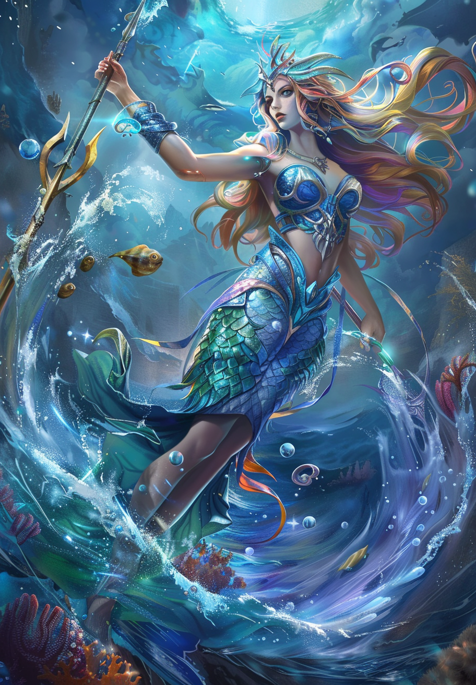
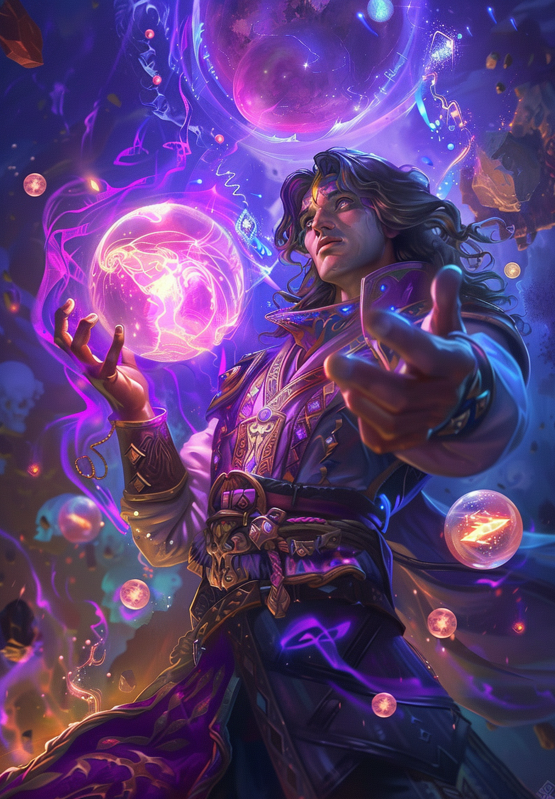
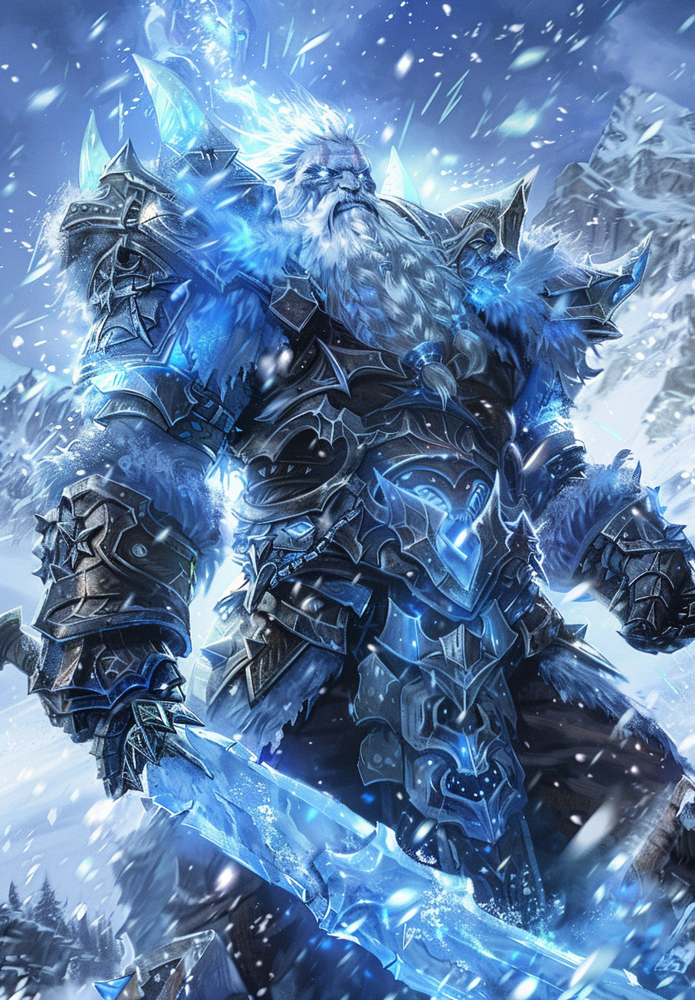
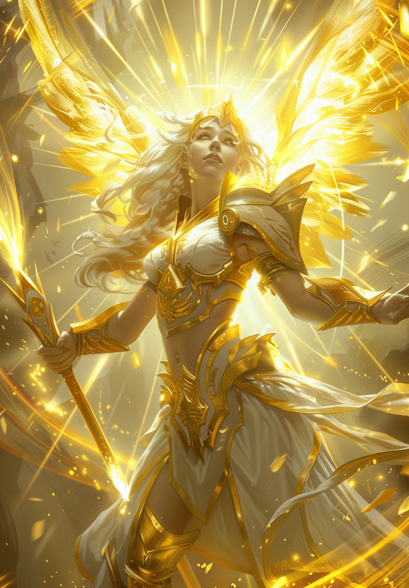
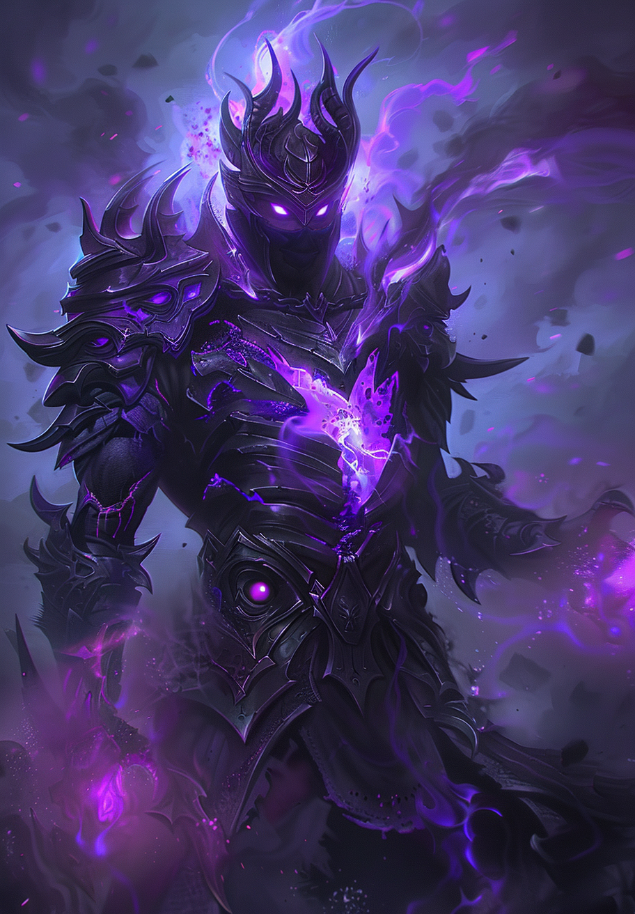
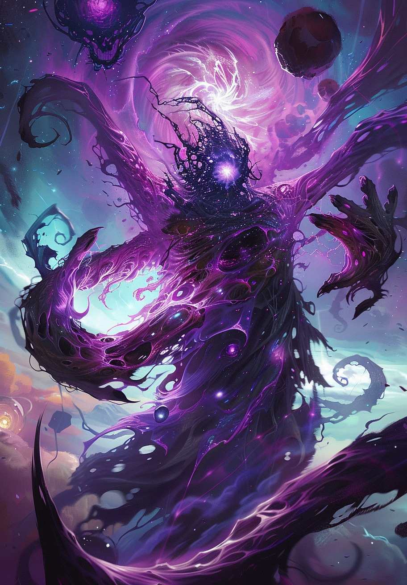
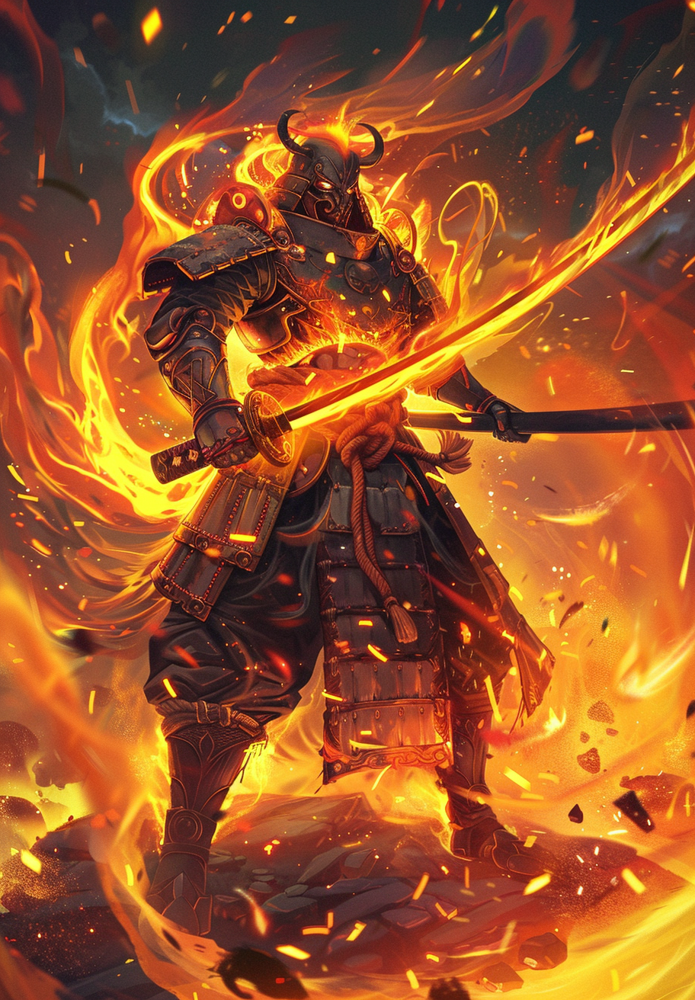
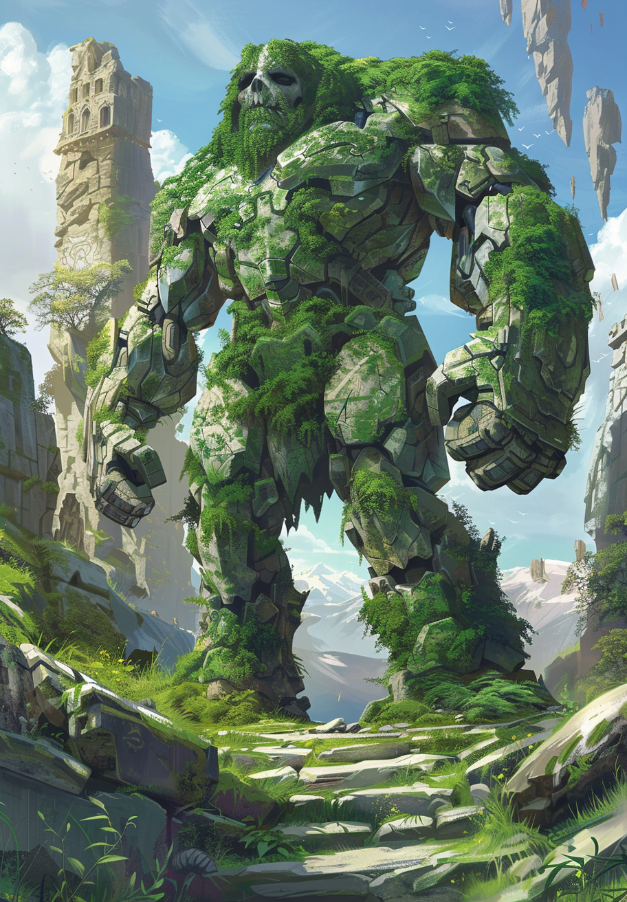
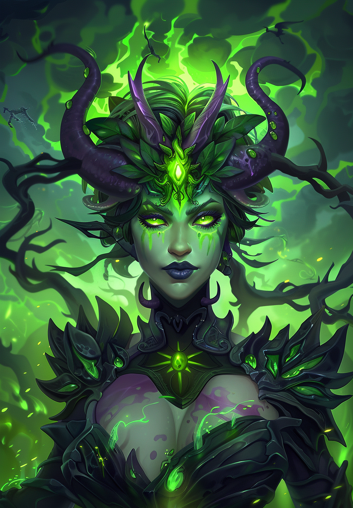
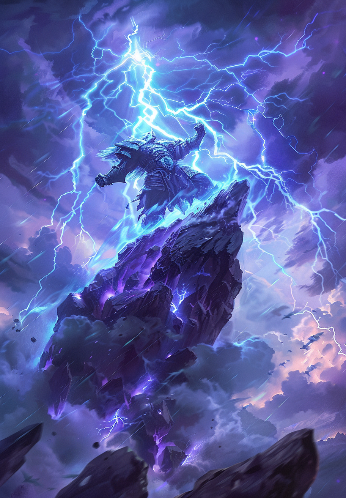

# 🦸 Catalogue des Héros

Ce catalogue présente tous les héros disponibles dans le jeu avec leurs capacités spéciales et images.

## 🎯 Index

- [Aquarielle, Gardienne des Marées](#aquarielle-gardienne-des-marees)
- [Arcanis, Sage des Flux Mystiques](#arcanis-sage-des-flux-mystiques)
- [Glacius, Empereur du Givre](#glacius-empereur-du-givre)
- [Luxielle, Avatar Radieux](#luxielle-avatar-radieux)
- [Mortrax, Sombre Dominateur](#mortrax-sombre-dominateur)
- [Nihilos, Avatar du Néant](#nihilos-avatar-du-neant)
- [Solaris, Champion des Cendres](#solaris-champion-des-cendres)
- [Telluron, Cœur de la Montagne](#telluron-cœur-de-la-montagne)
- [Toxina, Reine des Venins](#toxina-reine-des-venins)
- [Voltarn, Seigneur des Orages](#voltarn-seigneur-des-orages)
- [Zephira, Esprit des Tempêtes](#zephira-esprit-des-tempêtes)

## Détails des Héros

### **Aquarielle, Gardienne des Marées**

| **Nom**          | **Aquarielle, Gardienne des Marées**                                                                                     | **Élément:** Eau | **Type:** Héros |
|------------------|------------------------------------------------------------------------------------------------|------------------------|-----------------|
| **Image**        | 

 | **PV:** 1200      | **Attaque:** 28    |
| **Stats**        | &nbsp;                                                                                         | **Défense:** 24  | **Vitesse:** 0     |
| **Capacités**    | &nbsp;                                                                                         | **Critique:** 5.0% | **Esquive:** 5.0%    |
|                  | &nbsp;                                                                                         | **Précision:** 99.0% | **⚡ Vague Régénératrice (CD: 3)**  |
|                  | &nbsp;                                                                                         | &nbsp;                | **🛡️ Alliés Eau -10 % dégâts subit. (+2 coût)**  |

---

### **Arcanis, Sage des Flux Mystiques**

| **Nom**          | **Arcanis, Sage des Flux Mystiques**                                                                                     | **Élément:** Arcanique | **Type:** Héros |
|------------------|------------------------------------------------------------------------------------------------|------------------------|-----------------|
| **Image**        | 

 | **PV:** 1050      | **Attaque:** 35    |
| **Stats**        | &nbsp;                                                                                         | **Défense:** 22  | **Vitesse:** 0     |
| **Capacités**    | &nbsp;                                                                                         | **Critique:** 5.0% | **Esquive:** 5.0%    |
|                  | &nbsp;                                                                                         | **Précision:** 99.0% | **⚡ Distorsion du Temps (CD: 3)**  |
|                  | &nbsp;                                                                                         | &nbsp;                | **🛡️ -1 tour de cooldown global sur le deck (minimum 1 de CD). (+2 coût)**  |

---

### **Glacius, Empereur du Givre**

| **Nom**          | **Glacius, Empereur du Givre**                                                                                     | **Élément:** Glace | **Type:** Héros |
|------------------|------------------------------------------------------------------------------------------------|------------------------|-----------------|
| **Image**        | 

 | **PV:** 1150      | **Attaque:** 32    |
| **Stats**        | &nbsp;                                                                                         | **Défense:** 26  | **Vitesse:** 0     |
| **Capacités**    | &nbsp;                                                                                         | **Critique:** 5.0% | **Esquive:** 5.0%    |
|                  | &nbsp;                                                                                         | **Précision:** 99.0% | **⚡ Tempête de Givre (CD: 3)**  |
|                  | &nbsp;                                                                                         | &nbsp;                | **🛡️ -10 Défense ennemie. (+2 coût)**  |

---

### **Luxielle, Avatar Radieux**

| **Nom**          | **Luxielle, Avatar Radieux**                                                                                     | **Élément:** Lumière | **Type:** Héros |
|------------------|------------------------------------------------------------------------------------------------|------------------------|-----------------|
| **Image**        | 

 | **PV:** 1150      | **Attaque:** 32    |
| **Stats**        | &nbsp;                                                                                         | **Défense:** 25  | **Vitesse:** 0     |
| **Capacités**    | &nbsp;                                                                                         | **Critique:** 5.0% | **Esquive:** 5.0%    |
|                  | &nbsp;                                                                                         | **Précision:** 99.0% | **⚡ Bénédiction Solaire (CD: 3)**  |
|                  | &nbsp;                                                                                         | &nbsp;                | **🛡️ Alliés Lumière reçoivent -15 %. (+4 coût)**  |

---

### **Mortrax, Sombre Dominateur**

| **Nom**          | **Mortrax, Sombre Dominateur**                                                                                     | **Élément:** Ténèbres | **Type:** Héros |
|------------------|------------------------------------------------------------------------------------------------|------------------------|-----------------|
| **Image**        | 

 | **PV:** 1100      | **Attaque:** 38    |
| **Stats**        | &nbsp;                                                                                         | **Défense:** 23  | **Vitesse:** 0     |
| **Capacités**    | &nbsp;                                                                                         | **Critique:** 5.0% | **Esquive:** 5.0%    |
|                  | &nbsp;                                                                                         | **Précision:** 99.0% | **⚡ Siphon d'Ombres (CD: 3)**  |
|                  | &nbsp;                                                                                         | &nbsp;                | **🛡️ Alliés Ténèbres +15 %. (+4 coût)**  |

---

### **Nihilos, Avatar du Néant**

| **Nom**          | **Nihilos, Avatar du Néant**                                                                                     | **Élément:** Néant | **Type:** Héros |
|------------------|------------------------------------------------------------------------------------------------|------------------------|-----------------|
| **Image**        | 

 | **PV:** 1150      | **Attaque:** 38    |
| **Stats**        | &nbsp;                                                                                         | **Défense:** 20  | **Vitesse:** 0     |
| **Capacités**    | &nbsp;                                                                                         | **Critique:** 5.0% | **Esquive:** 5.0%    |
|                  | &nbsp;                                                                                         | **Précision:** 99.0% | **⚡ Annihilation Instantanée (CD: 3)**  |
|                  | &nbsp;                                                                                         | &nbsp;                | **🛡️ Immunisé aux effets élémentaires (Brûlure, Gel, etc.). (+3 coût)**  |

---

### **Solaris, Champion des Cendres**

| **Nom**          | **Solaris, Champion des Cendres**                                                                                     | **Élément:** Feu | **Type:** Héros |
|------------------|------------------------------------------------------------------------------------------------|------------------------|-----------------|
| **Image**        | 

 | **PV:** 1100      | **Attaque:** 35    |
| **Stats**        | &nbsp;                                                                                         | **Défense:** 22  | **Vitesse:** 0     |
| **Capacités**    | &nbsp;                                                                                         | **Critique:** 5.0% | **Esquive:** 5.0%    |
|                  | &nbsp;                                                                                         | **Précision:** 99.0% | **⚡ Inferno Purificateur (CD: 3)**  |
|                  | &nbsp;                                                                                         | &nbsp;                | **🛡️ Alliés Feu +10 % dégâts. (+2 coût)**  |

---

### **Telluron, Cœur de la Montagne**

| **Nom**          | **Telluron, Cœur de la Montagne**                                                                                     | **Élément:** Terre | **Type:** Héros |
|------------------|------------------------------------------------------------------------------------------------|------------------------|-----------------|
| **Image**        | 

 | **PV:** 1300      | **Attaque:** 25    |
| **Stats**        | &nbsp;                                                                                         | **Défense:** 30  | **Vitesse:** 0     |
| **Capacités**    | &nbsp;                                                                                         | **Critique:** 5.0% | **Esquive:** 5.0%    |
|                  | &nbsp;                                                                                         | **Précision:** 99.0% | **⚡ Barrière Rocailleuse (CD: 3)**  |
|                  | &nbsp;                                                                                         | &nbsp;                | **🛡️ Alliés Terre +5 DEF. (+1 coût)**  |

---

### **Toxina, Reine des Venins**

| **Nom**          | **Toxina, Reine des Venins**                                                                                     | **Élément:** Poison | **Type:** Héros |
|------------------|------------------------------------------------------------------------------------------------|------------------------|-----------------|
| **Image**        | 

 | **PV:** 1100      | **Attaque:** 36    |
| **Stats**        | &nbsp;                                                                                         | **Défense:** 20  | **Vitesse:** 0     |
| **Capacités**    | &nbsp;                                                                                         | **Critique:** 5.0% | **Esquive:** 5.0%    |
|                  | &nbsp;                                                                                         | **Précision:** 99.0% | **⚡ Nuage Infectieux (CD: 3)**  |
|                  | &nbsp;                                                                                         | &nbsp;                | **🛡️ Les alliés Poison appliquent un Poison plus fort (augmente les poisons de +2% dmg). (+2 coût)**  |

---

### **Voltarn, Seigneur des Orages**

| **Nom**          | **Voltarn, Seigneur des Orages**                                                                                     | **Élément:** Foudre | **Type:** Héros |
|------------------|------------------------------------------------------------------------------------------------|------------------------|-----------------|
| **Image**        | 

 | **PV:** 1050      | **Attaque:** 41    |
| **Stats**        | &nbsp;                                                                                         | **Défense:** 18  | **Vitesse:** 0     |
| **Capacités**    | &nbsp;                                                                                         | **Critique:** 5.0% | **Esquive:** 5.0%    |
|                  | &nbsp;                                                                                         | **Précision:** 99.0% | **⚡ Orage Implacable (CD: 3)**  |
|                  | &nbsp;                                                                                         | &nbsp;                | **🛡️ donne une chance à ses attaques de Paralyser (10% de chance). (+2 coût)**  |

---

### **Zephira, Esprit des Tempêtes**

| **Nom**          | **Zephira, Esprit des Tempêtes**                                                                                     | **Élément:** Air | **Type:** Héros |
|------------------|------------------------------------------------------------------------------------------------|------------------------|-----------------|
| **Image**        | 

 | **PV:** 1000      | **Attaque:** 38    |
| **Stats**        | &nbsp;                                                                                         | **Défense:** 20  | **Vitesse:** 0     |
| **Capacités**    | &nbsp;                                                                                         | **Critique:** 5.0% | **Esquive:** 5.0%    |
|                  | &nbsp;                                                                                         | **Précision:** 99.0% | **⚡ Danse des Rafales (CD: 3)**  |
|                  | &nbsp;                                                                                         | &nbsp;                | **🛡️ Alliés Air +10 % esquive. (+3 coût)**  |

---

