# 📚 Catalogue des Unités

Ce catalogue présente toutes les unités disponibles dans le jeu avec leurs statistiques, capacités et images.

## 📋 Légende

**Statistiques :**
- ❤️ **PV :** Points de vie
- ⚔️ **Attaque :** Dégâts de base
- 🛡️ **Défense :** Réduction des dégâts reçus
- 🏃 **Vitesse :** Nombre de cases déplaçables par tour
- 🎯 **Critique :** Chance de coup critique (%)
- 🌀 **Esquive :** Chance d'esquiver une attaque (%)
- 🔍 **Précision :** Chance de toucher la cible (%)

## 🎯 Index par Éléments

### Air
- [Aeris, Esprit du Zéphyr](#aeris-esprit-du-zephyr)
- [Corvus, Corbeau Mystique](#corvus-corbeau-mystique)
- [Galaxine, Voyageuse Céleste](#galaxine-voyageuse-celeste)
- [Nébulaire, Magicienne du Brouillard](#nebulaire-magicienne-du-brouillard)
- [Nébulo, Fantôme du Brouillard](#nebulo-fantôme-du-brouillard)
- [Orbaline, Magicienne Astrale](#orbaline-magicienne-astrale)
- [Skyla, Danseuse des Nuages](#skyla-danseuse-des-nuages)
- [Stratos, Esprit des Courants](#stratos-esprit-des-courants)
- [Sylphar, Archer de la Canopée](#sylphar-archer-de-la-canopee)
- [Tempestra, Danseuse de la Tornade](#tempestra-danseuse-de-la-tornade)
- [Zepho, Génie des Courants](#zepho-genie-des-courants)
- [Zyklair, Djinn des Rafales](#zyklair-djinn-des-rafales)
- [Zéphara, Valkyrie des Vents](#zephara-valkyrie-des-vents)

### Eau
- [Abyssalor, Kraken des Profondeurs](#abyssalor-kraken-des-profondeurs)
- [Abyssine, Félin des Profondeurs](#abyssine-felin-des-profondeurs)
- [Aquaria, Sirène Mystique](#aquaria-sirene-mystique)
- [Cristaline, Ondine Pure](#cristaline-ondine-pure)
- [Nixie, Fée de la Source](#nixie-fee-de-la-source)
- [Siriona, Enchanteresse des Abysses](#siriona-enchanteresse-des-abysses)
- [Torrentis, Gardien de l'Écume](#torrentis-gardien-de-l'ecume)
- [Torrick, Gardien du Torrent](#torrick-gardien-du-torrent)
- [Typhion, Léviathan du Maelström](#typhion-leviathan-du-maelström)

### Feu
- [Firocus, Renard Volcanique](#firocus-renard-volcanique)
- [Flamby, Lutin des Flammes](#flamby-lutin-des-flammes)
- [Ignarok, Roc en Fusion](#ignarok-roc-en-fusion)
- [Ignissia, Sorcière des Brasiers](#ignissia-sorciere-des-brasiers)
- [Incendior, Dragon de Feu](#incendior-dragon-de-feu)
- [Pyraxis, Élémentaire de Magma](#pyraxis-elementaire-de-magma)
- [Pyrodrake, Dragon de Braise](#pyrodrake-dragon-de-braise)
- [Pyrolynx, Lynx Ardent](#pyrolynx-lynx-ardent)
- [Pyropoulpe, Poulpe Incandescent](#pyropoulpe-poulpe-incandescent)
- [Rubra, Salamandre Incandescente](#rubra-salamandre-incandescente)
- [Salamandra, Magicienne Incandescente](#salamandra-magicienne-incandescente)
- [Solaris, Paladin du Soleil](#solaris-paladin-du-soleil)
- [Solune, Chamane Solaire](#solune-chamane-solaire)
- [Venturio, Chevalier Écarlate](#venturio-chevalier-ecarlate)
- [Vulcan, Forgeron de l'Enclume Ardente](#vulcan-forgeron-de-l'enclume-ardente)

### Foudre
- [Alice, la Lame Sanglante](#alice-la-lame-sanglante)
- [Fulgo, Orbe Electrique](#fulgo-orbe-electrique)
- [Fulminia, Valkyrie de l'Orage](#fulminia-valkyrie-de-l'orage)
- [Stormy, Enfant de la Foudre](#stormy-enfant-de-la-foudre)
- [Voltania, Serpent Fulgurant](#voltania-serpent-fulgurant)
- [Voltar, Seigneur de l'Orage](#voltar-seigneur-de-l'orage)
- [Voltix, Lutin Électrique](#voltix-lutin-electrique)

### Glace
- [Brumys, Fantôme du Givre](#brumys-fantôme-du-givre)
- [Cryomage, Mage du Givre](#cryomage-mage-du-givre)
- [Frimousse, Esprit Givré](#frimousse-esprit-givre)
- [Galádra, Matriarche du Givre](#galádra-matriarche-du-givre)
- [Gelgor, Troll du Givre](#gelgor-troll-du-givre)
- [Gelidar, Chevalier des Neiges](#gelidar-chevalier-des-neiges)
- [Glacia, Yéti Polaire](#glacia-yeti-polaire)
- [Glaciar, Yéti des Sommets](#glaciar-yeti-des-sommets)
- [Glacielle, Reine des Flocons](#glacielle-reine-des-flocons)
- [Gélax, Lutin de la Banquise](#gelax-lutin-de-la-banquise)
- [Tundrorr, Mammouth Givré](#tundrorr-mammouth-givre)

### Lumière
- [Astrilys, Sentinelle Astrale](#astrilys-sentinelle-astrale)
- [Lumicorne, Licorne Dorée](#lumicorne-licorne-doree)
- [Lumys, Renardeau Solaire](#lumys-renardeau-solaire)
- [Prismalyx, Papillon Lumineux](#prismalyx-papillon-lumineux)

### Poison
- [Briselys, Dryade Mousseuse](#briselys-dryade-mousseuse)
- [Crotignus, Crotte de Nez Mouvante](#crotignus-crotte-de-nez-mouvante)
- [Floralia, Druidesse des Fleurs](#floralia-druidesse-des-fleurs)
- [Mossio, Shaman des Mousses](#mossio-shaman-des-mousses)
- [Sylvara, Esprit de la Canopée](#sylvara-esprit-de-la-canopee)
- [Sylvert, Gardien de la Brume](#sylvert-gardien-de-la-brume)

### Terre
- [Barbak, Guerrier Barbare](#barbak-guerrier-barbare)
- [Bersi, Nain Invincible](#bersi-nain-invincible)
- [Gladrith, Écho des montagnes](#gladrith-echo-des-montagnes)
- [Lithos, Colosse de Quartz](#lithos-colosse-de-quartz)
- [Lixor, Golem Cristallin](#lixor-golem-cristallin)
- [Lumberjack, Bûcheron du Grand Nord](#lumberjack-bûcheron-du-grand-nord)
- [Rock, Colosse de Granit](#rock-colosse-de-granit)
- [Rocor, Gardien du Bloc](#rocor-gardien-du-bloc)
- [Roktus, Gobelin Mineur](#roktus-gobelin-mineur)
- [Silex, Gardien du Pic Rugueux](#silex-gardien-du-pic-rugueux)
- [Telluron, Géant de Schiste](#telluron-geant-de-schiste)
- [Terra, Sorcière de la Terre](#terra-sorciere-de-la-terre)

### Ténèbres
- [Murkax, Ombre Rampante](#murkax-ombre-rampante)

## Air

### **Aeris, Esprit du Zéphyr**
**Élément:** Air  | **Rareté:** Épique

| **Image**                          | **Stats**                          | **Capacités**                     |
|------------------------------------|------------------------------------|-----------------------------------|
| 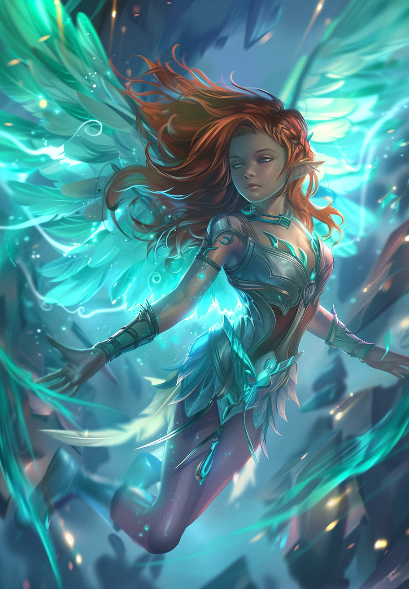 | ❤️ **PV:** 950 ⚔️ **Attaque:** 35 🛡️ **Défense:** 12  🎯 **Critique:** 3% 🌀 **Esquive:** 1% 🔍 **Précision:** 99% | **Baiser Alizée** ➡️ Esquive +40% (1t) | Critique +30% (1t) | Cible: 1 allié | CD: 2t  **Rapidité Aérienne** ➡️ Reset tous les CDs | Cible: 1 allié | CD: 8t |

---

### **Corvus, Corbeau Mystique**
**Élément:** Air  | **Rareté:** Épique

| **Image**                          | **Stats**                          | **Capacités**                     |
|------------------------------------|------------------------------------|-----------------------------------|
| 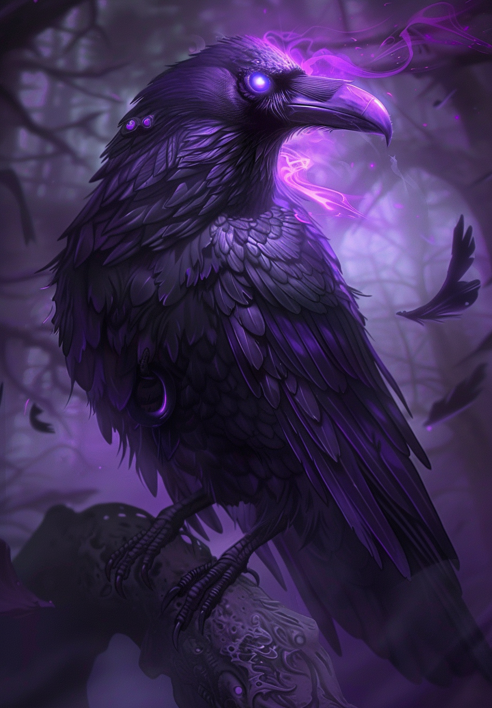 | ❤️ **PV:** 1113 ⚔️ **Attaque:** 33 🛡️ **Défense:** 21  🎯 **Critique:** 3% 🌀 **Esquive:** 1% 🔍 **Précision:** 99% | **3ème Oeil** ➡️ Silence (1t) | Cible: 1 ennemi aléatoire | CD: 3t  **Malédiction** ➡️ Cible: 1 ennemi aléatoire | CD: 1t |

---

### **Galaxine, Voyageuse Céleste**
**Élément:** Air  | **Rareté:** Mythique

| **Image**                          | **Stats**                          | **Capacités**                     |
|------------------------------------|------------------------------------|-----------------------------------|
| 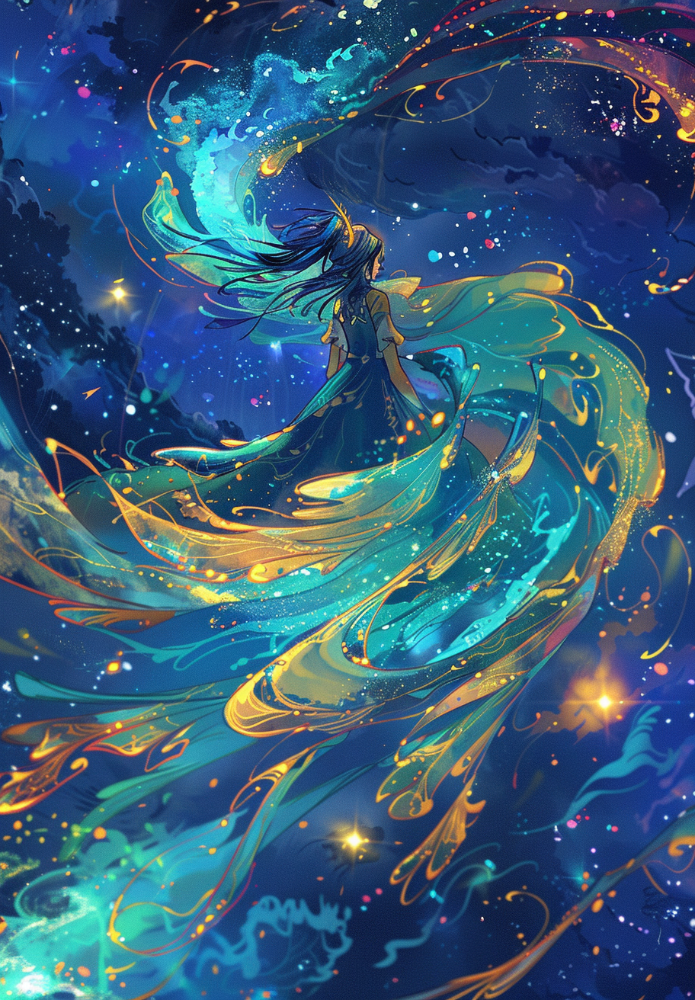 | ❤️ **PV:** 1100 ⚔️ **Attaque:** 36 🛡️ **Défense:** 19  🎯 **Critique:** 3% 🌀 **Esquive:** 1% 🔍 **Précision:** 99% | **Pluie de Météores** ➡️ Dégâts fixes: 6 | Cible: 20 cibles aléatoires | CD: 4t  **Lueur de la Voie Lactée** ➡️ Cible: self | CD: 4t |

---

### **Nébulaire, Magicienne du Brouillard**
**Élément:** Air  | **Rareté:** Épique

| **Image**                          | **Stats**                          | **Capacités**                     |
|------------------------------------|------------------------------------|-----------------------------------|
| 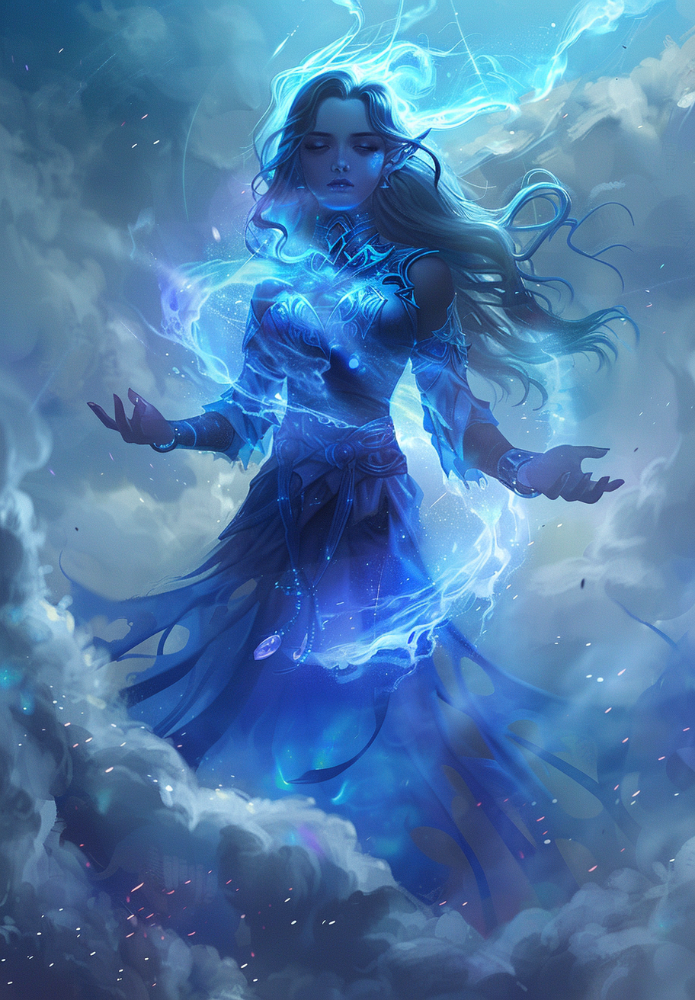 | ❤️ **PV:** 1010 ⚔️ **Attaque:** 35 🛡️ **Défense:** 15  🎯 **Critique:** 3% 🌀 **Esquive:** 1% 🔍 **Précision:** 99% | **Avancée du Brouillard** ➡️ Esquive +20% (1t) | Permanent | Cible: Soi + alliés | CD: 6t  **Orage** ➡️ Dégâts fixes: 11 | Dégâts/tour: 11 (3t) | Cible: 3 cibles aléatoires | CD: 3t |

---

### **Nébulo, Fantôme du Brouillard**
**Élément:** Air  | **Rareté:** Mythique

| **Image**                          | **Stats**                          | **Capacités**                     |
|------------------------------------|------------------------------------|-----------------------------------|
|  | ❤️ **PV:** 1220 ⚔️ **Attaque:** 25 🛡️ **Défense:** 34  🎯 **Critique:** 3% 🌀 **Esquive:** 1% 🔍 **Précision:** 99% | **Apparition Nébuleuse** ➡️ Cible: self | CD: 3t  **Emprise du Brouillard** ➡️ Dégâts fixes: 60 | Cible: all_enemies | CD: 2t |

---

### **Orbaline, Magicienne Astrale**
**Élément:** Air  | **Rareté:** Rare

| **Image**                          | **Stats**                          | **Capacités**                     |
|------------------------------------|------------------------------------|-----------------------------------|
| 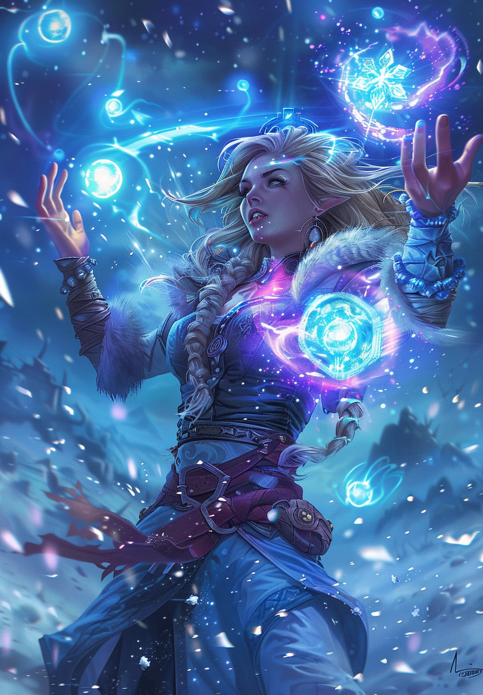 | ❤️ **PV:** 870 ⚔️ **Attaque:** 35 🛡️ **Défense:** 10  🎯 **Critique:** 3% 🌀 **Esquive:** 1% 🔍 **Précision:** 99% | **Orbe Astrale** ➡️ Dégâts: Attaque + 30 | Critique +10% (2t) | Cible: 1 ennemi | CD: 2t  **Attaque basique Air** ➡️ Dégâts fixes: 20 | Cible: 1 ennemi | CD: 1t |

---

### **Skyla, Danseuse des Nuages**
**Élément:** Air  | **Rareté:** Rare

| **Image**                          | **Stats**                          | **Capacités**                     |
|------------------------------------|------------------------------------|-----------------------------------|
| 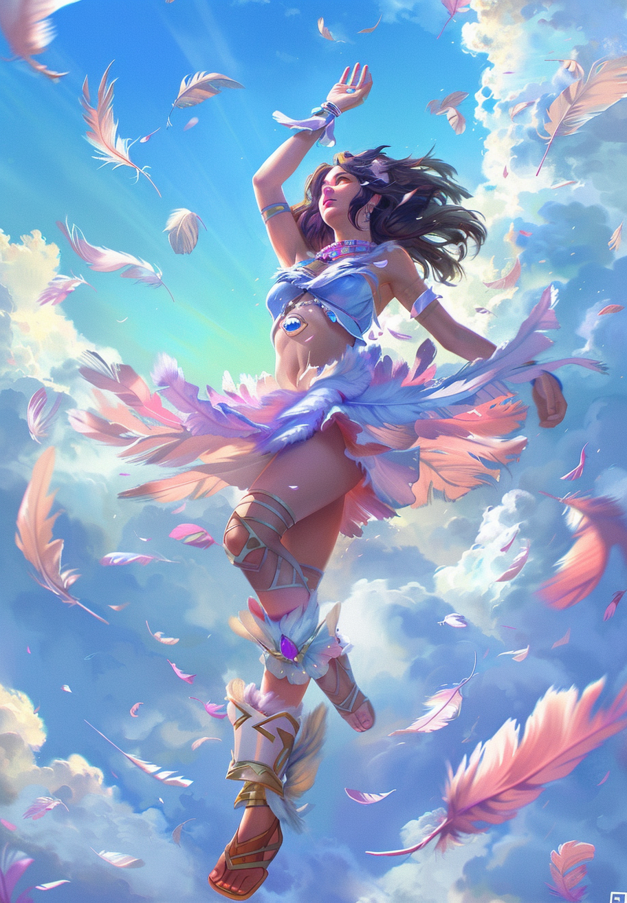 | ❤️ **PV:** 1010 ⚔️ **Attaque:** 28 🛡️ **Défense:** 21  🎯 **Critique:** 3% 🌀 **Esquive:** 1% 🔍 **Précision:** 99% | **Danse des Alizés** ➡️ Critique +20% (1t) | Cible: all_allies | CD: 3t  **Symphonie de l'Air** ➡️ Cible: 1 allié | CD: 2t |

---

### **Stratos, Esprit des Courants**
**Élément:** Air  | **Rareté:** Épique

| **Image**                          | **Stats**                          | **Capacités**                     |
|------------------------------------|------------------------------------|-----------------------------------|
| 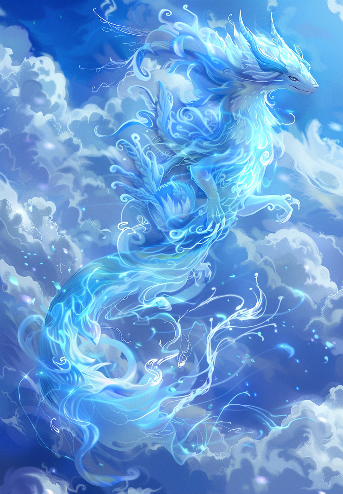 | ❤️ **PV:** 950 ⚔️ **Attaque:** 42 🛡️ **Défense:** 12  🎯 **Critique:** 3% 🌀 **Esquive:** 1% 🔍 **Précision:** 99% | **Voile Astral** ➡️ Cible: self | CD: 4t  **Souffle de la Nébuleuse** ➡️ Dégâts: Attaque + 40 | Permanent | Cible: 1 ennemi | CD: 2t |

---

### **Sylphar, Archer de la Canopée**
**Élément:** Air  | **Rareté:** Rare

| **Image**                          | **Stats**                          | **Capacités**                     |
|------------------------------------|------------------------------------|-----------------------------------|
| 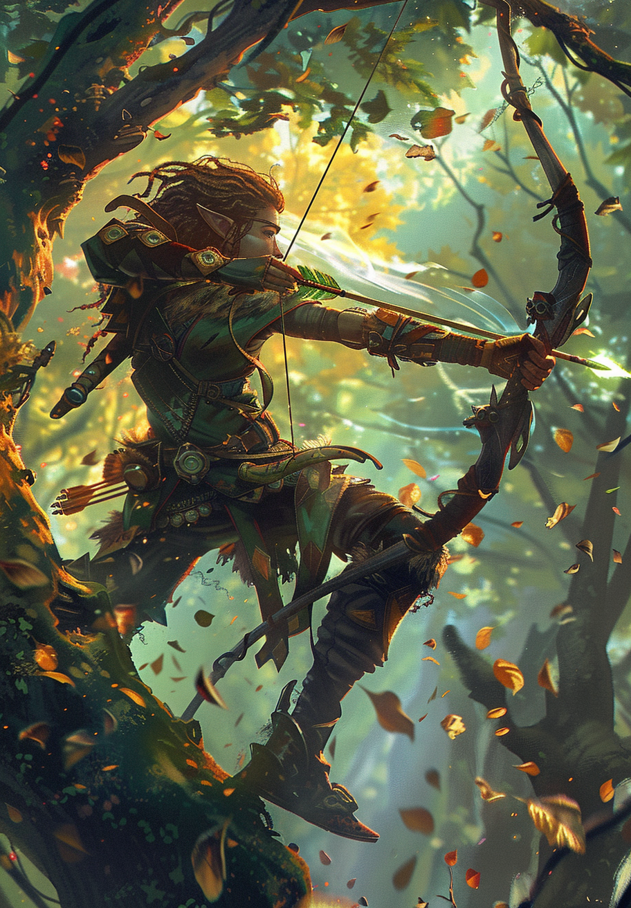 | ❤️ **PV:** 960 ⚔️ **Attaque:** 29 🛡️ **Défense:** 18  🎯 **Critique:** 3% 🌀 **Esquive:** 1% 🔍 **Précision:** 99% | **Tir Sylvestre** ➡️ Dégâts fixes: 45 | Cible: 1 ennemi | CD: 2t  &nbsp; |

---

### **Tempestra, Danseuse de la Tornade**
**Élément:** Air  | **Rareté:** Peu Commun

| **Image**                          | **Stats**                          | **Capacités**                     |
|------------------------------------|------------------------------------|-----------------------------------|
| 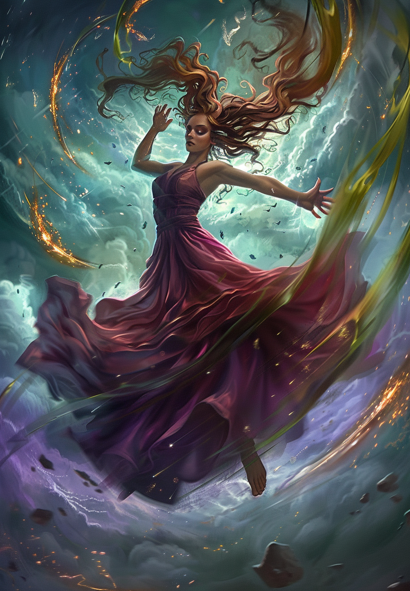 | ❤️ **PV:** 760 ⚔️ **Attaque:** 27 🛡️ **Défense:** 15  🎯 **Critique:** 3% 🌀 **Esquive:** 1% 🔍 **Précision:** 99% | **Attaque basique Air** ➡️ Dégâts fixes: 20 | Cible: 1 ennemi | CD: 1t  &nbsp; |

---

### **Zepho, Génie des Courants**
**Élément:** Air  | **Rareté:** Peu Commun

| **Image**                          | **Stats**                          | **Capacités**                     |
|------------------------------------|------------------------------------|-----------------------------------|
| 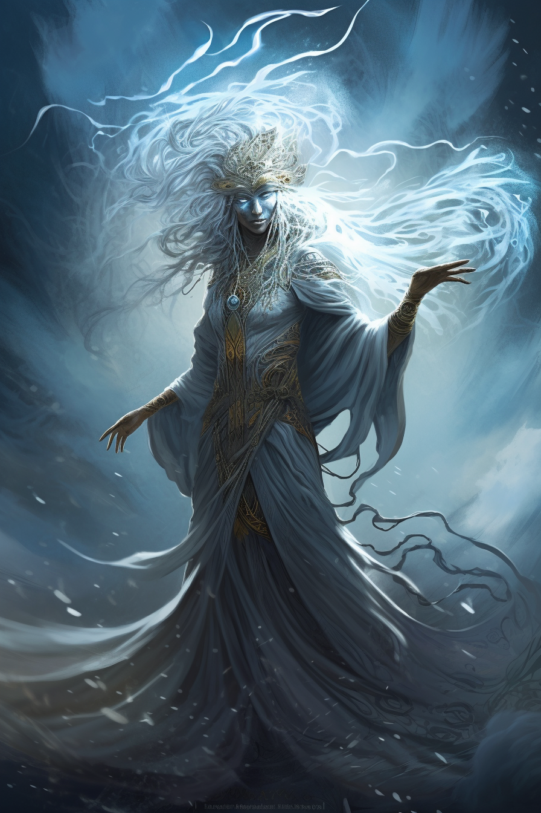 | ❤️ **PV:** 865 ⚔️ **Attaque:** 29 🛡️ **Défense:** 11  🎯 **Critique:** 3% 🌀 **Esquive:** 1% 🔍 **Précision:** 99% | **Attaque basique Air** ➡️ Dégâts fixes: 20 | Cible: 1 ennemi | CD: 1t  &nbsp; |

---

### **Zyklair, Djinn des Rafales**
**Élément:** Air  | **Rareté:** Rare

| **Image**                          | **Stats**                          | **Capacités**                     |
|------------------------------------|------------------------------------|-----------------------------------|
| 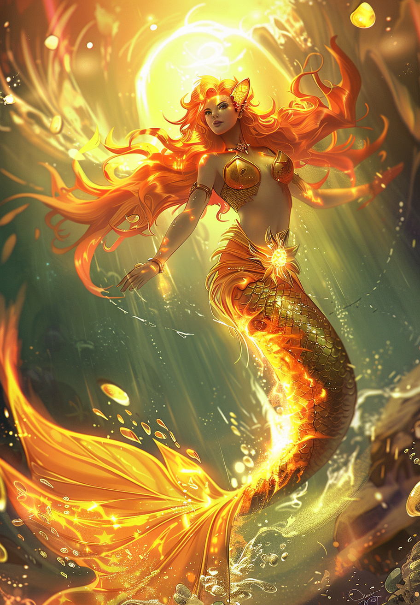 | ❤️ **PV:** 940 ⚔️ **Attaque:** 28 🛡️ **Défense:** 15  🎯 **Critique:** 3% 🌀 **Esquive:** 1% 🔍 **Précision:** 99% | **Attaque basique Air** ➡️ Dégâts fixes: 20 | Cible: 1 ennemi | CD: 1t  &nbsp; |

---

### **Zéphara, Valkyrie des Vents**
**Élément:** Air  | **Rareté:** Épique

| **Image**                          | **Stats**                          | **Capacités**                     |
|------------------------------------|------------------------------------|-----------------------------------|
| 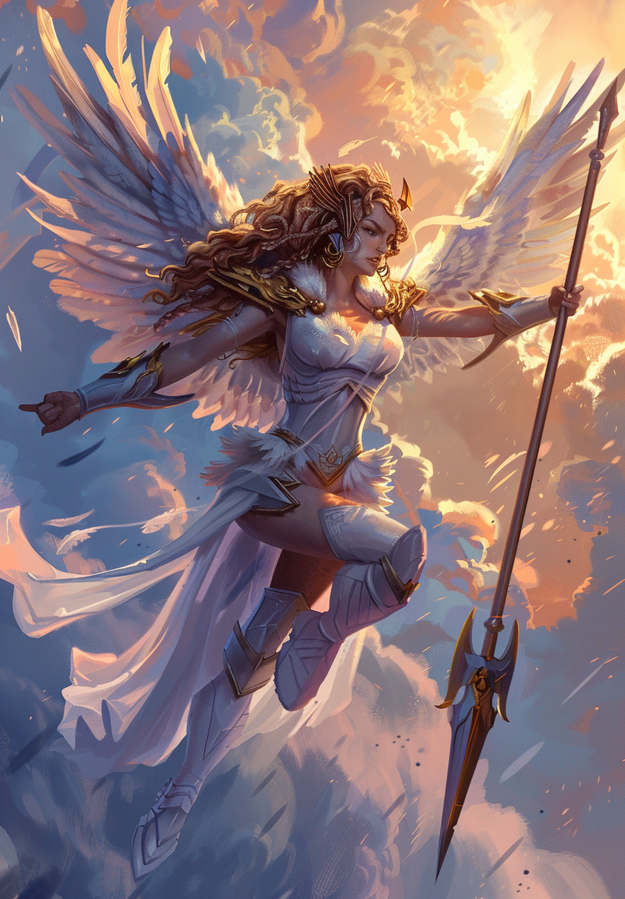 | ❤️ **PV:** 980 ⚔️ **Attaque:** 34 🛡️ **Défense:** 22  🎯 **Critique:** 3% 🌀 **Esquive:** 1% 🔍 **Précision:** 99% | **Égide Aérienne** ➡️ Réduction dégâts: 20% | Cible: 1 allié | CD: 2t  **Lames du Mistral** ➡️ Dégâts: Attaque + 30 | Cible: 1 ennemi | CD: 2t |

---

## Eau

### **Abyssalor, Kraken des Profondeurs**
**Élément:** Eau  | **Rareté:** Rare

| **Image**                          | **Stats**                          | **Capacités**                     |
|------------------------------------|------------------------------------|-----------------------------------|
| 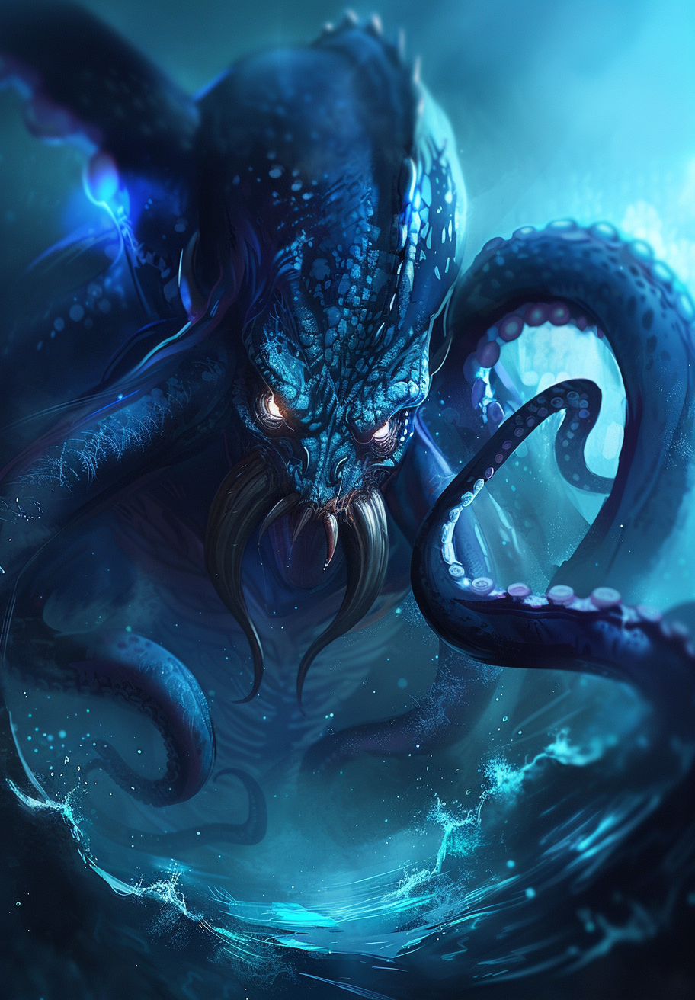 | ❤️ **PV:** 1160 ⚔️ **Attaque:** 30 🛡️ **Défense:** 27  🎯 **Critique:** 3% 🌀 **Esquive:** 1% 🔍 **Précision:** 99% | **Voile d'Encre** ➡️ Esquive +30% (2t) | Cible: Soi + alliés | CD: 5t  **Coup de Tentacule** ➡️ Dégâts: 0.6 | Cible: 2 cibles aléatoires | CD: 1t |

---

### **Abyssine, Félin des Profondeurs**
**Élément:** Eau  | **Rareté:** Peu Commun

| **Image**                          | **Stats**                          | **Capacités**                     |
|------------------------------------|------------------------------------|-----------------------------------|
| 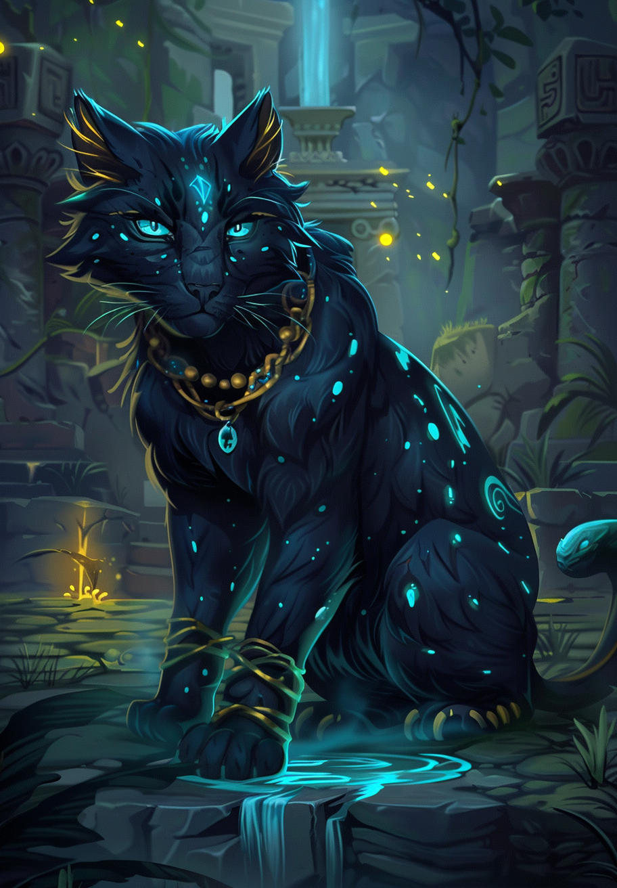 | ❤️ **PV:** 1020 ⚔️ **Attaque:** 21 🛡️ **Défense:** 23  🎯 **Critique:** 3% 🌀 **Esquive:** 1% 🔍 **Précision:** 99% | **Voile Aquatique** ➡️ Esquive +20% (2t) | Cible: self | CD: 3t  **Griffure Abyssale** ➡️ Dégâts: Attaque + 60 | Cible: 1 ennemi | CD: 2t |

---

### **Aquaria, Sirène Mystique**
**Élément:** Eau  | **Rareté:** Épique

| **Image**                          | **Stats**                          | **Capacités**                     |
|------------------------------------|------------------------------------|-----------------------------------|
| 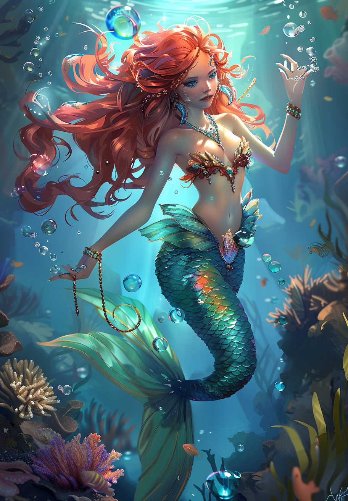 | ❤️ **PV:** 1029 ⚔️ **Attaque:** 30 🛡️ **Défense:** 20  🎯 **Critique:** 3% 🌀 **Esquive:** 1% 🔍 **Précision:** 99% | **Mélodie Hypnotique** ➡️ Silence (1t) | Cible: chain_random | CD: 6t  &nbsp; |

---

### **Cristaline, Ondine Pure**
**Élément:** Eau  | **Rareté:** Commun

| **Image**                          | **Stats**                          | **Capacités**                     |
|------------------------------------|------------------------------------|-----------------------------------|
| 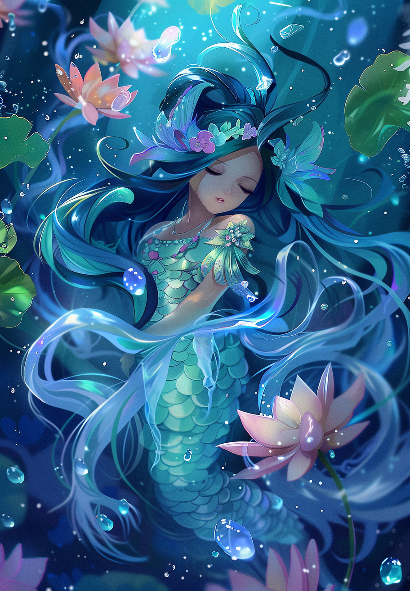 | ❤️ **PV:** 840 ⚔️ **Attaque:** 21 🛡️ **Défense:** 11  🎯 **Critique:** 3% 🌀 **Esquive:** 1% 🔍 **Précision:** 99% | **Ca coule de source** ➡️ Cible: 1 allié | CD: 1t  &nbsp; |

---

### **Nixie, Fée de la Source**
**Élément:** Eau  | **Rareté:** Rare

| **Image**                          | **Stats**                          | **Capacités**                     |
|------------------------------------|------------------------------------|-----------------------------------|
| 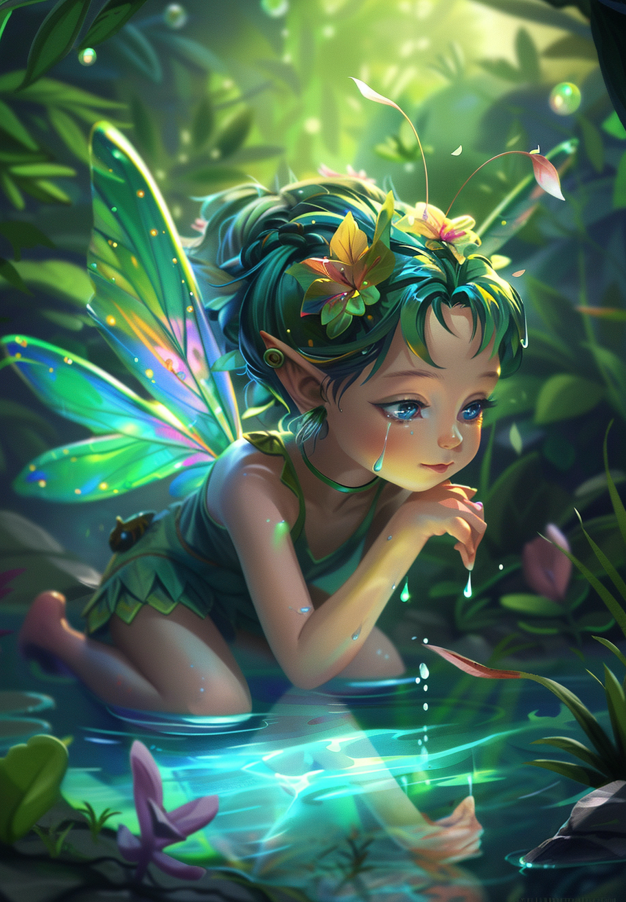 | ❤️ **PV:** 890 ⚔️ **Attaque:** 32 🛡️ **Défense:** 12  🎯 **Critique:** 3% 🌀 **Esquive:** 1% 🔍 **Précision:** 99% | **Larmes Féerique** ➡️ Dégâts: 40 | Cible: 1 allié | CD: 2t  &nbsp; |

---

### **Siriona, Enchanteresse des Abysses**
**Élément:** Eau  | **Rareté:** Épique

| **Image**                          | **Stats**                          | **Capacités**                     |
|------------------------------------|------------------------------------|-----------------------------------|
| 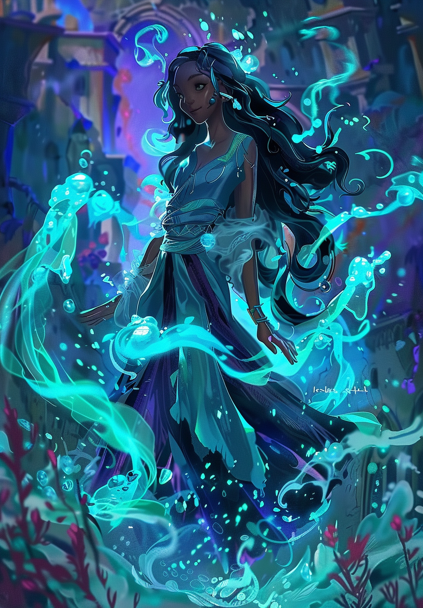 | ❤️ **PV:** 1200 ⚔️ **Attaque:** 26 🛡️ **Défense:** 34  🎯 **Critique:** 3% 🌀 **Esquive:** 1% 🔍 **Précision:** 99% | **Étreinte Liquide** ➡️ Dégâts fixes: 30 | Cible: 1 ennemi | CD: 2t  **Torrent Ensorcelé** ➡️ Dégâts fixes: 160 | Cible: 1 ennemi | CD: 4t |

---

### **Torrentis, Gardien de l'Écume**
**Élément:** Eau  | **Rareté:** Commun

| **Image**                          | **Stats**                          | **Capacités**                     |
|------------------------------------|------------------------------------|-----------------------------------|
| 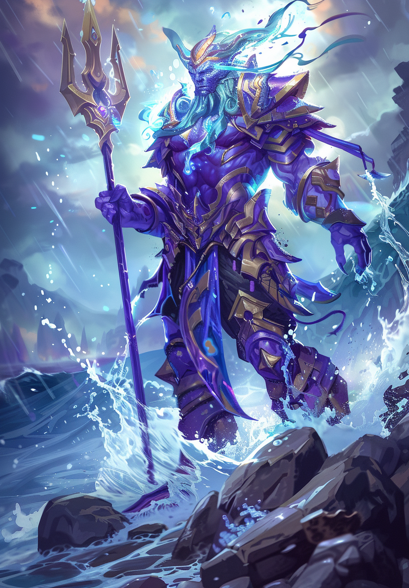 | ❤️ **PV:** 780 ⚔️ **Attaque:** 19 🛡️ **Défense:** 19  🎯 **Critique:** 3% 🌀 **Esquive:** 1% 🔍 **Précision:** 99% | **Attaque basique Eau** ➡️ Dégâts fixes: 20 | Cible: 1 ennemi | CD: 1t  &nbsp; |

---

### **Torrick, Gardien du Torrent**
**Élément:** Eau  | **Rareté:** Mythique

| **Image**                          | **Stats**                          | **Capacités**                     |
|------------------------------------|------------------------------------|-----------------------------------|
| 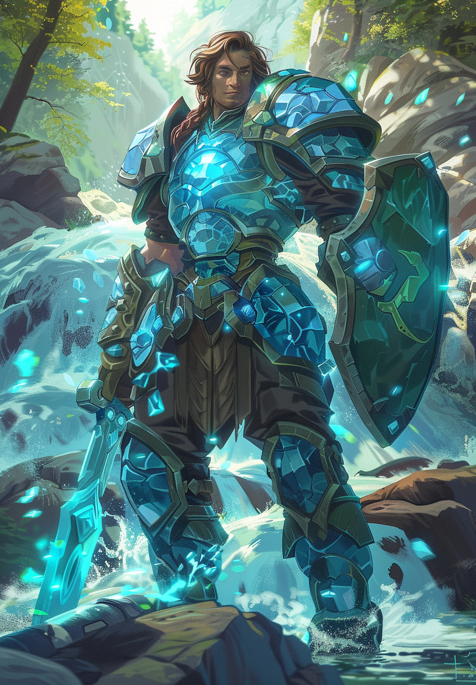 | ❤️ **PV:** 1350 ⚔️ **Attaque:** 39 🛡️ **Défense:** 24  🎯 **Critique:** 3% 🌀 **Esquive:** 1% 🔍 **Précision:** 99% | **Soin Protecteur** ➡️ Cible: 1 allié | CD: 3t  **Coup Tranchant** ➡️ Dégâts fixes: 30 | Cible: 1 ennemi | CD: 1t |

---

### **Typhion, Léviathan du Maelström**
**Élément:** Eau  | **Rareté:** Mythique

| **Image**                          | **Stats**                          | **Capacités**                     |
|------------------------------------|------------------------------------|-----------------------------------|
| 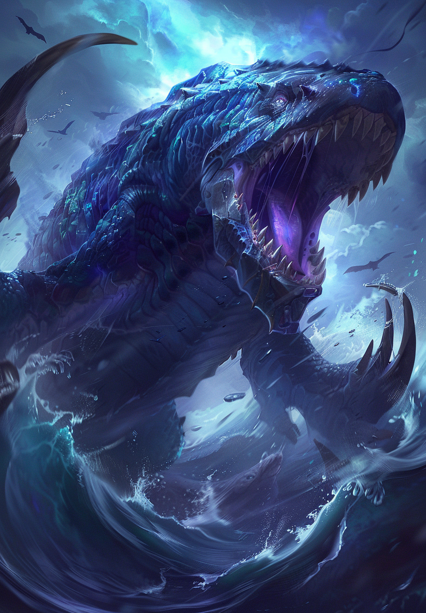 | ❤️ **PV:** 1111 ⚔️ **Attaque:** 44 🛡️ **Défense:** 16  🎯 **Critique:** 3% 🌀 **Esquive:** 1% 🔍 **Précision:** 99% | **Typhon** ➡️ Dégâts fixes: 80 | Cible: all_enemies | CD: 3t  **Avalement** ➡️ Dégâts: Attaque + 100 | Cible: 1 ennemi | CD: 4t |

---

## Feu

### **Firocus, Renard Volcanique**
**Élément:** Feu 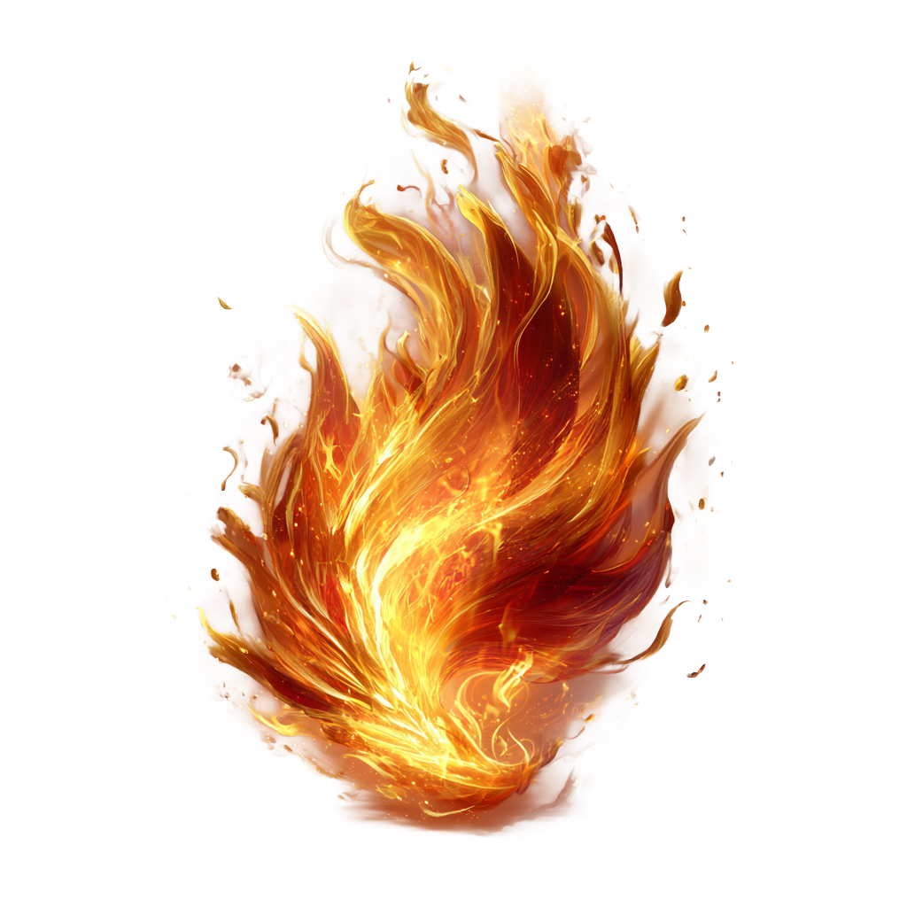 | **Rareté:** Épique

| **Image**                          | **Stats**                          | **Capacités**                     |
|------------------------------------|------------------------------------|-----------------------------------|
| 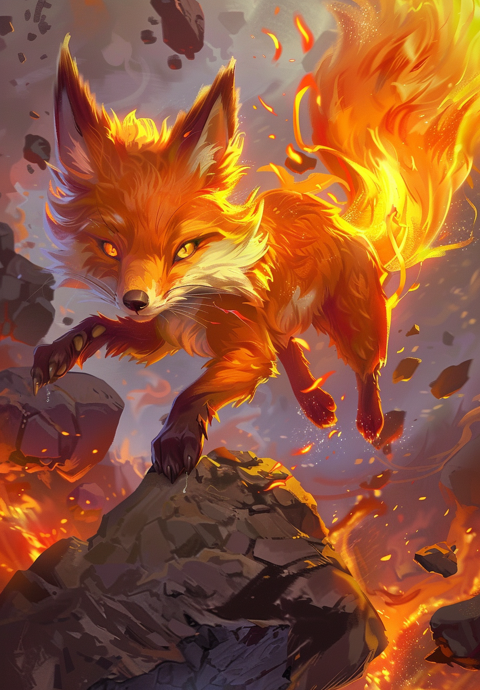 | ❤️ **PV:** 872 ⚔️ **Attaque:** 33 🛡️ **Défense:** 14  🎯 **Critique:** 3% 🌀 **Esquive:** 1% 🔍 **Précision:** 99% | **Attaque basique Feu** ➡️ Dégâts fixes: 20 | Cible: 1 ennemi | CD: 1t  **Attaque basique Feu** ➡️ Dégâts fixes: 20 | Cible: 1 ennemi | CD: 1t |

---

### **Flamby, Lutin des Flammes**
**Élément:** Feu  | **Rareté:** Spécial

| **Image**                          | **Stats**                          | **Capacités**                     |
|------------------------------------|------------------------------------|-----------------------------------|
| 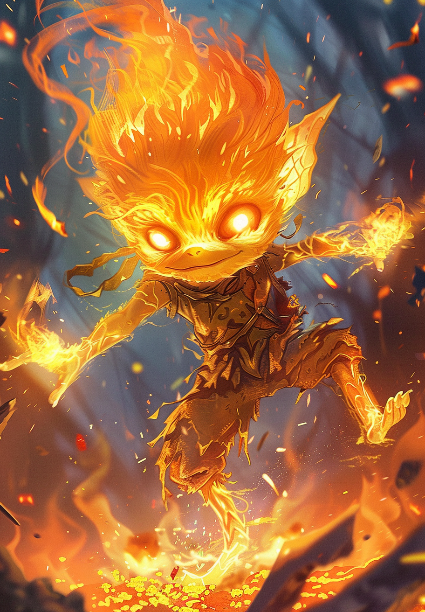 | ❤️ **PV:** 710 ⚔️ **Attaque:** 17 🛡️ **Défense:** 8  🎯 **Critique:** 3% 🌀 **Esquive:** 1% 🔍 **Précision:** 99% | **Graine Enflammée** ➡️ Dégâts fixes: 5 | Cible: 1 ennemi aléatoire | CD: 1t  **Graine Explosive** ➡️ Dégâts: 20 | Cible: 1 ennemi | CD: 2t |

---

### **Ignarok, Roc en Fusion**
**Élément:** Feu  | **Rareté:** Rare

| **Image**                          | **Stats**                          | **Capacités**                     |
|------------------------------------|------------------------------------|-----------------------------------|
|  | ❤️ **PV:** 870 ⚔️ **Attaque:** 28 🛡️ **Défense:** 16  🎯 **Critique:** 3% 🌀 **Esquive:** 1% 🔍 **Précision:** 99% | **Lancer Tellurique** ➡️ Dégâts: Attaque + 40 | Cible: 1 ennemi | CD: 3t  **Pierre Enflammée** ➡️ Dégâts: 0.7 | Cible: 1 ennemi | CD: 1t |

---

### **Ignissia, Sorcière des Brasiers**
**Élément:** Feu  | **Rareté:** Commun

| **Image**                          | **Stats**                          | **Capacités**                     |
|------------------------------------|------------------------------------|-----------------------------------|
| 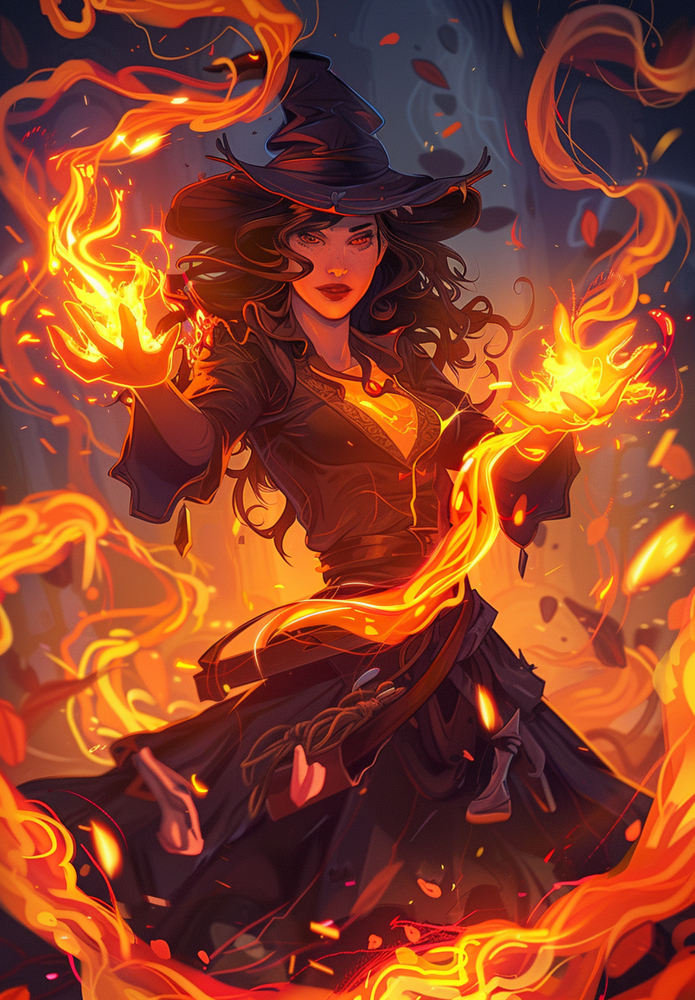 | ❤️ **PV:** 850 ⚔️ **Attaque:** 23 🛡️ **Défense:** 15  🎯 **Critique:** 3% 🌀 **Esquive:** 1% 🔍 **Précision:** 99% | **Attaque basique Feu** ➡️ Dégâts fixes: 20 | Cible: 1 ennemi | CD: 1t  &nbsp; |

---

### **Incendior, Dragon de Feu**
**Élément:** Feu  | **Rareté:** Rare

| **Image**                          | **Stats**                          | **Capacités**                     |
|------------------------------------|------------------------------------|-----------------------------------|
| 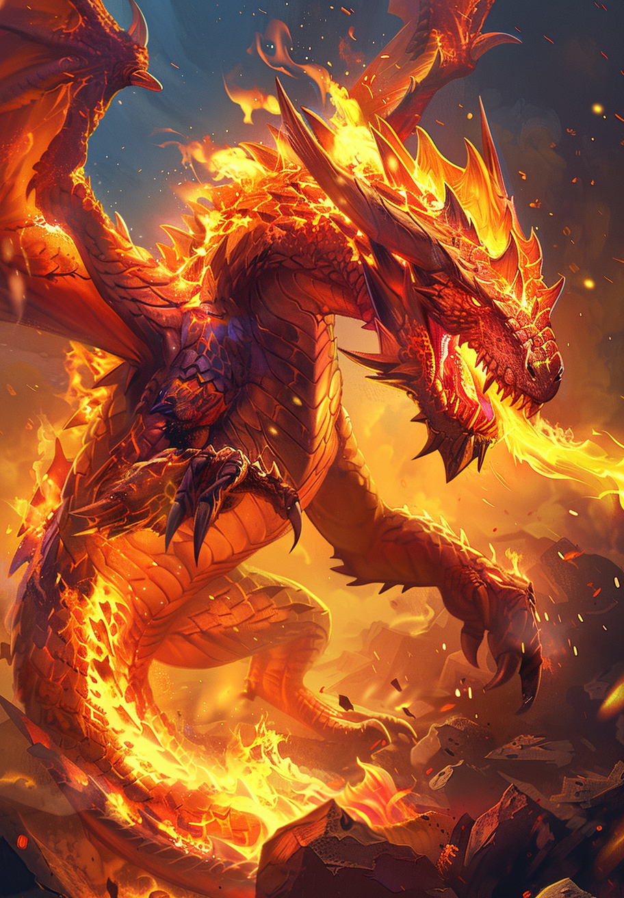 | ❤️ **PV:** 940 ⚔️ **Attaque:** 27 🛡️ **Défense:** 18  🎯 **Critique:** 3% 🌀 **Esquive:** 1% 🔍 **Précision:** 99% | **Souffle Enflammé** ➡️ Dégâts: Attaque + 20 | Cible: chain_random | CD: 3t  &nbsp; |

---

### **Pyraxis, Élémentaire de Magma**
**Élément:** Feu  | **Rareté:** Peu Commun

| **Image**                          | **Stats**                          | **Capacités**                     |
|------------------------------------|------------------------------------|-----------------------------------|
| 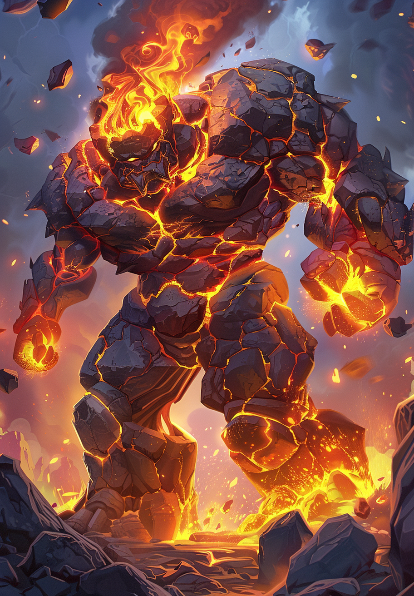 | ❤️ **PV:** 780 ⚔️ **Attaque:** 25 🛡️ **Défense:** 13  🎯 **Critique:** 3% 🌀 **Esquive:** 1% 🔍 **Précision:** 99% | **Rocher Magmatique** ➡️ Dégâts: 1.1 | Cible: 1 ennemi | CD: 2t  &nbsp; |

---

### **Pyrodrake, Dragon de Braise**
**Élément:** Feu  | **Rareté:** Mythique

| **Image**                          | **Stats**                          | **Capacités**                     |
|------------------------------------|------------------------------------|-----------------------------------|
| 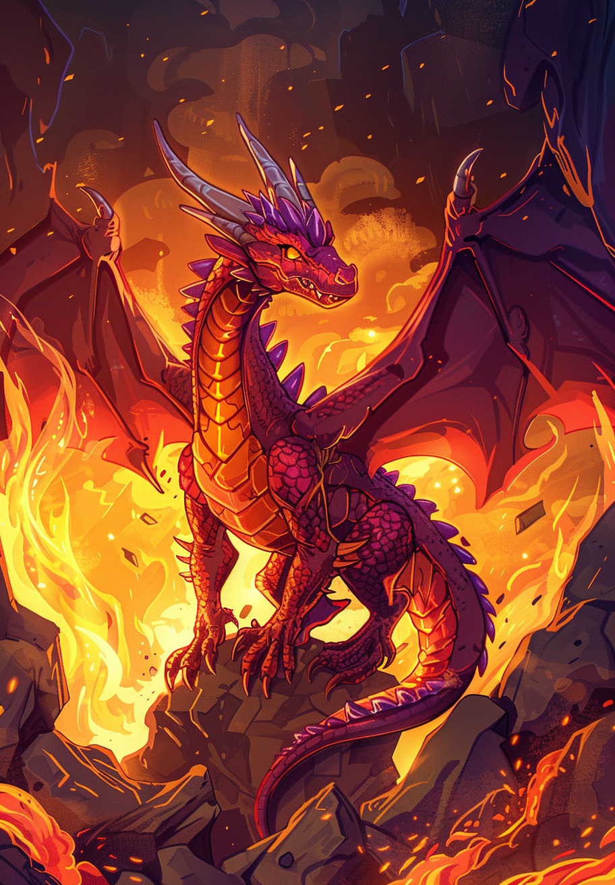 | ❤️ **PV:** 1200 ⚔️ **Attaque:** 35 🛡️ **Défense:** 22  🎯 **Critique:** 3% 🌀 **Esquive:** 1% 🔍 **Précision:** 99% | **Souffle Enflammé** ➡️ Dégâts: Attaque + 20 | Cible: chain_random | CD: 3t  **Tourbillon de Flamme** ➡️ Dégâts: 2.0 | Cible: 1 ennemi aléatoire | CD: 6t |

---

### **Pyrolynx, Lynx Ardent**
**Élément:** Feu  | **Rareté:** Épique

| **Image**                          | **Stats**                          | **Capacités**                     |
|------------------------------------|------------------------------------|-----------------------------------|
| 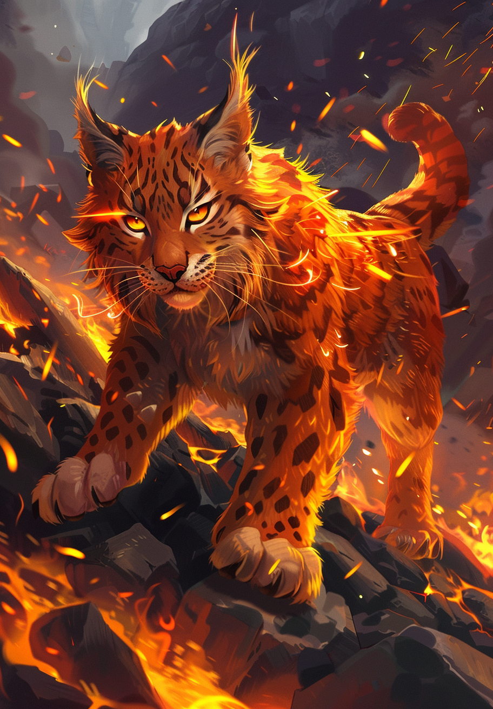 | ❤️ **PV:** 870 ⚔️ **Attaque:** 35 🛡️ **Défense:** 17  🎯 **Critique:** 3% 🌀 **Esquive:** 1% 🔍 **Précision:** 99% | **Coup de Griffe Ardente** ➡️ Dégâts: 0.6 | Cible: 1 ennemi | CD: 2t  &nbsp; |

---

### **Pyropoulpe, Poulpe Incandescent**
**Élément:** Feu  | **Rareté:** Peu Commun

| **Image**                          | **Stats**                          | **Capacités**                     |
|------------------------------------|------------------------------------|-----------------------------------|
|  | ❤️ **PV:** 995 ⚔️ **Attaque:** 30 🛡️ **Défense:** 18  🎯 **Critique:** 3% 🌀 **Esquive:** 1% 🔍 **Précision:** 99% | **Torrent Ardent** ➡️ Dégâts fixes: 30 | Cible: 2 cibles aléatoires | CD: 5t  &nbsp; |

---

### **Rubra, Salamandre Incandescente**
**Élément:** Feu  | **Rareté:** Peu Commun

| **Image**                          | **Stats**                          | **Capacités**                     |
|------------------------------------|------------------------------------|-----------------------------------|
| 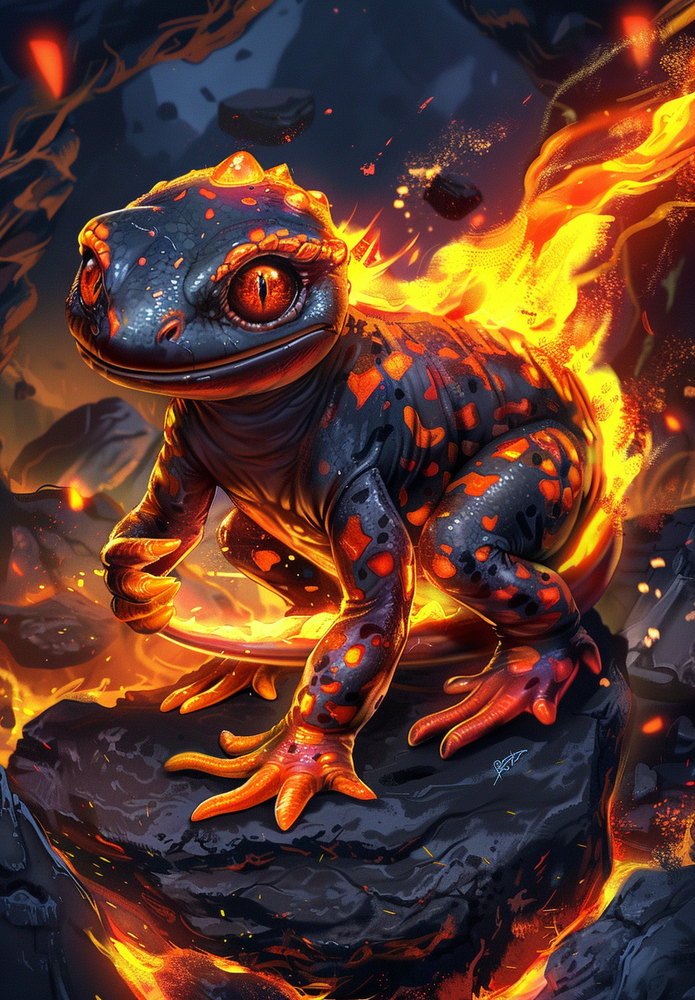 | ❤️ **PV:** 780 ⚔️ **Attaque:** 21 🛡️ **Défense:** 12  🎯 **Critique:** 3% 🌀 **Esquive:** 1% 🔍 **Précision:** 99% | **Griffe acérée** ➡️ Dégâts: Attaque + 15 | Cible: 1 ennemi | CD: 1t  **Coup de Langue** ➡️ Dégâts fixes: 45 | Cible: 1 ennemi | CD: 3t |

---

### **Salamandra, Magicienne Incandescente**
**Élément:** Feu  | **Rareté:** Épique

| **Image**                          | **Stats**                          | **Capacités**                     |
|------------------------------------|------------------------------------|-----------------------------------|
| 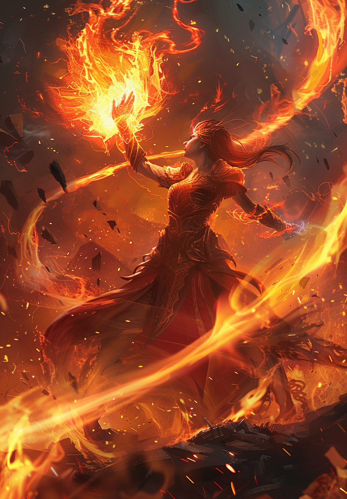 | ❤️ **PV:** 950 ⚔️ **Attaque:** 30 🛡️ **Défense:** 16  🎯 **Critique:** 3% 🌀 **Esquive:** 1% 🔍 **Précision:** 99% | **Flamme Foudroyante** ➡️ Dégâts: Attaque + 40 | Cible: 1 ennemi | CD: 3t  **Décharge Incandescente** ➡️ Dégâts: Attaque + 40 | Cible: 1 ennemi | CD: 3t |

---

### **Solaris, Paladin du Soleil**
**Élément:** Feu  | **Rareté:** Rare

| **Image**                          | **Stats**                          | **Capacités**                     |
|------------------------------------|------------------------------------|-----------------------------------|
| 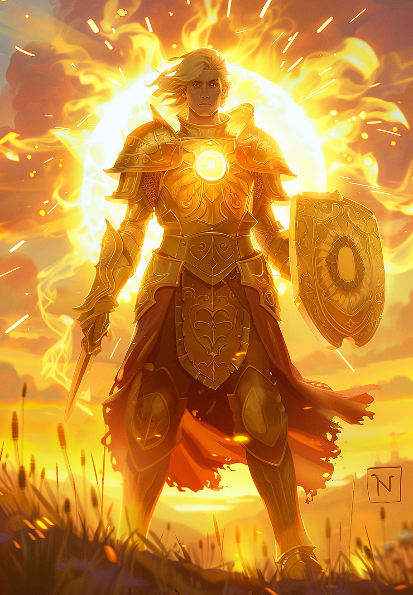 | ❤️ **PV:** 940 ⚔️ **Attaque:** 32 🛡️ **Défense:** 13  🎯 **Critique:** 3% 🌀 **Esquive:** 1% 🔍 **Précision:** 99% | **Armure Incandescente** ➡️ Cible: self | CD: 4t  &nbsp; |

---

### **Solune, Chamane Solaire**
**Élément:** Feu  | **Rareté:** Peu Commun

| **Image**                          | **Stats**                          | **Capacités**                     |
|------------------------------------|------------------------------------|-----------------------------------|
| 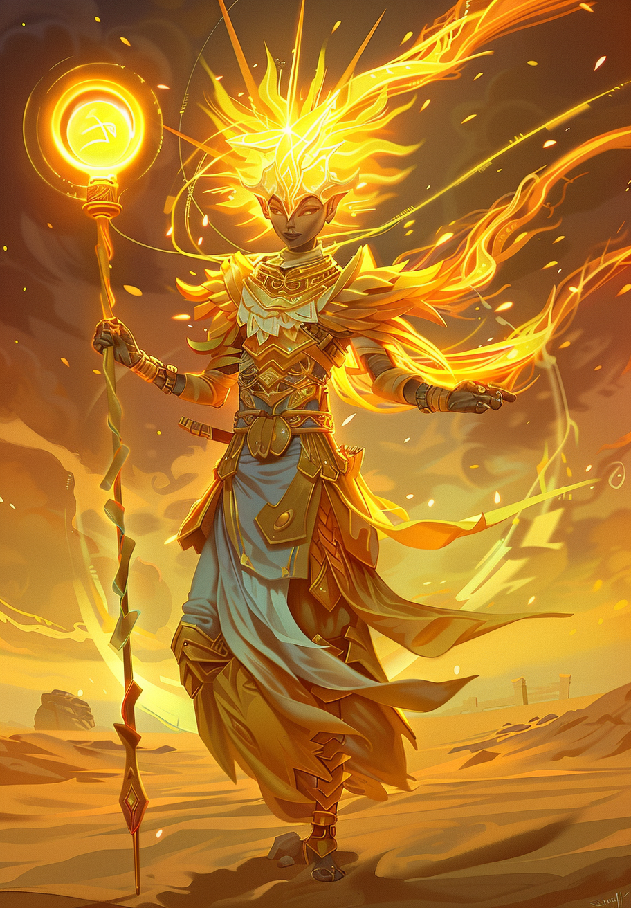 | ❤️ **PV:** 850 ⚔️ **Attaque:** 23 🛡️ **Défense:** 14  🎯 **Critique:** 3% 🌀 **Esquive:** 1% 🔍 **Précision:** 99% | **Attaque basique Feu** ➡️ Dégâts fixes: 20 | Cible: 1 ennemi | CD: 1t  &nbsp; |

---

### **Venturio, Chevalier Écarlate**
**Élément:** Feu  | **Rareté:** Rare

| **Image**                          | **Stats**                          | **Capacités**                     |
|------------------------------------|------------------------------------|-----------------------------------|
| 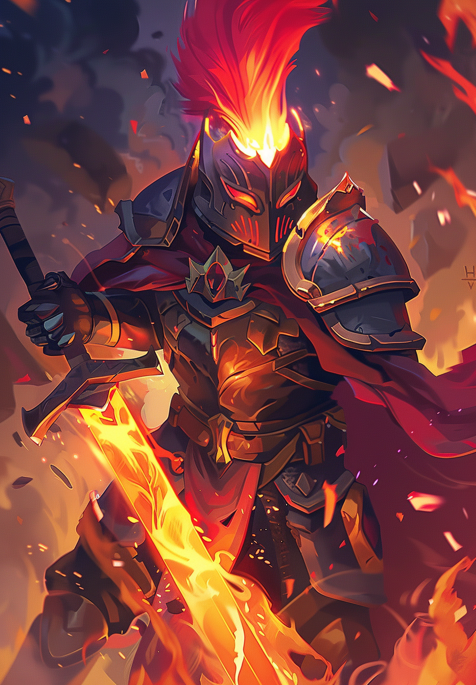 | ❤️ **PV:** 900 ⚔️ **Attaque:** 28 🛡️ **Défense:** 14  🎯 **Critique:** 3% 🌀 **Esquive:** 1% 🔍 **Précision:** 99% | **Attaque basique Feu** ➡️ Dégâts fixes: 20 | Cible: 1 ennemi | CD: 1t  &nbsp; |

---

### **Vulcan, Forgeron de l'Enclume Ardente**
**Élément:** Feu  | **Rareté:** Épique

| **Image**                          | **Stats**                          | **Capacités**                     |
|------------------------------------|------------------------------------|-----------------------------------|
| 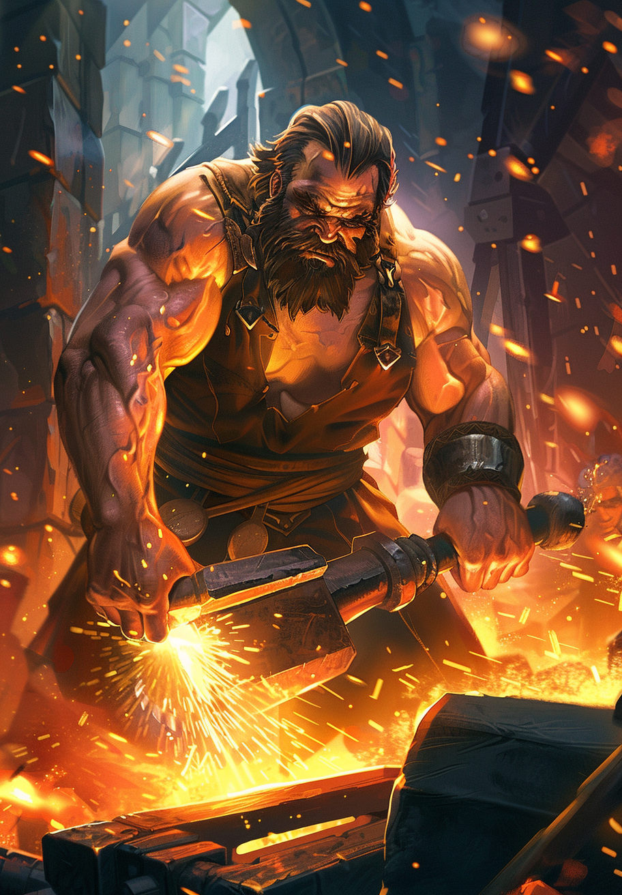 | ❤️ **PV:** 940 ⚔️ **Attaque:** 32 🛡️ **Défense:** 15  🎯 **Critique:** 3% 🌀 **Esquive:** 1% 🔍 **Précision:** 99% | **Ardeur de la Forge** ➡️ Permanent | Cible: self | CD: 2t  **Martelage** ➡️ Dégâts: 1.6 | Cible: 1 ennemi | CD: 1t |

---

## Foudre

### **Alice, la Lame Sanglante**
**Élément:** Foudre  | **Rareté:** Épique

| **Image**                          | **Stats**                          | **Capacités**                     |
|------------------------------------|------------------------------------|-----------------------------------|
| 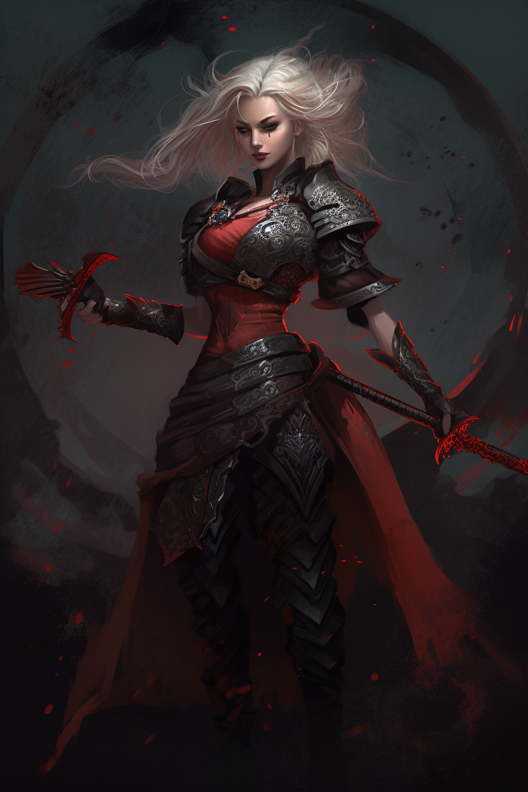 | ❤️ **PV:** 1100 ⚔️ **Attaque:** 28 🛡️ **Défense:** 11  🎯 **Critique:** 3% 🌀 **Esquive:** 1% 🔍 **Précision:** 99% | **Foudre Éclair** ➡️ Dégâts: 1.0 | Cible: 1 ennemi | CD: 4t  **Coupe Foudre** ➡️ Dégâts fixes: 15 | Cible: 1 ennemi | CD: 2t |

---

### **Fulgo, Orbe Electrique**
**Élément:** Foudre  | **Rareté:** Rare

| **Image**                          | **Stats**                          | **Capacités**                     |
|------------------------------------|------------------------------------|-----------------------------------|
| 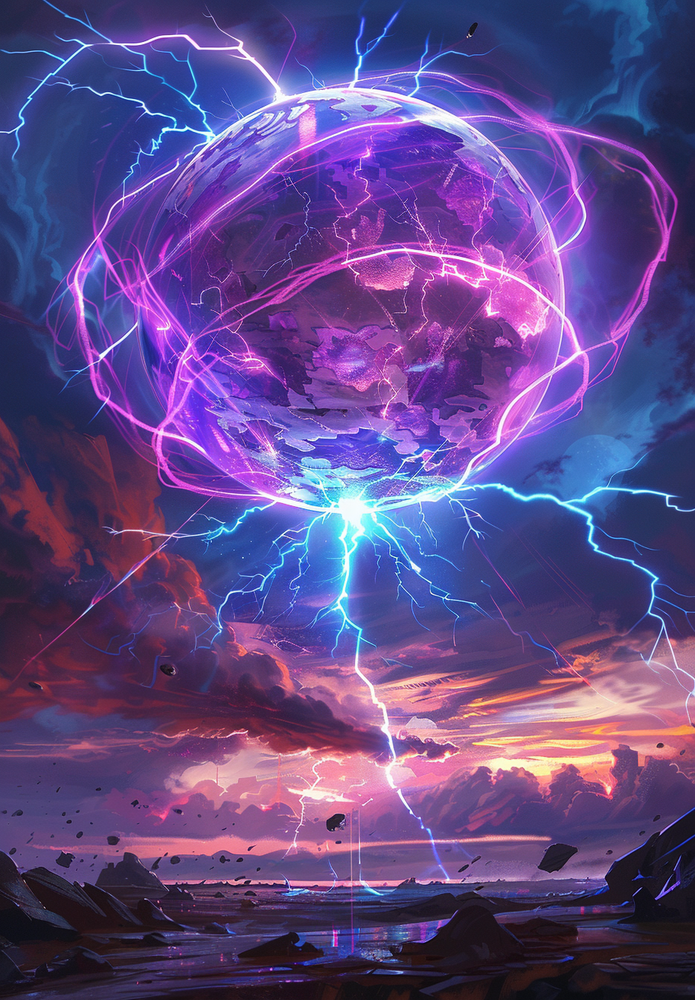 | ❤️ **PV:** 830 ⚔️ **Attaque:** 28 🛡️ **Défense:** 13  🎯 **Critique:** 3% 🌀 **Esquive:** 1% 🔍 **Précision:** 99% | **Sphère Shock** ➡️ Dégâts: 1.1 | Cible: 1 ennemi aléatoire | CD: 1t  &nbsp; |

---

### **Fulminia, Valkyrie de l'Orage**
**Élément:** Foudre  | **Rareté:** Rare

| **Image**                          | **Stats**                          | **Capacités**                     |
|------------------------------------|------------------------------------|-----------------------------------|
| 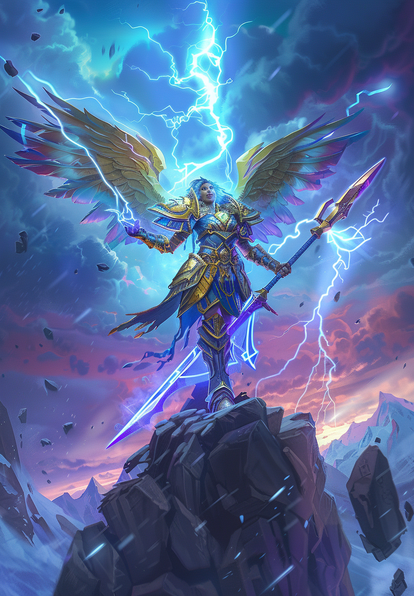 | ❤️ **PV:** 940 ⚔️ **Attaque:** 29 🛡️ **Défense:** 17  🎯 **Critique:** 3% 🌀 **Esquive:** 1% 🔍 **Précision:** 99% | **Éclair Tranchant** ➡️ Dégâts: Attaque + 24 | Cible: 1 ennemi | CD: 1t  &nbsp; |

---

### **Stormy, Enfant de la Foudre**
**Élément:** Foudre  | **Rareté:** Peu Commun

| **Image**                          | **Stats**                          | **Capacités**                     |
|------------------------------------|------------------------------------|-----------------------------------|
| 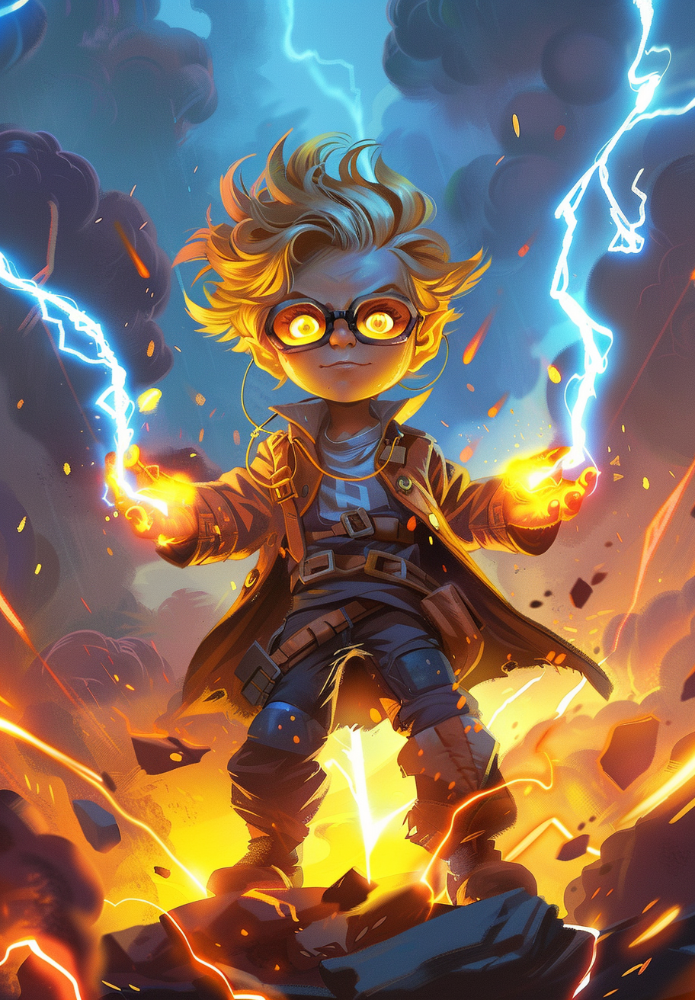 | ❤️ **PV:** 825 ⚔️ **Attaque:** 24 🛡️ **Défense:** 16  🎯 **Critique:** 3% 🌀 **Esquive:** 1% 🔍 **Précision:** 99% | **Morsure Statique** ➡️ Dégâts: 1.0 | Cible: 1 ennemi | CD: 1t  &nbsp; |

---

### **Voltania, Serpent Fulgurant**
**Élément:** Foudre  | **Rareté:** Rare

| **Image**                          | **Stats**                          | **Capacités**                     |
|------------------------------------|------------------------------------|-----------------------------------|
| 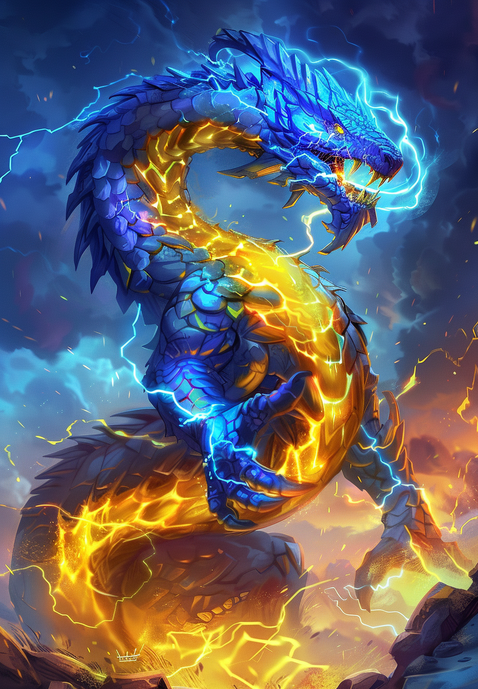 | ❤️ **PV:** 950 ⚔️ **Attaque:** 25 🛡️ **Défense:** 16  🎯 **Critique:** 3% 🌀 **Esquive:** 1% 🔍 **Précision:** 99% | **Morsure Fulgurante** ➡️ Dégâts: 1.0 | Cible: 1 ennemi | CD: 1t  **Double Frappe** ➡️ Dégâts: 0.8 | Cible: 1 ennemi | CD: 2t |

---

### **Voltar, Seigneur de l'Orage**
**Élément:** Foudre  | **Rareté:** Rare

| **Image**                          | **Stats**                          | **Capacités**                     |
|------------------------------------|------------------------------------|-----------------------------------|
| 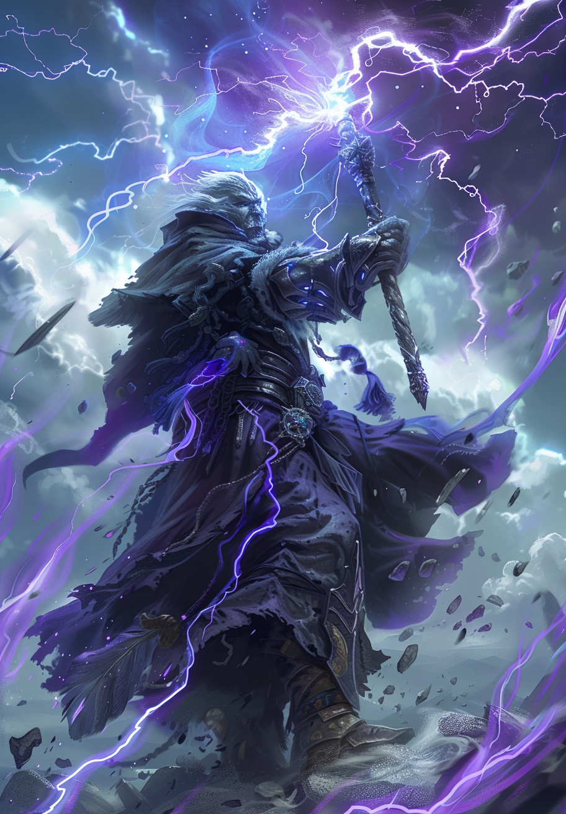 | ❤️ **PV:** 1080 ⚔️ **Attaque:** 28 🛡️ **Défense:** 18  🎯 **Critique:** 3% 🌀 **Esquive:** 1% 🔍 **Précision:** 99% | **Boule d'Énergie** ➡️ Dégâts: 1.2 | Cible: 1 ennemi aléatoire | CD: 1t  **Court-circuit** ➡️ Dégâts fixes: 28 | Cible: all_enemies | CD: 3t |

---

### **Voltix, Lutin Électrique**
**Élément:** Foudre  | **Rareté:** Épique

| **Image**                          | **Stats**                          | **Capacités**                     |
|------------------------------------|------------------------------------|-----------------------------------|
| 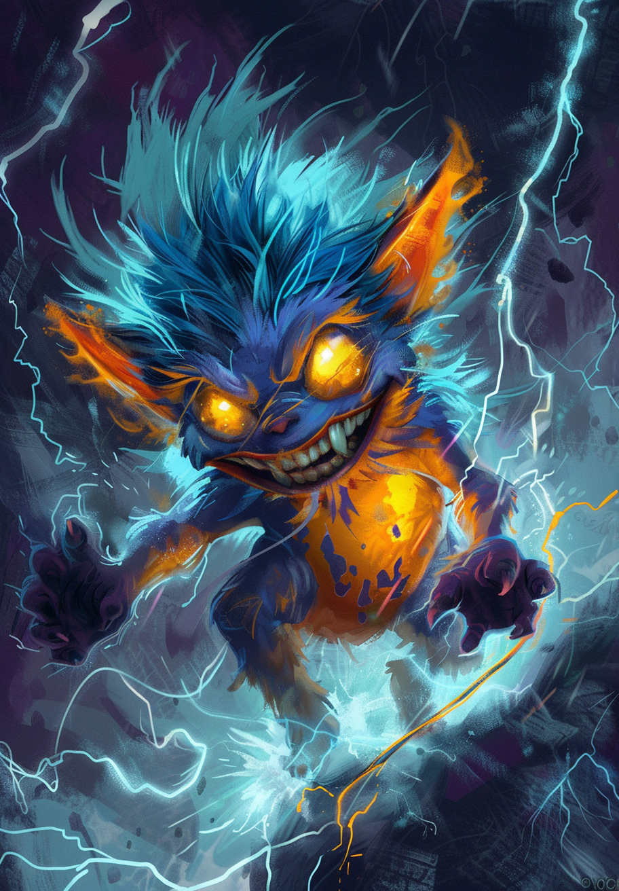 | ❤️ **PV:** 935 ⚔️ **Attaque:** 30 🛡️ **Défense:** 14  🎯 **Critique:** 3% 🌀 **Esquive:** 1% 🔍 **Précision:** 99% | **Foudre Bondissante** ➡️ Dégâts fixes: 37 | Cible: chain_enemies | CD: 3t  &nbsp; |

---

## Glace

### **Brumys, Fantôme du Givre**
**Élément:** Glace 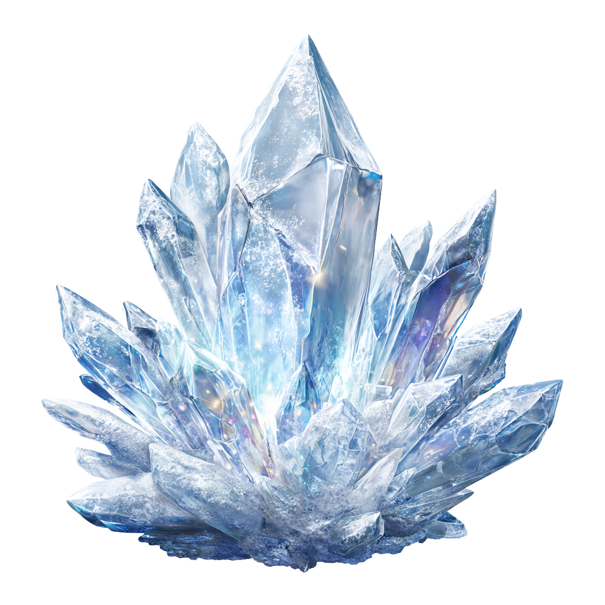 | **Rareté:** Rare

| **Image**                          | **Stats**                          | **Capacités**                     |
|------------------------------------|------------------------------------|-----------------------------------|
| 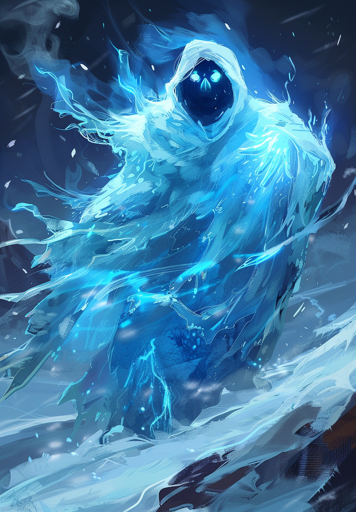 | ❤️ **PV:** 980 ⚔️ **Attaque:** 29 🛡️ **Défense:** 19  🎯 **Critique:** 3% 🌀 **Esquive:** 1% 🔍 **Précision:** 99% | **Attaque basique Glace** ➡️ Dégâts fixes: 20 | Cible: 1 ennemi | CD: 1t  &nbsp; |

---

### **Cryomage, Mage du Givre**
**Élément:** Glace  | **Rareté:** Rare

| **Image**                          | **Stats**                          | **Capacités**                     |
|------------------------------------|------------------------------------|-----------------------------------|
| 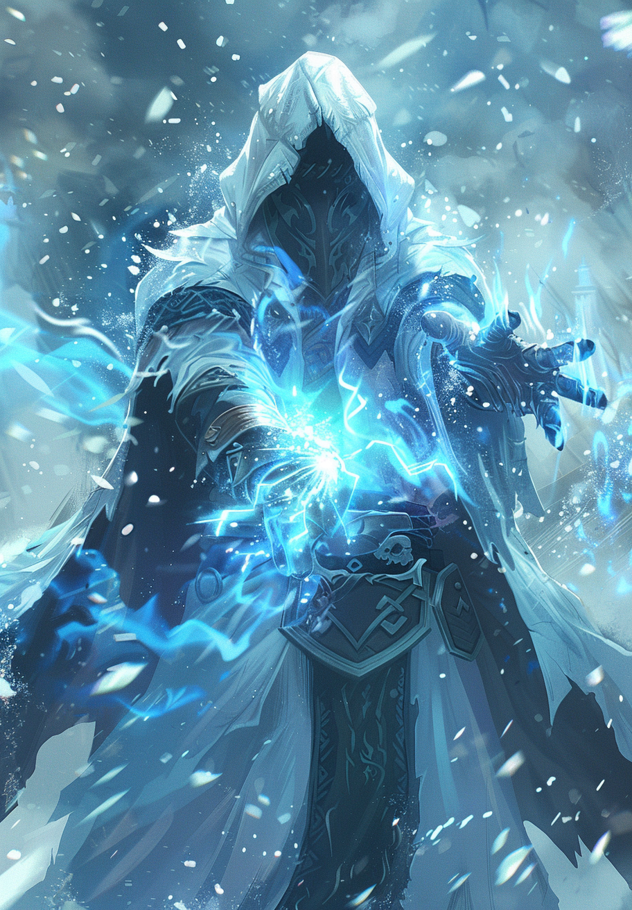 | ❤️ **PV:** 1290 ⚔️ **Attaque:** 24 🛡️ **Défense:** 36  🎯 **Critique:** 3% 🌀 **Esquive:** 1% 🔍 **Précision:** 99% | **Attaque basique Glace** ➡️ Dégâts fixes: 20 | Cible: 1 ennemi | CD: 1t  &nbsp; |

---

### **Frimousse, Esprit Givré**
**Élément:** Glace  | **Rareté:** Commun

| **Image**                          | **Stats**                          | **Capacités**                     |
|------------------------------------|------------------------------------|-----------------------------------|
|  | ❤️ **PV:** 780 ⚔️ **Attaque:** 23 🛡️ **Défense:** 13  🎯 **Critique:** 3% 🌀 **Esquive:** 1% 🔍 **Précision:** 99% | **Attaque basique Glace** ➡️ Dégâts fixes: 20 | Cible: 1 ennemi | CD: 1t  &nbsp; |

---

### **Galádra, Matriarche du Givre**
**Élément:** Glace  | **Rareté:** Rare

| **Image**                          | **Stats**                          | **Capacités**                     |
|------------------------------------|------------------------------------|-----------------------------------|
| 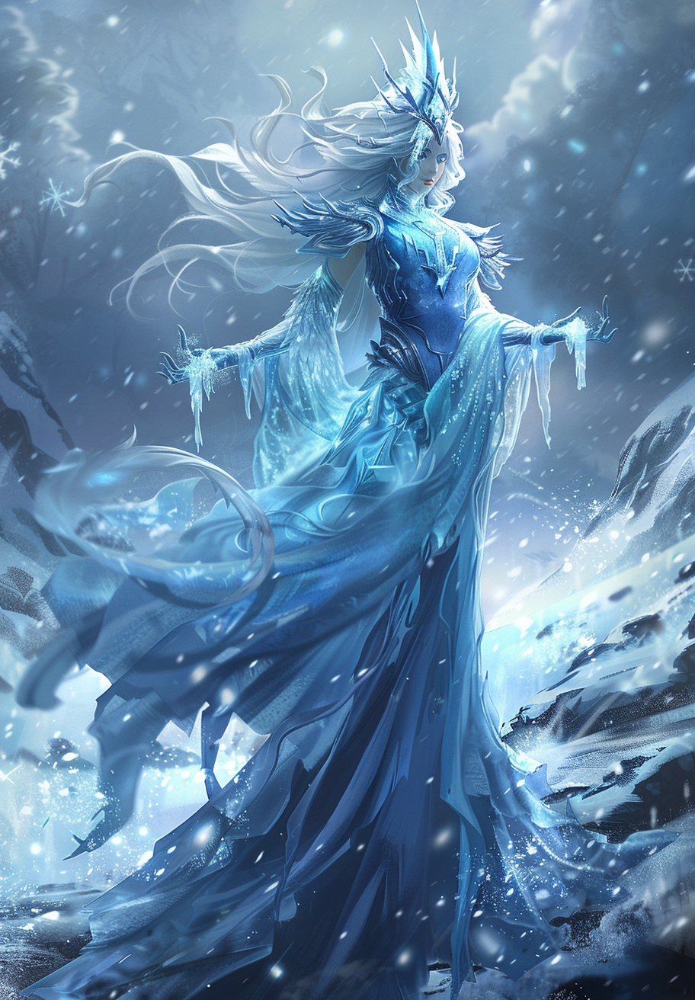 | ❤️ **PV:** 1040 ⚔️ **Attaque:** 29 🛡️ **Défense:** 19  🎯 **Critique:** 3% 🌀 **Esquive:** 1% 🔍 **Précision:** 99% | **Étreinte Maternelle** ➡️ Cible: all_allies | CD: 3t  **Regard de Givre** ➡️ Dégâts fixes: 22 | Cible: 1 ennemi | CD: 2t |

---

### **Gelgor, Troll du Givre**
**Élément:** Glace  | **Rareté:** Rare

| **Image**                          | **Stats**                          | **Capacités**                     |
|------------------------------------|------------------------------------|-----------------------------------|
| 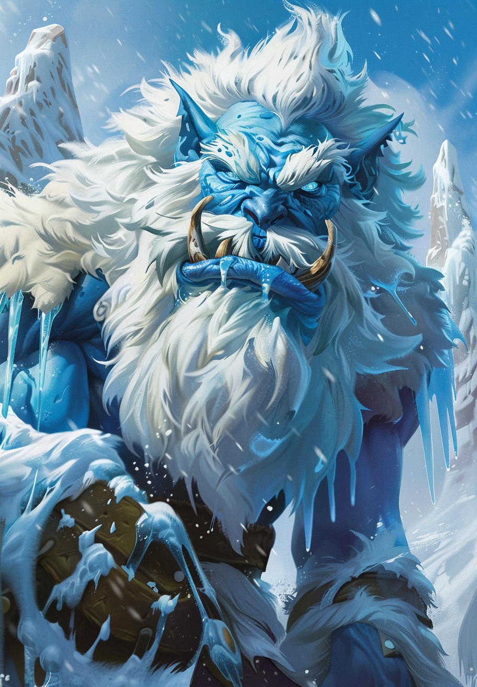 | ❤️ **PV:** 1040 ⚔️ **Attaque:** 32 🛡️ **Défense:** 19  🎯 **Critique:** 3% 🌀 **Esquive:** 1% 🔍 **Précision:** 99% | **Attaque basique Glace** ➡️ Dégâts fixes: 20 | Cible: 1 ennemi | CD: 1t  &nbsp; |

---

### **Gelidar, Chevalier des Neiges**
**Élément:** Glace  | **Rareté:** Spécial

| **Image**                          | **Stats**                          | **Capacités**                     |
|------------------------------------|------------------------------------|-----------------------------------|
|  | ❤️ **PV:** 1100 ⚔️ **Attaque:** 25 🛡️ **Défense:** 28  🎯 **Critique:** 3% 🌀 **Esquive:** 1% 🔍 **Précision:** 99% | **Frappe Boréale** ➡️ Dégâts: Attaque + 22 | Cible: 1 ennemi | CD: 1t  &nbsp; |

---

### **Glacia, Yéti Polaire**
**Élément:** Glace  | **Rareté:** Peu Commun

| **Image**                          | **Stats**                          | **Capacités**                     |
|------------------------------------|------------------------------------|-----------------------------------|
| 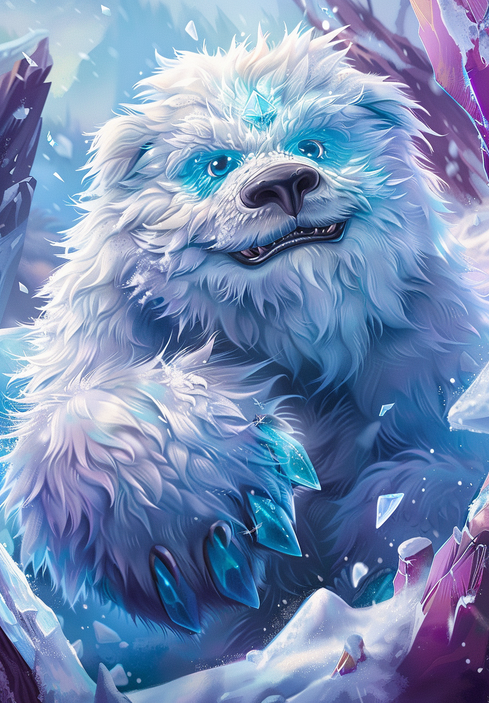 | ❤️ **PV:** 945 ⚔️ **Attaque:** 25 🛡️ **Défense:** 20  🎯 **Critique:** 3% 🌀 **Esquive:** 1% 🔍 **Précision:** 99% | **Attaque basique Glace** ➡️ Dégâts fixes: 20 | Cible: 1 ennemi | CD: 1t  &nbsp; |

---

### **Glaciar, Yéti des Sommets**
**Élément:** Glace  | **Rareté:** Rare

| **Image**                          | **Stats**                          | **Capacités**                     |
|------------------------------------|------------------------------------|-----------------------------------|
| 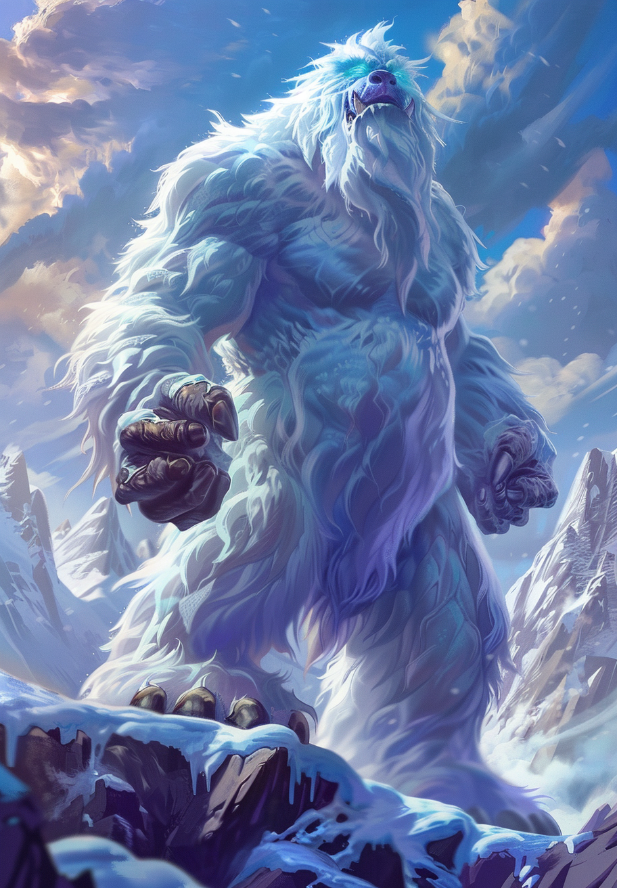 | ❤️ **PV:** 920 ⚔️ **Attaque:** 31 🛡️ **Défense:** 14  🎯 **Critique:** 3% 🌀 **Esquive:** 1% 🔍 **Précision:** 99% | **Choc des Neiges** ➡️ Dégâts: Attaque + 24 | Cible: 1 ennemi aléatoire | CD: 2t  &nbsp; |

---

### **Glacielle, Reine des Flocons**
**Élément:** Glace  | **Rareté:** Épique

| **Image**                          | **Stats**                          | **Capacités**                     |
|------------------------------------|------------------------------------|-----------------------------------|
| 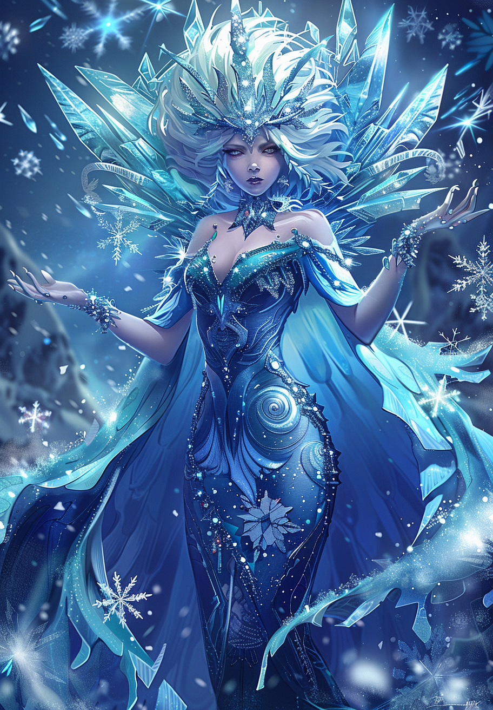 | ❤️ **PV:** 1092 ⚔️ **Attaque:** 30 🛡️ **Défense:** 21  🎯 **Critique:** 3% 🌀 **Esquive:** 1% 🔍 **Précision:** 99% | **Avalanche Royale** ➡️ Dégâts fixes: 45 | Cible: all_enemies | CD: 3t  &nbsp; |

---

### **Gélax, Lutin de la Banquise**
**Élément:** Glace  | **Rareté:** Commun

| **Image**                          | **Stats**                          | **Capacités**                     |
|------------------------------------|------------------------------------|-----------------------------------|
| 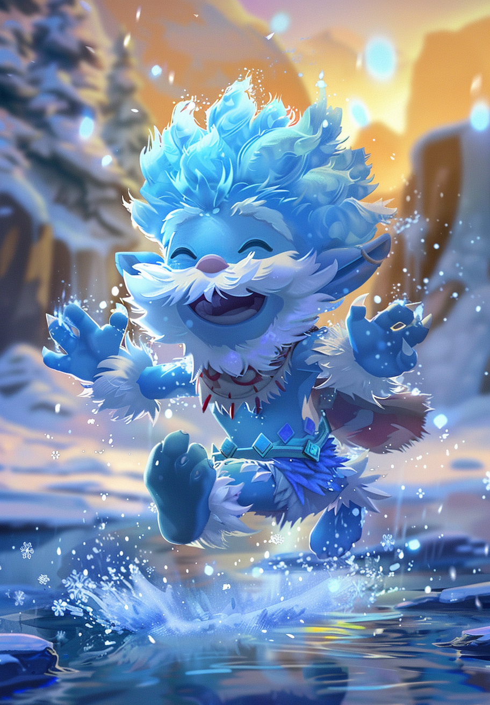 | ❤️ **PV:** 810 ⚔️ **Attaque:** 20 🛡️ **Défense:** 16  🎯 **Critique:** 3% 🌀 **Esquive:** 1% 🔍 **Précision:** 99% | **Attaque basique Glace** ➡️ Dégâts fixes: 20 | Cible: 1 ennemi | CD: 1t  &nbsp; |

---

### **Tundrorr, Mammouth Givré**
**Élément:** Glace  | **Rareté:** Mythique

| **Image**                          | **Stats**                          | **Capacités**                     |
|------------------------------------|------------------------------------|-----------------------------------|
| 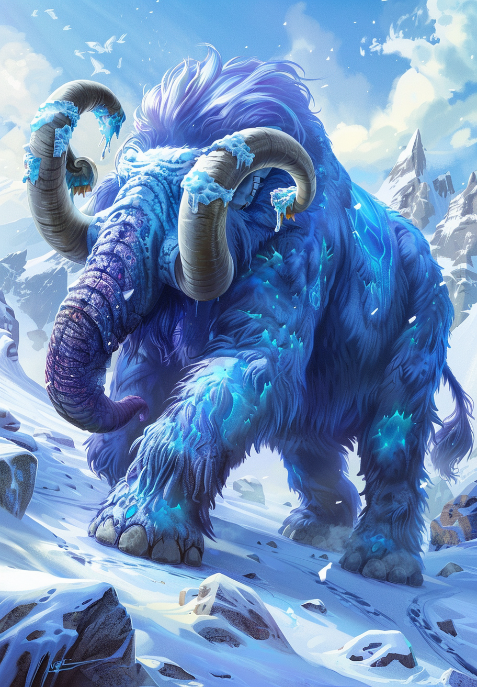 | ❤️ **PV:** 1075 ⚔️ **Attaque:** 34 🛡️ **Défense:** 22  🎯 **Critique:** 3% 🌀 **Esquive:** 1% 🔍 **Précision:** 99% | **Charge Polaire** ➡️ Dégâts: 2.0 | Cible: front_row | CD: 4t  &nbsp; |

---

## Lumière

### **Astrilys, Sentinelle Astrale**
**Élément:** Lumière 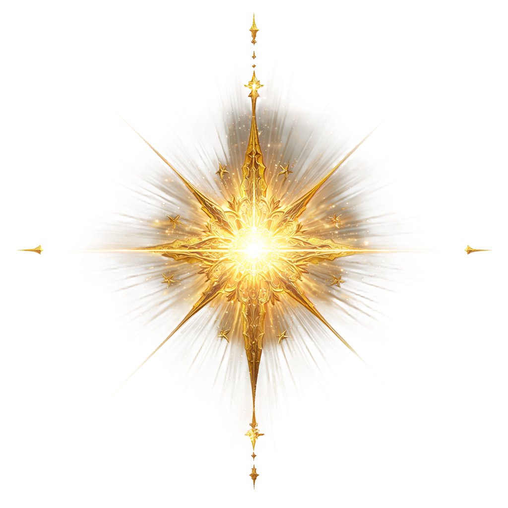 | **Rareté:** Peu Commun

| **Image**                          | **Stats**                          | **Capacités**                     |
|------------------------------------|------------------------------------|-----------------------------------|
| 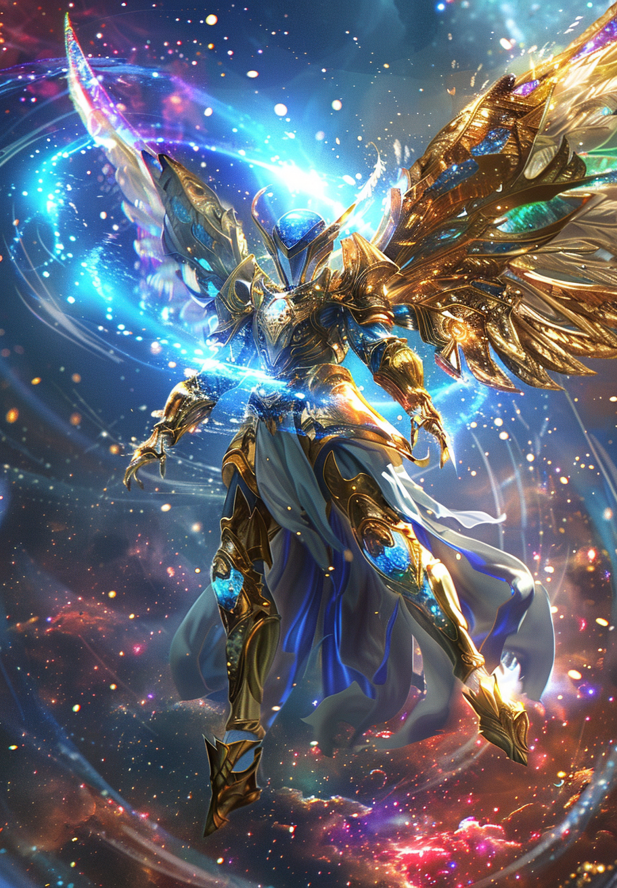 | ❤️ **PV:** 800 ⚔️ **Attaque:** 23 🛡️ **Défense:** 15  🎯 **Critique:** 3% 🌀 **Esquive:** 1% 🔍 **Précision:** 99% | **Rayon Purificateur** ➡️ Dégâts: Attaque + 15 | Cible: 1 ennemi | CD: 1t  &nbsp; |

---

### **Lumicorne, Licorne Dorée**
**Élément:** Lumière  | **Rareté:** Peu Commun

| **Image**                          | **Stats**                          | **Capacités**                     |
|------------------------------------|------------------------------------|-----------------------------------|
| 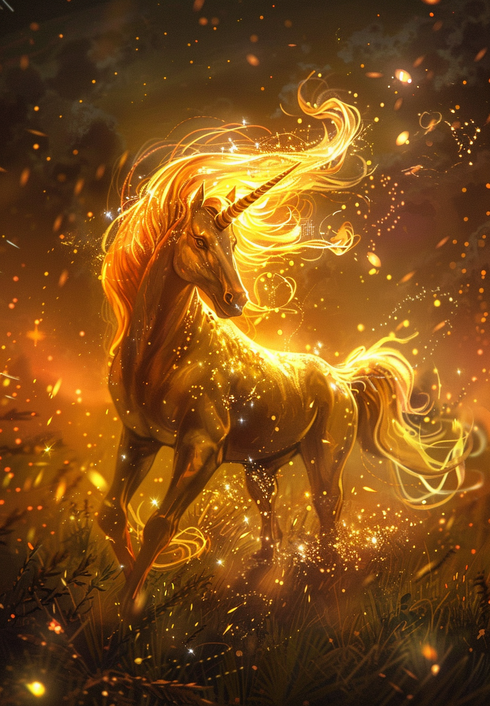 | ❤️ **PV:** 830 ⚔️ **Attaque:** 28 🛡️ **Défense:** 11  🎯 **Critique:** 3% 🌀 **Esquive:** 1% 🔍 **Précision:** 99% | **Charge Lumineuse** ➡️ Dégâts: 1.2 | Cible: 1 ennemi | CD: 1t  &nbsp; |

---

### **Lumys, Renardeau Solaire**
**Élément:** Lumière  | **Rareté:** Mythique

| **Image**                          | **Stats**                          | **Capacités**                     |
|------------------------------------|------------------------------------|-----------------------------------|
|  | ❤️ **PV:** 1030 ⚔️ **Attaque:** 38 🛡️ **Défense:** 21  🎯 **Critique:** 3% 🌀 **Esquive:** 1% 🔍 **Précision:** 99% | **Flamboiement Radieux** ➡️ Dégâts: 0.8 | Cible: all_enemies | CD: 3t  **Halo Espoir** ➡️ Cible: all_allies | CD: 5t |

---

### **Prismalyx, Papillon Lumineux**
**Élément:** Lumière  | **Rareté:** Épique

| **Image**                          | **Stats**                          | **Capacités**                     |
|------------------------------------|------------------------------------|-----------------------------------|
|  | ❤️ **PV:** 861 ⚔️ **Attaque:** 28 🛡️ **Défense:** 14  🎯 **Critique:** 3% 🌀 **Esquive:** 1% 🔍 **Précision:** 99% | **Éclat Prismatique** ➡️ Dégâts: Attaque + 19 | Cible: 1 ennemi aléatoire | CD: 1t  **Danse Iridescente** ➡️ Cible: all_allies | CD: 5t |

---

## Poison

### **Briselys, Dryade Mousseuse**
**Élément:** Poison 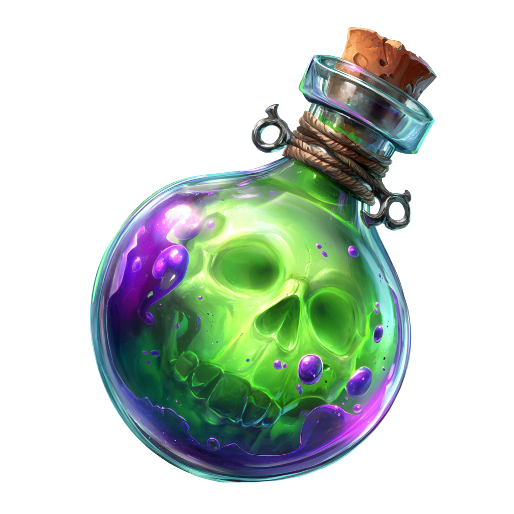 | **Rareté:** Rare

| **Image**                          | **Stats**                          | **Capacités**                     |
|------------------------------------|------------------------------------|-----------------------------------|
|  | ❤️ **PV:** 870 ⚔️ **Attaque:** 28 🛡️ **Défense:** 14  🎯 **Critique:** 3% 🌀 **Esquive:** 1% 🔍 **Précision:** 99% | **Jet Moussu** ➡️ Dégâts: Attaque + 19 | Cible: 1 ennemi aléatoire | CD: 1t  &nbsp; |

---

### **Crotignus, Crotte de Nez Mouvante**
**Élément:** Poison  | **Rareté:** Épique

| **Image**                          | **Stats**                          | **Capacités**                     |
|------------------------------------|------------------------------------|-----------------------------------|
| 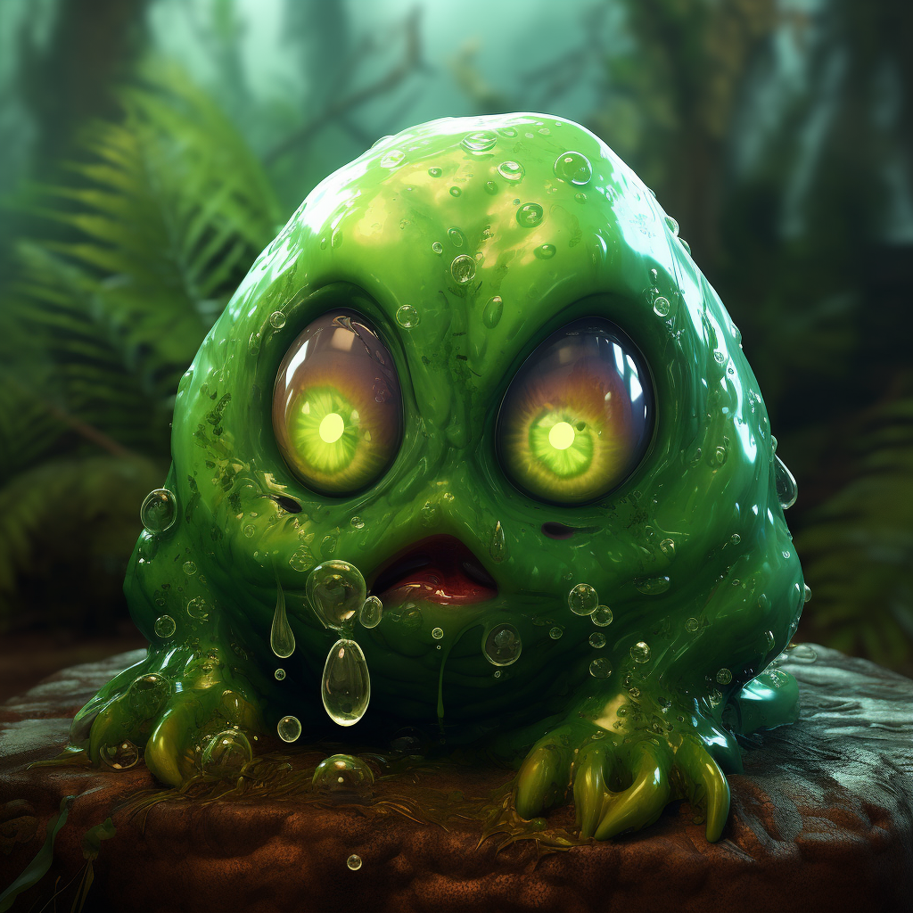 | ❤️ **PV:** 780 ⚔️ **Attaque:** 19 🛡️ **Défense:** 16  🎯 **Critique:** 3% 🌀 **Esquive:** 2% 🔍 **Précision:** 99% | **Lancer de CDN** ➡️ Dégâts fixes: 10 | Cible: 1 ennemi aléatoire | CD: 2t  &nbsp; |

---

### **Floralia, Druidesse des Fleurs**
**Élément:** Poison  | **Rareté:** Peu Commun

| **Image**                          | **Stats**                          | **Capacités**                     |
|------------------------------------|------------------------------------|-----------------------------------|
| 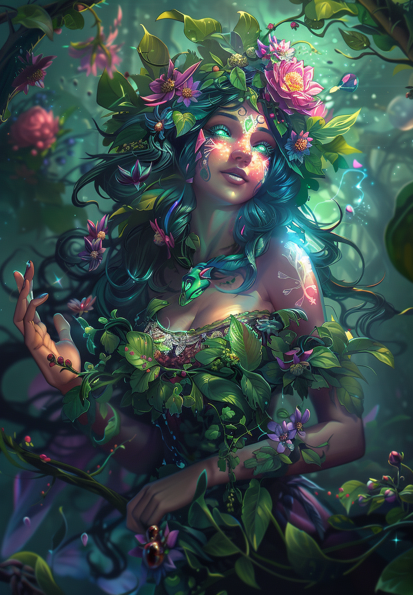 | ❤️ **PV:** 990 ⚔️ **Attaque:** 22 🛡️ **Défense:** 28  🎯 **Critique:** 3% 🌀 **Esquive:** 1% 🔍 **Précision:** 99% | **Attaque basique Poison** ➡️ Dégâts fixes: 20 | Cible: 1 ennemi | CD: 1t  **Poussée Toxique** ➡️ Dégâts: Attaque + 23 | Cible: 1 ennemi | CD: 3t |

---

### **Mossio, Shaman des Mousses**
**Élément:** Poison  | **Rareté:** Mythique

| **Image**                          | **Stats**                          | **Capacités**                     |
|------------------------------------|------------------------------------|-----------------------------------|
| 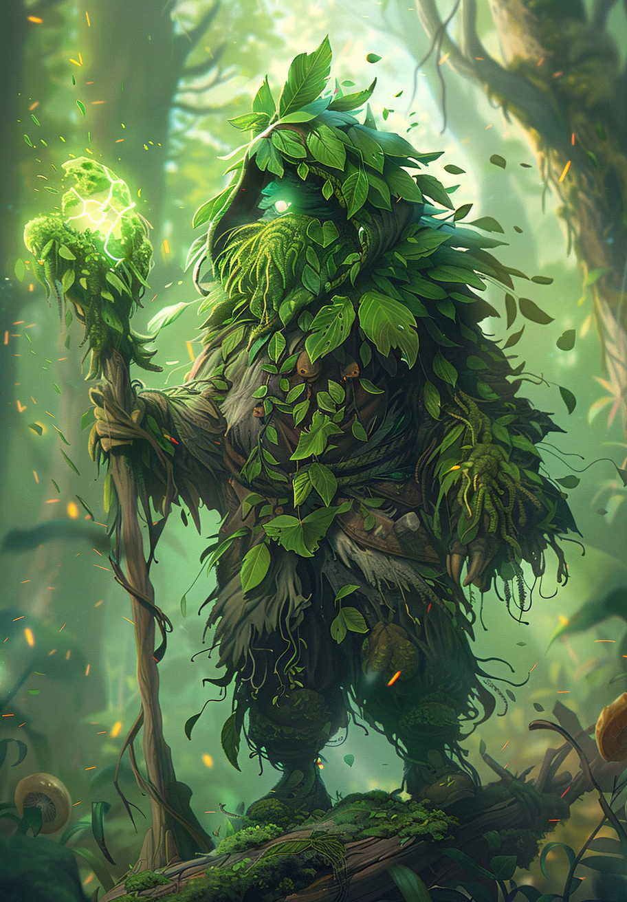 | ❤️ **PV:** 1020 ⚔️ **Attaque:** 36 🛡️ **Défense:** 21  🎯 **Critique:** 3% 🌀 **Esquive:** 1% 🔍 **Précision:** 99% | **Vague Nécrotique** ➡️ Dégâts: 0.7 | Cible: all_enemies | CD: 3t  **Attaque basique Poison** ➡️ Dégâts fixes: 20 | Cible: 1 ennemi | CD: 1t |

---

### **Sylvara, Esprit de la Canopée**
**Élément:** Poison  | **Rareté:** Mythique

| **Image**                          | **Stats**                          | **Capacités**                     |
|------------------------------------|------------------------------------|-----------------------------------|
|  | ❤️ **PV:** 1220 ⚔️ **Attaque:** 39 🛡️ **Défense:** 27  🎯 **Critique:** 3% 🌀 **Esquive:** 1% 🔍 **Précision:** 99% | **Essence Mortelle** ➡️ Dégâts: Attaque + 44 | Cible: 1 ennemi | CD: 2t  **Toxine Mortelle** ➡️ Dégâts fixes: 10 | Cible: 1 ennemi aléatoire | CD: 4t |

---

### **Sylvert, Gardien de la Brume**
**Élément:** Poison  | **Rareté:** Peu Commun

| **Image**                          | **Stats**                          | **Capacités**                     |
|------------------------------------|------------------------------------|-----------------------------------|
|  | ❤️ **PV:** 1200 ⚔️ **Attaque:** 25 🛡️ **Défense:** 34  🎯 **Critique:** 3% 🌀 **Esquive:** 1% 🔍 **Précision:** 99% | **Ronce Empoisonnée** ➡️ Dégâts: 1.0 | Cible: 1 ennemi | CD: 1t  **Brouillard Corrosif** ➡️ Dégâts: 0.7 | Cible: all_enemies | CD: 6t |

---

## Terre

### **Barbak, Guerrier Barbare**
**Élément:** Terre 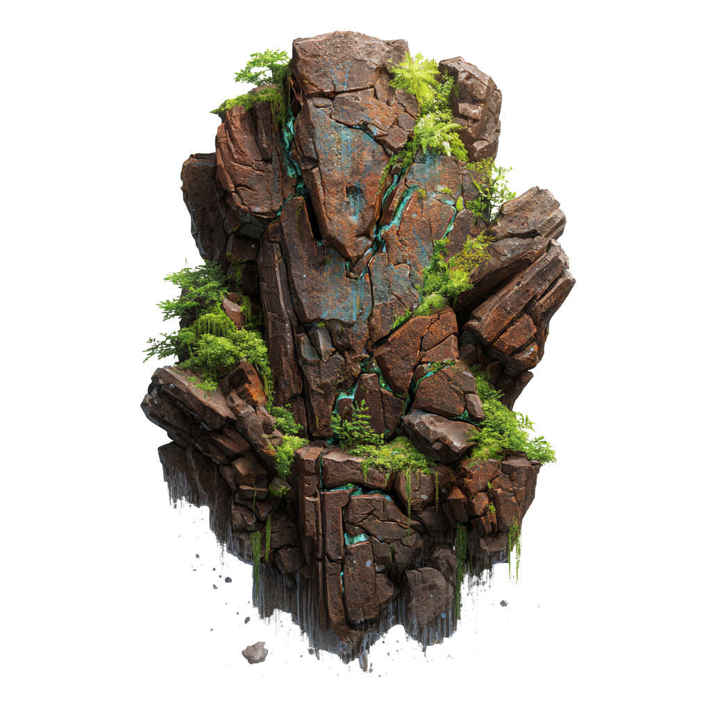 | **Rareté:** Rare

| **Image**                          | **Stats**                          | **Capacités**                     |
|------------------------------------|------------------------------------|-----------------------------------|
| 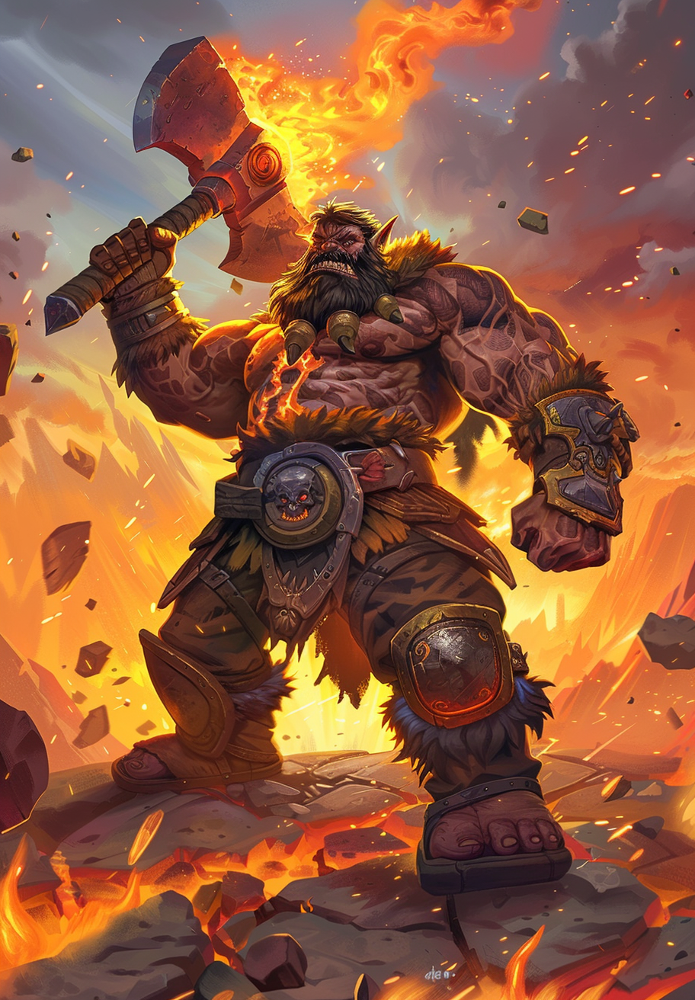 | ❤️ **PV:** 1130 ⚔️ **Attaque:** 32 🛡️ **Défense:** 18  🎯 **Critique:** 3% 🌀 **Esquive:** 1% 🔍 **Précision:** 99% | **Heurtoir** ➡️ Dégâts: 1.0 | Cible: 1 ennemi | CD: 1t  **Rage Berseker** ➡️ Cible: self | CD: 2t |

---

### **Bersi, Nain Invincible**
**Élément:** Terre  | **Rareté:** Peu Commun

| **Image**                          | **Stats**                          | **Capacités**                     |
|------------------------------------|------------------------------------|-----------------------------------|
| 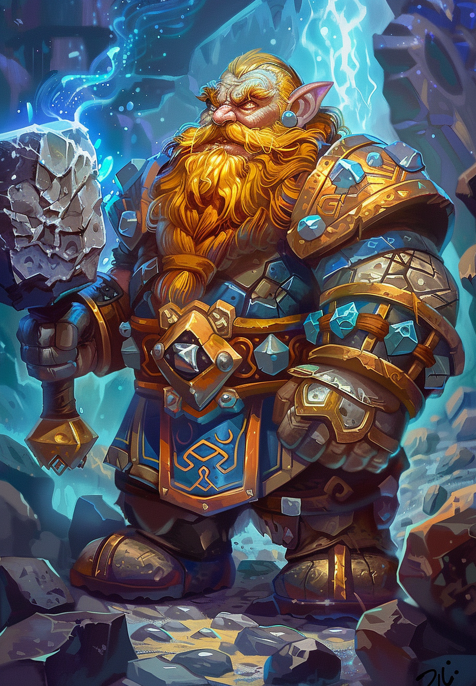 | ❤️ **PV:** 1160 ⚔️ **Attaque:** 26 🛡️ **Défense:** 30  🎯 **Critique:** 3% 🌀 **Esquive:** 1% 🔍 **Précision:** 99% | **Haine Naine** ➡️ Cible: 1 ennemi | CD: 1t  &nbsp; |

---

### **Gladrith, Écho des montagnes**
**Élément:** Terre  | **Rareté:** Rare

| **Image**                          | **Stats**                          | **Capacités**                     |
|------------------------------------|------------------------------------|-----------------------------------|
| 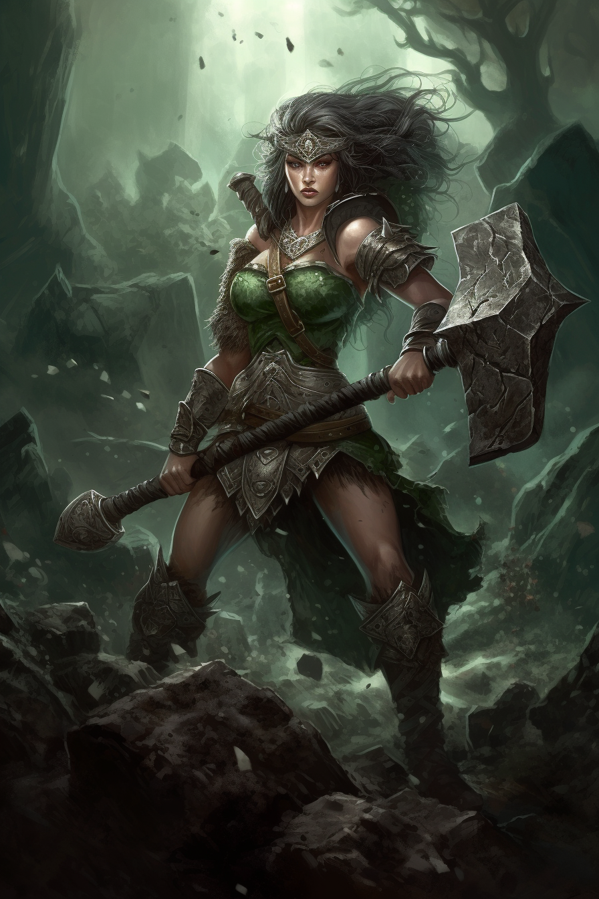 | ❤️ **PV:** 780 ⚔️ **Attaque:** 31 🛡️ **Défense:** 15  🎯 **Critique:** 3% 🌀 **Esquive:** 1% 🔍 **Précision:** 99% | **Frappe sismique** ➡️ Dégâts: 1.0 | Cible: 1 ennemi aléatoire | CD: 2t  &nbsp; |

---

### **Lithos, Colosse de Quartz**
**Élément:** Terre  | **Rareté:** Épique

| **Image**                          | **Stats**                          | **Capacités**                     |
|------------------------------------|------------------------------------|-----------------------------------|
| 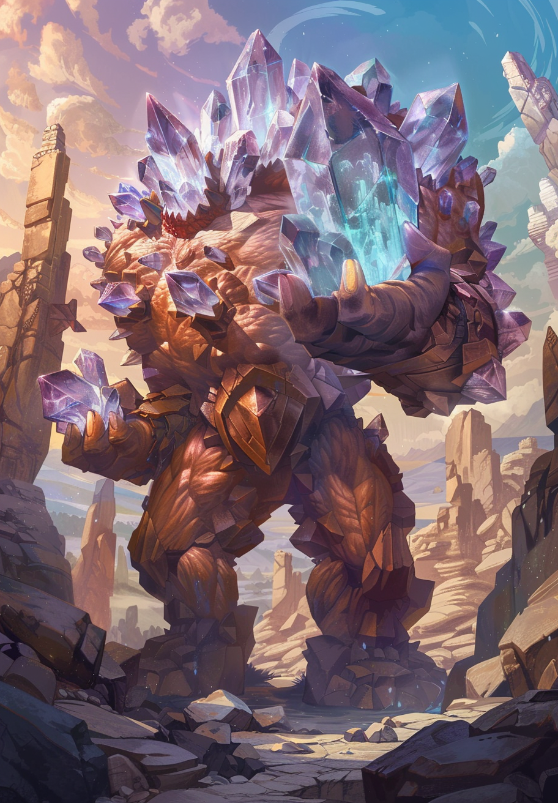 | ❤️ **PV:** 990 ⚔️ **Attaque:** 37 🛡️ **Défense:** 16  🎯 **Critique:** 3% 🌀 **Esquive:** 1% 🔍 **Précision:** 99% | **Briseur de Montagne** ➡️ Dégâts: 0.1 | Cible: 1 ennemi | CD: 5t  **Fureur Tellurique** ➡️ Dégâts: 0.05 | Cible: all_enemies | CD: 3t |

---

### **Lixor, Golem Cristallin**
**Élément:** Terre  | **Rareté:** Rare

| **Image**                          | **Stats**                          | **Capacités**                     |
|------------------------------------|------------------------------------|-----------------------------------|
| 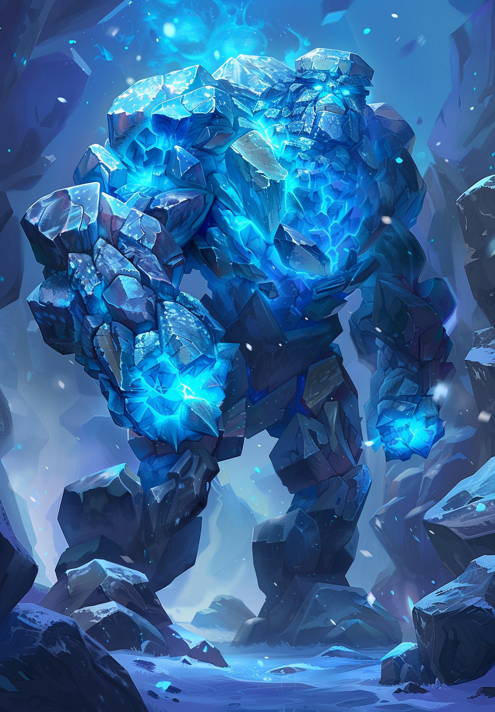 | ❤️ **PV:** 870 ⚔️ **Attaque:** 30 🛡️ **Défense:** 15  🎯 **Critique:** 3% 🌀 **Esquive:** 1% 🔍 **Précision:** 99% | **Brise-Roc** ➡️ Dégâts: 1.0 | Cible: 1 ennemi | CD: 4t  &nbsp; |

---

### **Lumberjack, Bûcheron du Grand Nord**
**Élément:** Terre  | **Rareté:** Rare

| **Image**                          | **Stats**                          | **Capacités**                     |
|------------------------------------|------------------------------------|-----------------------------------|
|  | ❤️ **PV:** 1190 ⚔️ **Attaque:** 28 🛡️ **Défense:** 29  🎯 **Critique:** 3% 🌀 **Esquive:** 1% 🔍 **Précision:** 99% | **Heurtoir** ➡️ Dégâts: 1.0 | Cible: 1 ennemi | CD: 1t  **Attaque basique Terre** ➡️ Dégâts fixes: 20 | Cible: 1 ennemi | CD: 1t |

---

### **Rock, Colosse de Granit**
**Élément:** Terre  | **Rareté:** Peu Commun

| **Image**                          | **Stats**                          | **Capacités**                     |
|------------------------------------|------------------------------------|-----------------------------------|
| 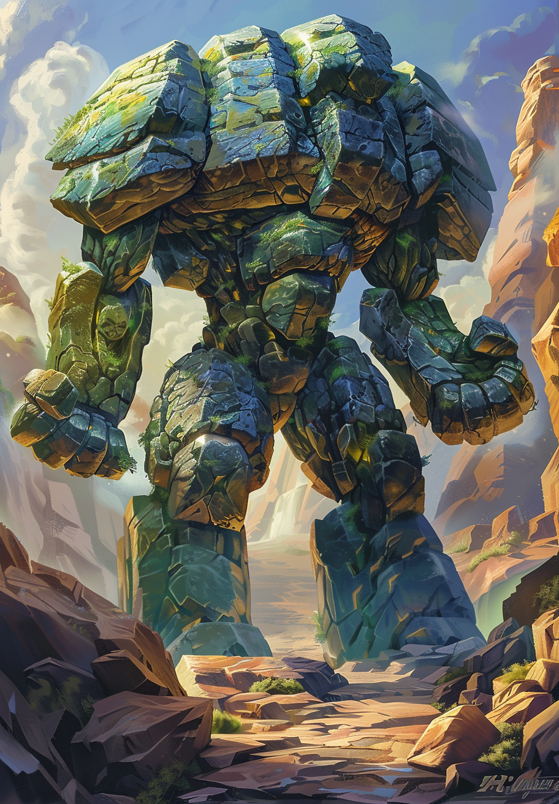 | ❤️ **PV:** 810 ⚔️ **Attaque:** 28 🛡️ **Défense:** 13  🎯 **Critique:** 3% 🌀 **Esquive:** 1% 🔍 **Précision:** 99% | **Attaque basique Terre** ➡️ Dégâts fixes: 20 | Cible: 1 ennemi | CD: 1t  &nbsp; |

---

### **Rocor, Gardien du Bloc**
**Élément:** Terre  | **Rareté:** Peu Commun

| **Image**                          | **Stats**                          | **Capacités**                     |
|------------------------------------|------------------------------------|-----------------------------------|
|  | ❤️ **PV:** 880 ⚔️ **Attaque:** 22 🛡️ **Défense:** 17  🎯 **Critique:** 3% 🌀 **Esquive:** 1% 🔍 **Précision:** 99% | **Attaque basique Terre** ➡️ Dégâts fixes: 20 | Cible: 1 ennemi | CD: 1t  **Lancer Tellurique** ➡️ Dégâts: Attaque + 40 | Cible: 1 ennemi | CD: 3t |

---

### **Roktus, Gobelin Mineur**
**Élément:** Terre  | **Rareté:** Peu Commun

| **Image**                          | **Stats**                          | **Capacités**                     |
|------------------------------------|------------------------------------|-----------------------------------|
| 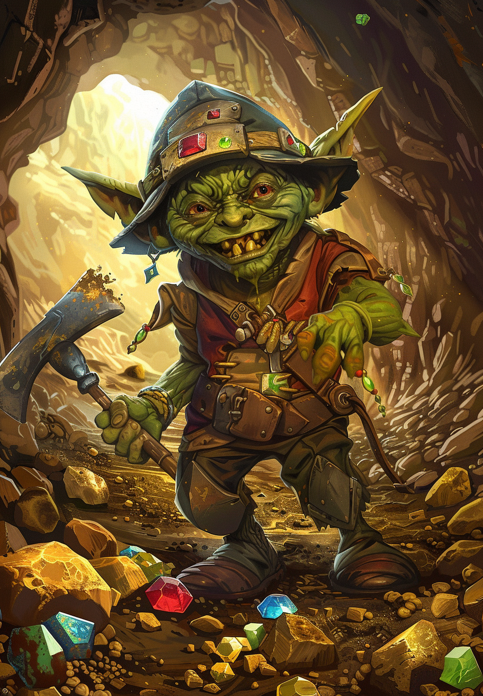 | ❤️ **PV:** 845 ⚔️ **Attaque:** 26 🛡️ **Défense:** 12  🎯 **Critique:** 3% 🌀 **Esquive:** 1% 🔍 **Précision:** 99% | **Piège à Pétards** ➡️ Dégâts fixes: 28 | Cible: 1 ennemi | CD: 3t  **Dynamite** ➡️ Dégâts fixes: 80 | Cible: 1 ennemi aléatoire | CD: 3t |

---

### **Silex, Gardien du Pic Rugueux**
**Élément:** Terre  | **Rareté:** Rare

| **Image**                          | **Stats**                          | **Capacités**                     |
|------------------------------------|------------------------------------|-----------------------------------|
| 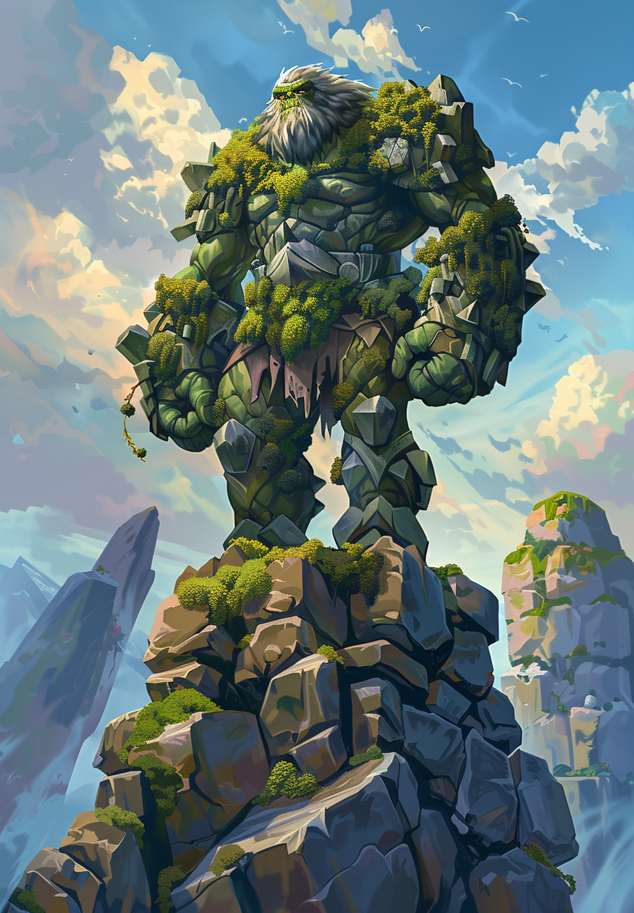 | ❤️ **PV:** 900 ⚔️ **Attaque:** 31 🛡️ **Défense:** 14  🎯 **Critique:** 3% 🌀 **Esquive:** 1% 🔍 **Précision:** 99% | **Lancer Tellurique** ➡️ Dégâts: Attaque + 40 | Cible: 1 ennemi | CD: 3t  **Armure de roche** ➡️ Cible: self | CD: 3t |

---

### **Telluron, Géant de Schiste**
**Élément:** Terre  | **Rareté:** Épique

| **Image**                          | **Stats**                          | **Capacités**                     |
|------------------------------------|------------------------------------|-----------------------------------|
| 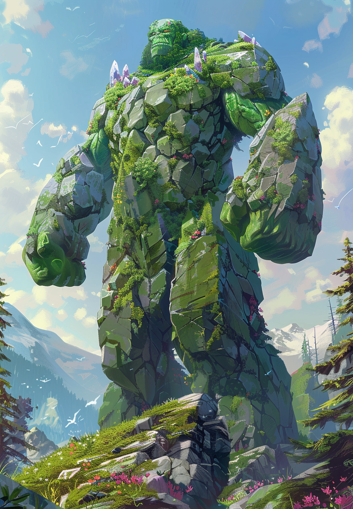 | ❤️ **PV:** 830 ⚔️ **Attaque:** 29 🛡️ **Défense:** 14  🎯 **Critique:** 3% 🌀 **Esquive:** 1% 🔍 **Précision:** 99% | **Brise-Roc** ➡️ Dégâts: 1.0 | Cible: 1 ennemi | CD: 4t  **Glissement de Terrain** ➡️ Dégâts: 0.8 | Cible: 1 ennemi | CD: 3t |

---

### **Terra, Sorcière de la Terre**
**Élément:** Terre  | **Rareté:** Rare

| **Image**                          | **Stats**                          | **Capacités**                     |
|------------------------------------|------------------------------------|-----------------------------------|
| 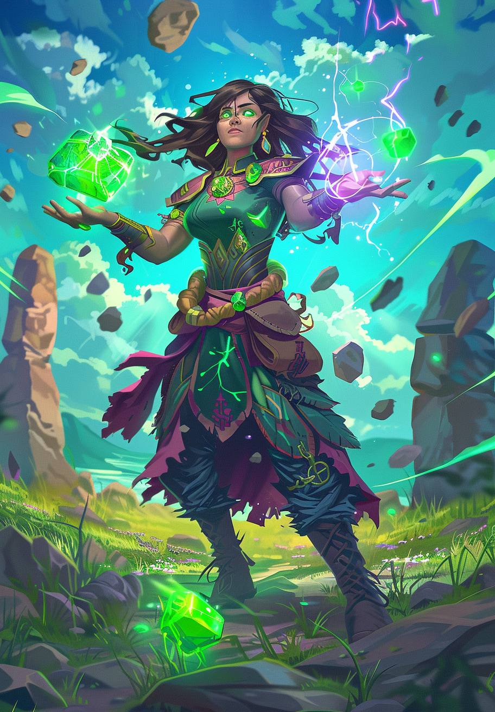 | ❤️ **PV:** 1400 ⚔️ **Attaque:** 18 🛡️ **Défense:** 41  🎯 **Critique:** 3% 🌀 **Esquive:** 1% 🔍 **Précision:** 99% | **Éboulement** ➡️ Dégâts fixes: 40 | Cible: chain_enemies | CD: 6t  **Attaque basique Terre** ➡️ Dégâts fixes: 20 | Cible: 1 ennemi | CD: 1t |

---

## Ténèbres

### **Murkax, Ombre Rampante**
**Élément:** Ténèbres  | **Rareté:** Épique

| **Image**                          | **Stats**                          | **Capacités**                     |
|------------------------------------|------------------------------------|-----------------------------------|
| 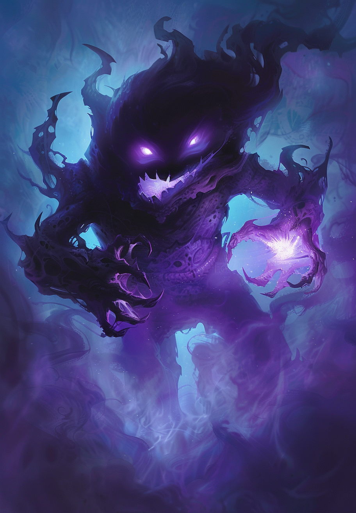 | ❤️ **PV:** 1300 ⚔️ **Attaque:** 39 🛡️ **Défense:** 24  🎯 **Critique:** 3% 🌀 **Esquive:** 1% 🔍 **Précision:** 99% | **Griffes de l'Abîme** ➡️ Dégâts: Attaque + 30 | Cible: 1 ennemi | CD: 2t  **Voile d'Éclipsombre** ➡️ Dégâts: 0.7 | Cible: all_enemies | CD: 4t |

---

