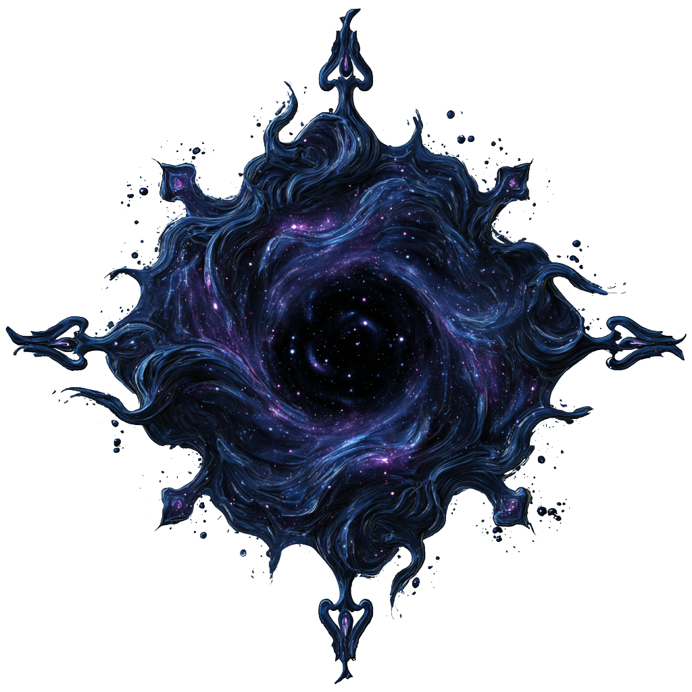
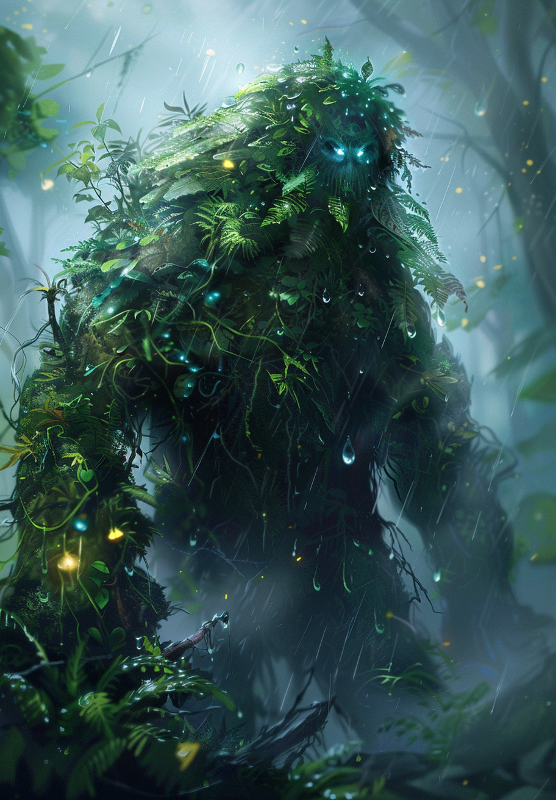

# 📚 Catalogue des Unités

Ce catalogue présente toutes les unités disponibles dans le jeu, groupées par élément avec des sections repliables.

## 📋 Légende

**Statistiques :**
- ❤️ **PV :** Points de vie
- ⚔️ **Attaque :** Dégâts de base
- 🛡️ **Défense :** Réduction des dégâts reçus
- 🎯 **Critique :** Chance de coup critique (%)
- 🌀 **Esquive :** Chance d'esquiver une attaque (%)
- 🔍 **Précision :** Chance de toucher la cible (%)

## 📖 Unités par Élément

<strong>Air</strong> <em>(Cliquez pour afficher)</em>

### Air

### **Aeris, Esprit du Zéphyr**
**Élément:** Air  | **Rareté:** Épique

| **Image**                          | **Stats**                          | **Capacités**                     |
|------------------------------------|------------------------------------|-----------------------------------|
|  | ❤️ **PV:** 950 ⚔️ **Attaque:** 35 🛡️ **Défense:** 12  🯠**Critique:** 3% 🌀 **Esquive:** 1% 🔠**Précision:** 99% |  **Baiser Alizée** (Esq+40% (1t) • Crit+30% (1t) • Cible: 1 allié • CD: 2t) Un baiser mystérieux qui fait planer quiconque en est la cible   **Rapidité Aérienne** (Reset CDs • Cible: 1 allié • CD: 8t) La rapidité est telle qu'on ne la voit plus |

---

### **Corvus, Corbeau Mystique**
**Élément:** Air  | **Rareté:** Épique

| **Image**                          | **Stats**                          | **Capacités**                     |
|------------------------------------|------------------------------------|-----------------------------------|
|  | ❤️ **PV:** 1113 ⚔️ **Attaque:** 33 🛡️ **Défense:** 21  🯠**Critique:** 3% 🌀 **Esquive:** 1% 🔠**Précision:** 99% |  **3ème Oeil** (Silence (1t) • Cible: 1 ennemi aléa • CD: 3t) La vision du futur est réservée qu'a peu d'être vivant   **Malédiction** (Cible: 1 ennemi aléa • CD: 1t) Une malédiction aussi puissante que mystérieuse |

---

### **Galaxine, Voyageuse Céleste**
**Élément:** Air  | **Rareté:** Mythique

| **Image**                          | **Stats**                          | **Capacités**                     |
|------------------------------------|------------------------------------|-----------------------------------|
|  | ❤️ **PV:** 1100 ⚔️ **Attaque:** 36 🛡️ **Défense:** 19  🯠**Critique:** 3% 🌀 **Esquive:** 1% 🔠**Précision:** 99% |  **Pluie de Météores** (DMG: 6 • Cible: 20 aléatoires • CD: 4t) Une pluie de météores s'abats   **Lueur de la Voie Lactée** (Cible: self • CD: 4t) Une bande blanchâtre et floue dans le ciel nocturne qui compose notre galaxie   **Poussière d'Aurore** (Cible: 1 ennemi • CD: 2t) Un nuage iridescent entoure sa cible |

---

### **Nébulaire, Magicienne du Brouillard**
**Élément:** Air  | **Rareté:** Épique

| **Image**                          | **Stats**                          | **Capacités**                     |
|------------------------------------|------------------------------------|-----------------------------------|
|  | ❤️ **PV:** 1010 ⚔️ **Attaque:** 35 🛡️ **Défense:** 15  🯠**Critique:** 3% 🌀 **Esquive:** 1% 🔠**Précision:** 99% |  **Avancée du Brouillard** (Esq+20% (1t) • Permanent • Cible: Soi+alliés • CD: 6t) Un brouillard apparait et s'épaiçit   **Orage** (DMG: 11 • DMG/tour: 11 (3t) • Cible: 3 aléatoires • CD: 3t) Un orage qui fait s'abbatre la foudre sur le champ de bataille |

---

### **Nébulo, Fantôme du Brouillard**
**Élément:** Air  | **Rareté:** Mythique

| **Image**                          | **Stats**                          | **Capacités**                     |
|------------------------------------|------------------------------------|-----------------------------------|
|  | ❤️ **PV:** 1220 ⚔️ **Attaque:** 25 🛡️ **Défense:** 34  🯠**Critique:** 3% 🌀 **Esquive:** 1% 🔠**Précision:** 99% |  **Apparition Nébuleuse** (Cible: self • CD: 3t) Disparition dans la brume avant de réapparaitre pour une attaque sournoise   **Emprise du Brouillard** (DMG: 60 • Cible: all_enemies • CD: 2t) Une brume spectrale et glaciale qui s'étend silencieusement sur le champ de bataille |

---

### **Orbaline, Magicienne Astrale**
**Élément:** Air  | **Rareté:** Rare

| **Image**                          | **Stats**                          | **Capacités**                     |
|------------------------------------|------------------------------------|-----------------------------------|
|  | ❤️ **PV:** 870 ⚔️ **Attaque:** 35 🛡️ **Défense:** 10  🯠**Critique:** 3% 🌀 **Esquive:** 1% 🔠**Précision:** 99% |  **Orbe Astrale** (DMG: ATK+30 • Crit+10% (2t) • Cible: 1 ennemi • CD: 2t) Formée à partir d'air, puis glacée, cette orbe est aussi véloce que mortelle   **Attaque basique Air** (DMG: 20 • Cible: 1 ennemi • CD: 1t) Attaque basique de Air |

---

### **Skyla, Danseuse des Nuages**
**Élément:** Air  | **Rareté:** Rare

| **Image**                          | **Stats**                          | **Capacités**                     |
|------------------------------------|------------------------------------|-----------------------------------|
|  | ❤️ **PV:** 1010 ⚔️ **Attaque:** 28 🛡️ **Défense:** 21  🯠**Critique:** 3% 🌀 **Esquive:** 1% 🔠**Précision:** 99% |  **Danse des Alizés** (Crit+20% (1t) • Cible: all_allies • CD: 3t) Une danse majestueuse et aussi gracieuse que le vent   **Symphonie de l'Air** (Cible: 1 allié • CD: 2t) Au rythme d'une danse invisible, l'air vibre et s'anime |

---

### **Stratos, Esprit des Courants**
**Élément:** Air  | **Rareté:** Épique

| **Image**                          | **Stats**                          | **Capacités**                     |
|------------------------------------|------------------------------------|-----------------------------------|
|  | ❤️ **PV:** 950 ⚔️ **Attaque:** 42 🛡️ **Défense:** 12  🯠**Critique:** 3% 🌀 **Esquive:** 1% 🔠**Précision:** 99% |  **Voile Astral** (Cible: self • CD: 4t) Une brume d'air céleste se répand, rendant la créature presque intangible   **Souffle de la Nébuleuse** (DMG: ATK+40 • Permanent • Cible: 1 ennemi • CD: 2t) Dans une grande inspiration, la créature convoque l'énergie astrale de l'air |

---

### **Sylphar, Archer de la Canopée**
**Élément:** Air  | **Rareté:** Rare

| **Image**                          | **Stats**                          | **Capacités**                     |
|------------------------------------|------------------------------------|-----------------------------------|
|  | ❤️ **PV:** 960 ⚔️ **Attaque:** 29 🛡️ **Défense:** 18  🯠**Critique:** 3% 🌀 **Esquive:** 1% 🔠**Précision:** 99% |  **Tir Sylvestre** (DMG: 45 • Cible: 1 ennemi • CD: 2t) Un Tir imbibé du pouvoir de l'air |

---

### **Tempestra, Danseuse de la Tornade**
**Élément:** Air  | **Rareté:** Peu Commun

| **Image**                          | **Stats**                          | **Capacités**                     |
|------------------------------------|------------------------------------|-----------------------------------|
|  | ❤️ **PV:** 760 ⚔️ **Attaque:** 27 🛡️ **Défense:** 15  🯠**Critique:** 3% 🌀 **Esquive:** 1% 🔠**Précision:** 99% |  **Attaque basique Air** (DMG: 20 • Cible: 1 ennemi • CD: 1t) Attaque basique de Air |

---

### **Zepho, Génie des Courants**
**Élément:** Air  | **Rareté:** Peu Commun

| **Image**                          | **Stats**                          | **Capacités**                     |
|------------------------------------|------------------------------------|-----------------------------------|
|  | ❤️ **PV:** 865 ⚔️ **Attaque:** 29 🛡️ **Défense:** 11  🯠**Critique:** 3% 🌀 **Esquive:** 1% 🔠**Précision:** 99% |  **Attaque basique Air** (DMG: 20 • Cible: 1 ennemi • CD: 1t) Attaque basique de Air |

---

### **Zyklair, Djinn des Rafales**
**Élément:** Air  | **Rareté:** Rare

| **Image**                          | **Stats**                          | **Capacités**                     |
|------------------------------------|------------------------------------|-----------------------------------|
|  | ❤️ **PV:** 940 ⚔️ **Attaque:** 28 🛡️ **Défense:** 15  🯠**Critique:** 3% 🌀 **Esquive:** 1% 🔠**Précision:** 99% |  **Attaque basique Air** (DMG: 20 • Cible: 1 ennemi • CD: 1t) Attaque basique de Air |

---

### **Zéphara, Valkyrie des Vents**
**Élément:** Air  | **Rareté:** Épique

| **Image**                          | **Stats**                          | **Capacités**                     |
|------------------------------------|------------------------------------|-----------------------------------|
|  | ❤️ **PV:** 980 ⚔️ **Attaque:** 34 🛡️ **Défense:** 22  🯠**Critique:** 3% 🌀 **Esquive:** 1% 🔠**Précision:** 99% |  **Égide Aérienne** (Réduc: 20% • Cible: 1 allié • CD: 2t) Une puissante barrière de vent tourbillonnant   **Lames du Mistral** (DMG: ATK+30 • Cible: 1 ennemi • CD: 2t) Invoque des courants tranchants et invisibles |

---

<strong>Eau</strong> <em>(Cliquez pour afficher)</em>

### Eau

### **Abyssalor, Kraken des Profondeurs**
**Élément:** Eau  | **Rareté:** Rare

| **Image**                          | **Stats**                          | **Capacités**                     |
|------------------------------------|------------------------------------|-----------------------------------|
|  | ❤️ **PV:** 1160 ⚔️ **Attaque:** 30 🛡️ **Défense:** 27  🯠**Critique:** 3% 🌀 **Esquive:** 1% 🔠**Précision:** 99% |  **Voile d'Encre** (Esq+30% (2t) • Cible: Soi+alliés • CD: 5t) Un voile d'encre magique envahit le champ de bataille obstruant la vue des ennemis   **Coup de Tentacule** (DMG: 0.6 • Cible: 2 aléatoires • CD: 1t) Un coup de tentacule géant balayant une large zone |

---

### **Abyssine, Félin des Profondeurs**
**Élément:** Eau  | **Rareté:** Peu Commun

| **Image**                          | **Stats**                          | **Capacités**                     |
|------------------------------------|------------------------------------|-----------------------------------|
|  | ❤️ **PV:** 1020 ⚔️ **Attaque:** 21 🛡️ **Défense:** 23  🯠**Critique:** 3% 🌀 **Esquive:** 1% 🔠**Précision:** 99% |  **Voile Aquatique** (Esq+20% (2t) • Cible: self • CD: 3t) Se sert de l'eau comme d'un voile pour refléter l'environnement et s'y fondre   **Griffure Abyssale** (DMG: ATK+60 • Cible: 1 ennemi • CD: 2t) Une lacération qui surgit des tréfonds |

---

### **Aquaria, Sirène Mystique**
**Élément:** Eau  | **Rareté:** Épique

| **Image**                          | **Stats**                          | **Capacités**                     |
|------------------------------------|------------------------------------|-----------------------------------|
|  | ❤️ **PV:** 1029 ⚔️ **Attaque:** 30 🛡️ **Défense:** 20  🯠**Critique:** 3% 🌀 **Esquive:** 1% 🔠**Précision:** 99% |  **Mélodie Hypnotique** (Silence (1t) • Cible: chain_random • CD: 6t) Une douce musique qui ensorcèle celui qui l'écoute |

---

### **Cristaline, Ondine Pure**
**Élément:** Eau  | **Rareté:** Commun

| **Image**                          | **Stats**                          | **Capacités**                     |
|------------------------------------|------------------------------------|-----------------------------------|
|  | ❤️ **PV:** 840 ⚔️ **Attaque:** 21 🛡️ **Défense:** 11  🯠**Critique:** 3% 🌀 **Esquive:** 1% 🔠**Précision:** 99% |  **Ca coule de source** (Cible: 1 allié • CD: 1t) Une eau de source qui revitalise ! |

---

### **Nixie, Fée de la Source**
**Élément:** Eau  | **Rareté:** Rare

| **Image**                          | **Stats**                          | **Capacités**                     |
|------------------------------------|------------------------------------|-----------------------------------|
|  | ❤️ **PV:** 890 ⚔️ **Attaque:** 32 🛡️ **Défense:** 12  🯠**Critique:** 3% 🌀 **Esquive:** 1% 🔠**Précision:** 99% |  **Larmes Féerique** (DMG: 40 • Cible: 1 allié • CD: 2t) Des larmes aux propriétées soignante |

---

### **Siriona, Enchanteresse des Abysses**
**Élément:** Eau  | **Rareté:** Épique

| **Image**                          | **Stats**                          | **Capacités**                     |
|------------------------------------|------------------------------------|-----------------------------------|
|  | ❤️ **PV:** 1200 ⚔️ **Attaque:** 26 🛡️ **Défense:** 34  🯠**Critique:** 3% 🌀 **Esquive:** 1% 🔠**Précision:** 99% |  **Étreinte Liquide** (DMG: 30 • Cible: 1 ennemi • CD: 2t) Une main faites d'eau vient étreindre sa cible   **Torrent Ensorcelé** (DMG: 160 • Cible: 1 ennemi • CD: 4t) Torrent magique dévastateur |

---

### **Torrentis, Gardien de l'Écume**
**Élément:** Eau  | **Rareté:** Commun

| **Image**                          | **Stats**                          | **Capacités**                     |
|------------------------------------|------------------------------------|-----------------------------------|
|  | ❤️ **PV:** 780 ⚔️ **Attaque:** 19 🛡️ **Défense:** 19  🯠**Critique:** 3% 🌀 **Esquive:** 1% 🔠**Précision:** 99% |  **Attaque basique Eau** (DMG: 20 • Cible: 1 ennemi • CD: 1t) Attaque basique de Eau |

---

### **Torrick, Gardien du Torrent**
**Élément:** Eau  | **Rareté:** Mythique

| **Image**                          | **Stats**                          | **Capacités**                     |
|------------------------------------|------------------------------------|-----------------------------------|
|  | ❤️ **PV:** 1350 ⚔️ **Attaque:** 39 🛡️ **Défense:** 24  🯠**Critique:** 3% 🌀 **Esquive:** 1% 🔠**Précision:** 99% |  **Soin Protecteur** (Cible: 1 allié • CD: 3t) Grâce au pouvoir de son bouclier combinée à sa magie, il soigne et protège une cible   **Coup Tranchant** (DMG: 30 • Cible: 1 ennemi • CD: 1t) Un coup d'épée runique, on dit que le porteur est revigorer à chaque attaque portée |

---

### **Typhion, Léviathan du Maelström**
**Élément:** Eau  | **Rareté:** Mythique

| **Image**                          | **Stats**                          | **Capacités**                     |
|------------------------------------|------------------------------------|-----------------------------------|
|  | ❤️ **PV:** 1111 ⚔️ **Attaque:** 44 🛡️ **Défense:** 16  🯠**Critique:** 3% 🌀 **Esquive:** 1% 🔠**Précision:** 99% |  **Typhon** (DMG: 80 • Cible: all_enemies • CD: 3t) Un immense Typhon qui emporte tout   **Avalement** (DMG: ATK+100 • Cible: 1 ennemi • CD: 4t) Avale sa cible   **Cri Abyssale** (Cible: 1 allié • CD: 4t) Un cri qui pousse quiconque qui l'entends à se surpasser de peur de devenir un encas |

---

<strong>Feu</strong> <em>(Cliquez pour afficher)</em>

### Feu

### **Firocus, Renard Volcanique**
**Élément:** Feu  | **Rareté:** Épique

| **Image**                          | **Stats**                          | **Capacités**                     |
|------------------------------------|------------------------------------|-----------------------------------|
|  | ❤️ **PV:** 872 ⚔️ **Attaque:** 33 🛡️ **Défense:** 14  🯠**Critique:** 3% 🌀 **Esquive:** 1% 🔠**Précision:** 99% |  **Attaque basique Feu** (DMG: 20 • Cible: 1 ennemi • CD: 1t) Attaque basique de Feu   **Attaque basique Feu** (DMG: 20 • Cible: 1 ennemi • CD: 1t) Attaque basique de Feu |

---

### **Flamby, Lutin des Flammes**
**Élément:** Feu  | **Rareté:** Spécial

| **Image**                          | **Stats**                          | **Capacités**                     |
|------------------------------------|------------------------------------|-----------------------------------|
|  | ❤️ **PV:** 710 ⚔️ **Attaque:** 17 🛡️ **Défense:** 8  🯠**Critique:** 3% 🌀 **Esquive:** 1% 🔠**Précision:** 99% |  **Graine Enflammée** (DMG: 5 • Cible: 1 ennemi aléa • CD: 1t) Lance des graines enflammées qui explosent après un certain temps   **Graine Explosive** (DMG: 20 • Cible: 1 ennemi • CD: 2t) Lance une graine qui explose au contact |

---

### **Ignarok, Roc en Fusion**
**Élément:** Feu  | **Rareté:** Rare

| **Image**                          | **Stats**                          | **Capacités**                     |
|------------------------------------|------------------------------------|-----------------------------------|
|  | ❤️ **PV:** 870 ⚔️ **Attaque:** 28 🛡️ **Défense:** 16  🯠**Critique:** 3% 🌀 **Esquive:** 1% 🔠**Précision:** 99% |  **Lancer Tellurique** (DMG: ATK+40 • Cible: 1 ennemi • CD: 3t) Lance un énorme rocher qui peut étourdir   **Pierre Enflammée** (DMG: 0.7 • Cible: 1 ennemi • CD: 1t) Lance de petite pierre enflammée |

---

### **Ignissia, Sorcière des Brasiers**
**Élément:** Feu  | **Rareté:** Commun

| **Image**                          | **Stats**                          | **Capacités**                     |
|------------------------------------|------------------------------------|-----------------------------------|
|  | ❤️ **PV:** 850 ⚔️ **Attaque:** 23 🛡️ **Défense:** 15  🯠**Critique:** 3% 🌀 **Esquive:** 1% 🔠**Précision:** 99% |  **Attaque basique Feu** (DMG: 20 • Cible: 1 ennemi • CD: 1t) Attaque basique de Feu |

---

### **Incendior, Dragon de Feu**
**Élément:** Feu  | **Rareté:** Rare

| **Image**                          | **Stats**                          | **Capacités**                     |
|------------------------------------|------------------------------------|-----------------------------------|
|  | ❤️ **PV:** 940 ⚔️ **Attaque:** 27 🛡️ **Défense:** 18  🯠**Critique:** 3% 🌀 **Esquive:** 1% 🔠**Précision:** 99% |  **Souffle Enflammé** (DMG: ATK+20 • Cible: chain_random • CD: 3t) Terrible souffle de flamme se déchaînant sur le champ de bataille |

---

### **Pyraxis, Élémentaire de Magma**
**Élément:** Feu  | **Rareté:** Peu Commun

| **Image**                          | **Stats**                          | **Capacités**                     |
|------------------------------------|------------------------------------|-----------------------------------|
|  | ❤️ **PV:** 780 ⚔️ **Attaque:** 25 🛡️ **Défense:** 13  🯠**Critique:** 3% 🌀 **Esquive:** 1% 🔠**Précision:** 99% |  **Rocher Magmatique** (DMG: 1.1 • Cible: 1 ennemi • CD: 2t) Lance un rocher en fusion qui explose à l'impact |

---

### **Pyrodrake, Dragon de Braise**
**Élément:** Feu  | **Rareté:** Mythique

| **Image**                          | **Stats**                          | **Capacités**                     |
|------------------------------------|------------------------------------|-----------------------------------|
|  | ❤️ **PV:** 1200 ⚔️ **Attaque:** 35 🛡️ **Défense:** 22  🯠**Critique:** 3% 🌀 **Esquive:** 1% 🔠**Précision:** 99% |  **Souffle Enflammé** (DMG: ATK+20 • Cible: chain_random • CD: 3t) Terrible souffle de flamme se déchaînant sur le champ de bataille   **Tourbillon de Flamme** (DMG: 2.0 • Cible: 1 ennemi aléa • CD: 6t) Absorbe la chaleur environnante avant de cracher du feu |

---

### **Pyrolynx, Lynx Ardent**
**Élément:** Feu  | **Rareté:** Épique

| **Image**                          | **Stats**                          | **Capacités**                     |
|------------------------------------|------------------------------------|-----------------------------------|
|  | ❤️ **PV:** 870 ⚔️ **Attaque:** 35 🛡️ **Défense:** 17  🯠**Critique:** 3% 🌀 **Esquive:** 1% 🔠**Précision:** 99% |  **Coup de Griffe Ardente** (DMG: 0.6 • Cible: 1 ennemi • CD: 2t) Lacère sa cible de coups de griffe rapides |

---

### **Pyropoulpe, Poulpe Incandescent**
**Élément:** Feu  | **Rareté:** Peu Commun

| **Image**                          | **Stats**                          | **Capacités**                     |
|------------------------------------|------------------------------------|-----------------------------------|
|  | ❤️ **PV:** 995 ⚔️ **Attaque:** 30 🛡️ **Défense:** 18  🯠**Critique:** 3% 🌀 **Esquive:** 1% 🔠**Précision:** 99% |  **Torrent Ardent** (DMG: 30 • Cible: 2 aléatoires • CD: 5t) Vague de flammes tourbillonnantes |

---

### **Rubra, Salamandre Incandescente**
**Élément:** Feu  | **Rareté:** Peu Commun

| **Image**                          | **Stats**                          | **Capacités**                     |
|------------------------------------|------------------------------------|-----------------------------------|
|  | ❤️ **PV:** 780 ⚔️ **Attaque:** 21 🛡️ **Défense:** 12  🯠**Critique:** 3% 🌀 **Esquive:** 1% 🔠**Précision:** 99% |  **Griffe acérée** (DMG: ATK+15 • Cible: 1 ennemi • CD: 1t) Griffe enflammée (Attaque + 15)   **Coup de Langue** (DMG: 45 • Cible: 1 ennemi • CD: 3t) Sa langue s'allonge et frappe vivement sa proie |

---

### **Salamandra, Magicienne Incandescente**
**Élément:** Feu  | **Rareté:** Épique

| **Image**                          | **Stats**                          | **Capacités**                     |
|------------------------------------|------------------------------------|-----------------------------------|
|  | ❤️ **PV:** 950 ⚔️ **Attaque:** 30 🛡️ **Défense:** 16  🯠**Critique:** 3% 🌀 **Esquive:** 1% 🔠**Précision:** 99% |  **Flamme Foudroyante** (DMG: ATK+40 • Cible: 1 ennemi • CD: 3t) Sort de flamme aux propriétées électriques   **Décharge Incandescente** (DMG: ATK+40 • Cible: 1 ennemi • CD: 3t) Sort électrique aussi brûlant que le feu |

---

### **Solaris, Paladin du Soleil**
**Élément:** Feu  | **Rareté:** Rare

| **Image**                          | **Stats**                          | **Capacités**                     |
|------------------------------------|------------------------------------|-----------------------------------|
|  | ❤️ **PV:** 940 ⚔️ **Attaque:** 32 🛡️ **Défense:** 13  🯠**Critique:** 3% 🌀 **Esquive:** 1% 🔠**Précision:** 99% |  **Armure Incandescente** (Cible: self • CD: 4t) Protège d'une cuirasse brûlante |

---

### **Solune, Chamane Solaire**
**Élément:** Feu  | **Rareté:** Peu Commun

| **Image**                          | **Stats**                          | **Capacités**                     |
|------------------------------------|------------------------------------|-----------------------------------|
|  | ❤️ **PV:** 850 ⚔️ **Attaque:** 23 🛡️ **Défense:** 14  🯠**Critique:** 3% 🌀 **Esquive:** 1% 🔠**Précision:** 99% |  **Attaque basique Feu** (DMG: 20 • Cible: 1 ennemi • CD: 1t) Attaque basique de Feu |

---

### **Venturio, Chevalier Écarlate**
**Élément:** Feu  | **Rareté:** Rare

| **Image**                          | **Stats**                          | **Capacités**                     |
|------------------------------------|------------------------------------|-----------------------------------|
|  | ❤️ **PV:** 900 ⚔️ **Attaque:** 28 🛡️ **Défense:** 14  🯠**Critique:** 3% 🌀 **Esquive:** 1% 🔠**Précision:** 99% |  **Attaque basique Feu** (DMG: 20 • Cible: 1 ennemi • CD: 1t) Attaque basique de Feu |

---

### **Vulcan, Forgeron de l'Enclume Ardente**
**Élément:** Feu  | **Rareté:** Épique

| **Image**                          | **Stats**                          | **Capacités**                     |
|------------------------------------|------------------------------------|-----------------------------------|
|  | ❤️ **PV:** 940 ⚔️ **Attaque:** 32 🛡️ **Défense:** 15  🯠**Critique:** 3% 🌀 **Esquive:** 1% 🔠**Précision:** 99% |  **Ardeur de la Forge** (Permanent • Cible: self • CD: 2t) Canalise la puissance ancestrale des forges ardentes   **Martelage** (DMG: 1.6 • Cible: 1 ennemi • CD: 1t) Le forgeron frappe de tout son poids avec son marteau |

---

<strong>Foudre</strong> <em>(Cliquez pour afficher)</em>

### Foudre

### **Alice, la Lame Sanglante**
**Élément:** Foudre  | **Rareté:** Épique

| **Image**                          | **Stats**                          | **Capacités**                     |
|------------------------------------|------------------------------------|-----------------------------------|
|  | ❤️ **PV:** 1100 ⚔️ **Attaque:** 28 🛡️ **Défense:** 11  🯠**Critique:** 3% 🌀 **Esquive:** 1% 🔠**Précision:** 99% |  **Foudre Éclair** (DMG: 1.0 • Cible: 1 ennemi • CD: 4t) Canalisant l'énergie du tonnerre, elle déchaîne trois frappes rapides d'une précision surnaturelle.   **Coupe Foudre** (DMG: 15 • Cible: 1 ennemi • CD: 2t) Après deux Coupes Foudre, la 3ème créer une tornade d'électricité ravageant la zone. |

---

### **Fulgo, Orbe Electrique**
**Élément:** Foudre  | **Rareté:** Rare

| **Image**                          | **Stats**                          | **Capacités**                     |
|------------------------------------|------------------------------------|-----------------------------------|
|  | ❤️ **PV:** 830 ⚔️ **Attaque:** 28 🛡️ **Défense:** 13  🯠**Critique:** 3% 🌀 **Esquive:** 1% 🔠**Précision:** 99% |  **Sphère Shock** (DMG: 1.1 • Cible: 1 ennemi aléa • CD: 1t) Lance une sphère électrique instable sur un ennemi |

---

### **Fulminia, Valkyrie de l'Orage**
**Élément:** Foudre  | **Rareté:** Rare

| **Image**                          | **Stats**                          | **Capacités**                     |
|------------------------------------|------------------------------------|-----------------------------------|
|  | ❤️ **PV:** 940 ⚔️ **Attaque:** 29 🛡️ **Défense:** 17  🯠**Critique:** 3% 🌀 **Esquive:** 1% 🔠**Précision:** 99% |  **Éclair Tranchant** (DMG: ATK+24 • Cible: 1 ennemi • CD: 1t) Une attaque éclair fulgurante, tranche l'air et foudroie la cible |

---

### **Stormy, Enfant de la Foudre**
**Élément:** Foudre  | **Rareté:** Peu Commun

| **Image**                          | **Stats**                          | **Capacités**                     |
|------------------------------------|------------------------------------|-----------------------------------|
|  | ❤️ **PV:** 825 ⚔️ **Attaque:** 24 🛡️ **Défense:** 16  🯠**Critique:** 3% 🌀 **Esquive:** 1% 🔠**Précision:** 99% |  **Morsure Statique** (DMG: 1.0 • Cible: 1 ennemi • CD: 1t) Un coup de crocs libérant une décharge électrique |

---

### **Voltania, Serpent Fulgurant**
**Élément:** Foudre  | **Rareté:** Rare

| **Image**                          | **Stats**                          | **Capacités**                     |
|------------------------------------|------------------------------------|-----------------------------------|
|  | ❤️ **PV:** 950 ⚔️ **Attaque:** 25 🛡️ **Défense:** 16  🯠**Critique:** 3% 🌀 **Esquive:** 1% 🔠**Précision:** 99% |  **Morsure Fulgurante** (DMG: 1.0 • Cible: 1 ennemi • CD: 1t) Une morsure chargée d'énergie qui peut désarçonner la cible   **Double Frappe** (DMG: 0.8 • Cible: 1 ennemi • CD: 2t) Deux coups rapides en rafale |

---

### **Voltar, Seigneur de l'Orage**
**Élément:** Foudre  | **Rareté:** Rare

| **Image**                          | **Stats**                          | **Capacités**                     |
|------------------------------------|------------------------------------|-----------------------------------|
|  | ❤️ **PV:** 1080 ⚔️ **Attaque:** 28 🛡️ **Défense:** 18  🯠**Critique:** 3% 🌀 **Esquive:** 1% 🔠**Précision:** 99% |  **Boule d'Énergie** (DMG: 1.2 • Cible: 1 ennemi aléa • CD: 1t) Génère une sphère électrique qui éclate sur un ennemi   **Court-circuit** (DMG: 28 • Cible: all_enemies • CD: 3t) Dérègle les nerfs adverses avec une décharge aveuglante |

---

### **Voltix, Lutin Électrique**
**Élément:** Foudre  | **Rareté:** Épique

| **Image**                          | **Stats**                          | **Capacités**                     |
|------------------------------------|------------------------------------|-----------------------------------|
|  | ❤️ **PV:** 935 ⚔️ **Attaque:** 30 🛡️ **Défense:** 14  🯠**Critique:** 3% 🌀 **Esquive:** 1% 🔠**Précision:** 99% |  **Foudre Bondissante** (DMG: 37 • Cible: chain_enemies • CD: 3t) Un éclair agile frappe plusieurs ennemis en sautant de l'un à l'autre |

---

<strong>Glace</strong> <em>(Cliquez pour afficher)</em>

### Glace

### **Brumys, Fantôme du Givre**
**Élément:** Glace  | **Rareté:** Rare

| **Image**                          | **Stats**                          | **Capacités**                     |
|------------------------------------|------------------------------------|-----------------------------------|
|  | ❤️ **PV:** 980 ⚔️ **Attaque:** 29 🛡️ **Défense:** 19  🯠**Critique:** 3% 🌀 **Esquive:** 1% 🔠**Précision:** 99% |  **Attaque basique Glace** (DMG: 20 • Cible: 1 ennemi • CD: 1t) Attaque basique de Glace |

---

### **Cryomage, Mage du Givre**
**Élément:** Glace  | **Rareté:** Rare

| **Image**                          | **Stats**                          | **Capacités**                     |
|------------------------------------|------------------------------------|-----------------------------------|
|  | ❤️ **PV:** 1290 ⚔️ **Attaque:** 24 🛡️ **Défense:** 36  🯠**Critique:** 3% 🌀 **Esquive:** 1% 🔠**Précision:** 99% |  **Attaque basique Glace** (DMG: 20 • Cible: 1 ennemi • CD: 1t) Attaque basique de Glace |

---

### **Frimousse, Esprit Givré**
**Élément:** Glace  | **Rareté:** Commun

| **Image**                          | **Stats**                          | **Capacités**                     |
|------------------------------------|------------------------------------|-----------------------------------|
|  | ❤️ **PV:** 780 ⚔️ **Attaque:** 23 🛡️ **Défense:** 13  🯠**Critique:** 3% 🌀 **Esquive:** 1% 🔠**Précision:** 99% |  **Attaque basique Glace** (DMG: 20 • Cible: 1 ennemi • CD: 1t) Attaque basique de Glace |

---

### **Galádra, Matriarche du Givre**
**Élément:** Glace  | **Rareté:** Rare

| **Image**                          | **Stats**                          | **Capacités**                     |
|------------------------------------|------------------------------------|-----------------------------------|
|  | ❤️ **PV:** 1040 ⚔️ **Attaque:** 29 🛡️ **Défense:** 19  🯠**Critique:** 3% 🌀 **Esquive:** 1% 🔠**Précision:** 99% |  **Étreinte Maternelle** (Cible: all_allies • CD: 3t) Enveloppe ses alliés d'un courant de givre régénérateur   **Regard de Givre** (DMG: 22 • Cible: 1 ennemi • CD: 2t) Un regard glacial qui glace le sang de l'ennemi |

---

### **Gelgor, Troll du Givre**
**Élément:** Glace  | **Rareté:** Rare

| **Image**                          | **Stats**                          | **Capacités**                     |
|------------------------------------|------------------------------------|-----------------------------------|
|  | ❤️ **PV:** 1040 ⚔️ **Attaque:** 32 🛡️ **Défense:** 19  🯠**Critique:** 3% 🌀 **Esquive:** 1% 🔠**Précision:** 99% |  **Attaque basique Glace** (DMG: 20 • Cible: 1 ennemi • CD: 1t) Attaque basique de Glace |

---

### **Gelidar, Chevalier des Neiges**
**Élément:** Glace  | **Rareté:** Spécial

| **Image**                          | **Stats**                          | **Capacités**                     |
|------------------------------------|------------------------------------|-----------------------------------|
|  | ❤️ **PV:** 1100 ⚔️ **Attaque:** 25 🛡️ **Défense:** 28  🯠**Critique:** 3% 🌀 **Esquive:** 1% 🔠**Précision:** 99% |  **Frappe Boréale** (DMG: ATK+22 • Cible: 1 ennemi • CD: 1t) Frappe inspirée du vent boréal |

---

### **Glacia, Yéti Polaire**
**Élément:** Glace  | **Rareté:** Peu Commun

| **Image**                          | **Stats**                          | **Capacités**                     |
|------------------------------------|------------------------------------|-----------------------------------|
|  | ❤️ **PV:** 945 ⚔️ **Attaque:** 25 🛡️ **Défense:** 20  🯠**Critique:** 3% 🌀 **Esquive:** 1% 🔠**Précision:** 99% |  **Attaque basique Glace** (DMG: 20 • Cible: 1 ennemi • CD: 1t) Attaque basique de Glace |

---

### **Glaciar, Yéti des Sommets**
**Élément:** Glace  | **Rareté:** Rare

| **Image**                          | **Stats**                          | **Capacités**                     |
|------------------------------------|------------------------------------|-----------------------------------|
|  | ❤️ **PV:** 920 ⚔️ **Attaque:** 31 🛡️ **Défense:** 14  🯠**Critique:** 3% 🌀 **Esquive:** 1% 🔠**Précision:** 99% |  **Choc des Neiges** (DMG: ATK+24 • Cible: 1 ennemi aléa • CD: 2t) Écrase l'ennemi sous une masse de neige |

---

### **Glacielle, Reine des Flocons**
**Élément:** Glace  | **Rareté:** Épique

| **Image**                          | **Stats**                          | **Capacités**                     |
|------------------------------------|------------------------------------|-----------------------------------|
|  | ❤️ **PV:** 1092 ⚔️ **Attaque:** 30 🛡️ **Défense:** 21  🯠**Critique:** 3% 🌀 **Esquive:** 1% 🔠**Précision:** 99% |  **Avalanche Royale** (DMG: 45 • Cible: all_enemies • CD: 3t) Un raz-de-marée de neige s'abat sur l'ennemi |

---

### **Gélax, Lutin de la Banquise**
**Élément:** Glace  | **Rareté:** Commun

| **Image**                          | **Stats**                          | **Capacités**                     |
|------------------------------------|------------------------------------|-----------------------------------|
|  | ❤️ **PV:** 810 ⚔️ **Attaque:** 20 🛡️ **Défense:** 16  🯠**Critique:** 3% 🌀 **Esquive:** 1% 🔠**Précision:** 99% |  **Attaque basique Glace** (DMG: 20 • Cible: 1 ennemi • CD: 1t) Attaque basique de Glace |

---

### **Tundrorr, Mammouth Givré**
**Élément:** Glace  | **Rareté:** Mythique

| **Image**                          | **Stats**                          | **Capacités**                     |
|------------------------------------|------------------------------------|-----------------------------------|
|  | ❤️ **PV:** 1075 ⚔️ **Attaque:** 34 🛡️ **Défense:** 22  🯠**Critique:** 3% 🌀 **Esquive:** 1% 🔠**Précision:** 99% |  **Charge Polaire** (DMG: 2.0 • Cible: front_row • CD: 4t) Un coup de défense dévastateur qui glace tout sur son passage |

---

<strong>Lumière</strong> <em>(Cliquez pour afficher)</em>

### Lumière

### **Astrilys, Sentinelle Astrale**
**Élément:** Lumière  | **Rareté:** Peu Commun

| **Image**                          | **Stats**                          | **Capacités**                     |
|------------------------------------|------------------------------------|-----------------------------------|
|  | ❤️ **PV:** 800 ⚔️ **Attaque:** 23 🛡️ **Défense:** 15  🯠**Critique:** 3% 🌀 **Esquive:** 1% 🔠**Précision:** 99% |  **Rayon Purificateur** (DMG: ATK+15 • Cible: 1 ennemi • CD: 1t) Un rayon transcendental traverse l'ombre et blesse la cible |

---

### **Lumicorne, Licorne Dorée**
**Élément:** Lumière  | **Rareté:** Peu Commun

| **Image**                          | **Stats**                          | **Capacités**                     |
|------------------------------------|------------------------------------|-----------------------------------|
|  | ❤️ **PV:** 830 ⚔️ **Attaque:** 28 🛡️ **Défense:** 11  🯠**Critique:** 3% 🌀 **Esquive:** 1% 🔠**Précision:** 99% |  **Charge Lumineuse** (DMG: 1.2 • Cible: 1 ennemi • CD: 1t) Percée éclatante dévalant l'arène dans une gerbe d'étincelles dorées |

---

### **Lumys, Renardeau Solaire**
**Élément:** Lumière  | **Rareté:** Mythique

| **Image**                          | **Stats**                          | **Capacités**                     |
|------------------------------------|------------------------------------|-----------------------------------|
|  | ❤️ **PV:** 1030 ⚔️ **Attaque:** 38 🛡️ **Défense:** 21  🯠**Critique:** 3% 🌀 **Esquive:** 1% 🔠**Précision:** 99% |  **Flamboiement Radieux** (DMG: 0.8 • Cible: all_enemies • CD: 3t) Vague solaire submergeant tous les adversaires   **Halo Espoir** (Cible: all_allies • CD: 5t) Un anneau protecteur illumine les alliés, les immunisant un tour |

---

### **Prismalyx, Papillon Lumineux**
**Élément:** Lumière  | **Rareté:** Épique

| **Image**                          | **Stats**                          | **Capacités**                     |
|------------------------------------|------------------------------------|-----------------------------------|
|  | ❤️ **PV:** 861 ⚔️ **Attaque:** 28 🛡️ **Défense:** 14  🯠**Critique:** 3% 🌀 **Esquive:** 1% 🔠**Précision:** 99% |  **Éclat Prismatique** (DMG: ATK+19 • Cible: 1 ennemi aléa • CD: 1t) Un rayon polychromatique brise la défense de la cible   **Danse Iridescente** (Cible: all_allies • CD: 5t) Battements d'ailes diffusant une aura réparatrice |

---

<strong>Poison</strong> <em>(Cliquez pour afficher)</em>

### Poison

### **Briselys, Dryade Mousseuse**
**Élément:** Poison  | **Rareté:** Rare

| **Image**                          | **Stats**                          | **Capacités**                     |
|------------------------------------|------------------------------------|-----------------------------------|
|  | ❤️ **PV:** 870 ⚔️ **Attaque:** 28 🛡️ **Défense:** 14  🯠**Critique:** 3% 🌀 **Esquive:** 1% 🔠**Précision:** 99% |  **Jet Moussu** (DMG: ATK+19 • Cible: 1 ennemi aléa • CD: 1t) Projette une boule de mousse chargée de toxines volatiles |

---

### **Crotignus, Crotte de Nez Mouvante**
**Élément:** Poison  | **Rareté:** Épique

| **Image**                          | **Stats**                          | **Capacités**                     |
|------------------------------------|------------------------------------|-----------------------------------|
|  | ❤️ **PV:** 780 ⚔️ **Attaque:** 19 🛡️ **Défense:** 16  🯠**Critique:** 3% 🌀 **Esquive:** 2% 🔠**Précision:** 99% |  **Lancer de CDN** (DMG: 10 • Cible: 1 ennemi aléa • CD: 2t) Lance quelque chose verdâtre, jaunâtre et surtout gluante |

---

### **Floralia, Druidesse des Fleurs**
**Élément:** Poison  | **Rareté:** Peu Commun

| **Image**                          | **Stats**                          | **Capacités**                     |
|------------------------------------|------------------------------------|-----------------------------------|
|  | ❤️ **PV:** 990 ⚔️ **Attaque:** 22 🛡️ **Défense:** 28  🯠**Critique:** 3% 🌀 **Esquive:** 1% 🔠**Précision:** 99% |  **Attaque basique Poison** (DMG: 20 • Cible: 1 ennemi • CD: 1t) Attaque basique de Poison   **Poussée Toxique** (DMG: ATK+23 • Cible: 1 ennemi • CD: 3t) Déclenche une vague de spores agressives |

---

### **Mossio, Shaman des Mousses**
**Élément:** Poison  | **Rareté:** Mythique

| **Image**                          | **Stats**                          | **Capacités**                     |
|------------------------------------|------------------------------------|-----------------------------------|
|  | ❤️ **PV:** 1020 ⚔️ **Attaque:** 36 🛡️ **Défense:** 21  🯠**Critique:** 3% 🌀 **Esquive:** 1% 🔠**Précision:** 99% |  **Vague Nécrotique** (DMG: 0.7 • Cible: all_enemies • CD: 3t) Déferlement toxique s'étendant sur le champ de bataille   **Attaque basique Poison** (DMG: 20 • Cible: 1 ennemi • CD: 1t) Attaque basique de Poison |

---

### **Sylvara, Esprit de la Canopée**
**Élément:** Poison  | **Rareté:** Mythique

| **Image**                          | **Stats**                          | **Capacités**                     |
|------------------------------------|------------------------------------|-----------------------------------|
|  | ❤️ **PV:** 1220 ⚔️ **Attaque:** 39 🛡️ **Défense:** 27  🯠**Critique:** 3% 🌀 **Esquive:** 1% 🔠**Précision:** 99% |  **Essence Mortelle** (DMG: ATK+44 • Cible: 1 ennemi • CD: 2t) Synthèse ultime de toxines végétales infligées dans le sang   **Toxine Mortelle** (DMG: 10 • Cible: 1 ennemi aléa • CD: 4t) Un virus mortel qui tue tout ceux qui l'inhale |

---

### **Sylvert, Gardien de la Brume**
**Élément:** Poison  | **Rareté:** Peu Commun

| **Image**                          | **Stats**                          | **Capacités**                     |
|------------------------------------|------------------------------------|-----------------------------------|
|  | ❤️ **PV:** 1200 ⚔️ **Attaque:** 25 🛡️ **Défense:** 34  🯠**Critique:** 3% 🌀 **Esquive:** 1% 🔠**Précision:** 99% |  **Ronce Empoisonnée** (DMG: 1.0 • Cible: 1 ennemi • CD: 1t) Les ronces étouffent la cible, injectant du venin   **Brouillard Corrosif** (DMG: 0.7 • Cible: all_enemies • CD: 6t) Libère un nuage nocif touchant tous les adversaires |

---

<strong>Terre</strong> <em>(Cliquez pour afficher)</em>

### Terre

### **Barbak, Guerrier Barbare**
**Élément:** Terre  | **Rareté:** Rare

| **Image**                          | **Stats**                          | **Capacités**                     |
|------------------------------------|------------------------------------|-----------------------------------|
|  | ❤️ **PV:** 1130 ⚔️ **Attaque:** 32 🛡️ **Défense:** 18  🯠**Critique:** 3% 🌀 **Esquive:** 1% 🔠**Précision:** 99% |  **Heurtoir** (DMG: 1.0 • Cible: 1 ennemi • CD: 1t) Coup de Hache simple   **Rage Berseker** (Cible: self • CD: 2t) Rentre dans une rage incontrollable |

---

### **Bersi, Nain Invincible**
**Élément:** Terre  | **Rareté:** Peu Commun

| **Image**                          | **Stats**                          | **Capacités**                     |
|------------------------------------|------------------------------------|-----------------------------------|
|  | ❤️ **PV:** 1160 ⚔️ **Attaque:** 26 🛡️ **Défense:** 30  🯠**Critique:** 3% 🌀 **Esquive:** 1% 🔠**Précision:** 99% |  **Haine Naine** (Cible: 1 ennemi • CD: 1t) Un coup tout ce qu'il y a de plus basique mais donné avec HAINE |

---

### **Gladrith, Écho des montagnes**
**Élément:** Terre  | **Rareté:** Rare

| **Image**                          | **Stats**                          | **Capacités**                     |
|------------------------------------|------------------------------------|-----------------------------------|
|  | ❤️ **PV:** 780 ⚔️ **Attaque:** 31 🛡️ **Défense:** 15  🯠**Critique:** 3% 🌀 **Esquive:** 1% 🔠**Précision:** 99% |  **Frappe sismique** (DMG: 1.0 • Cible: 1 ennemi aléa • CD: 2t) Une frappe au sol déclenchant une onde de choc qui fissure la terre et projette violemment l'ennemi pris pour cible |

---

### **Lithos, Colosse de Quartz**
**Élément:** Terre  | **Rareté:** Épique

| **Image**                          | **Stats**                          | **Capacités**                     |
|------------------------------------|------------------------------------|-----------------------------------|
|  | ❤️ **PV:** 990 ⚔️ **Attaque:** 37 🛡️ **Défense:** 16  🯠**Critique:** 3% 🌀 **Esquive:** 1% 🔠**Précision:** 99% |  **Briseur de Montagne** (DMG: 0.1 • Cible: 1 ennemi • CD: 5t) Un coup si puissant que le vent provoqué par le coup rends inerte sa cible   **Fureur Tellurique** (DMG: 0.05 • Cible: all_enemies • CD: 3t) Concentre l'énergie de la Terre pour la faire exploser ensuite dans une giganteste décharge |

---

### **Lixor, Golem Cristallin**
**Élément:** Terre  | **Rareté:** Rare

| **Image**                          | **Stats**                          | **Capacités**                     |
|------------------------------------|------------------------------------|-----------------------------------|
|  | ❤️ **PV:** 870 ⚔️ **Attaque:** 30 🛡️ **Défense:** 15  🯠**Critique:** 3% 🌀 **Esquive:** 1% 🔠**Précision:** 99% |  **Brise-Roc** (DMG: 1.0 • Cible: 1 ennemi • CD: 4t) Frappe d'un gros coup rendant sa cible désorientée |

---

### **Lumberjack, Bûcheron du Grand Nord**
**Élément:** Terre  | **Rareté:** Rare

| **Image**                          | **Stats**                          | **Capacités**                     |
|------------------------------------|------------------------------------|-----------------------------------|
|  | ❤️ **PV:** 1190 ⚔️ **Attaque:** 28 🛡️ **Défense:** 29  🯠**Critique:** 3% 🌀 **Esquive:** 1% 🔠**Précision:** 99% |  **Heurtoir** (DMG: 1.0 • Cible: 1 ennemi • CD: 1t) Coup de Hache simple   **Attaque basique Terre** (DMG: 20 • Cible: 1 ennemi • CD: 1t) Attaque basique de Terre |

---

### **Rock, Colosse de Granit**
**Élément:** Terre  | **Rareté:** Peu Commun

| **Image**                          | **Stats**                          | **Capacités**                     |
|------------------------------------|------------------------------------|-----------------------------------|
|  | ❤️ **PV:** 810 ⚔️ **Attaque:** 28 🛡️ **Défense:** 13  🯠**Critique:** 3% 🌀 **Esquive:** 1% 🔠**Précision:** 99% |  **Attaque basique Terre** (DMG: 20 • Cible: 1 ennemi • CD: 1t) Attaque basique de Terre |

---

### **Rocor, Gardien du Bloc**
**Élément:** Terre  | **Rareté:** Peu Commun

| **Image**                          | **Stats**                          | **Capacités**                     |
|------------------------------------|------------------------------------|-----------------------------------|
|  | ❤️ **PV:** 880 ⚔️ **Attaque:** 22 🛡️ **Défense:** 17  🯠**Critique:** 3% 🌀 **Esquive:** 1% 🔠**Précision:** 99% |  **Attaque basique Terre** (DMG: 20 • Cible: 1 ennemi • CD: 1t) Attaque basique de Terre   **Lancer Tellurique** (DMG: ATK+40 • Cible: 1 ennemi • CD: 3t) Lance un énorme rocher qui peut étourdir |

---

### **Roktus, Gobelin Mineur**
**Élément:** Terre  | **Rareté:** Peu Commun

| **Image**                          | **Stats**                          | **Capacités**                     |
|------------------------------------|------------------------------------|-----------------------------------|
|  | ❤️ **PV:** 845 ⚔️ **Attaque:** 26 🛡️ **Défense:** 12  🯠**Critique:** 3% 🌀 **Esquive:** 1% 🔠**Précision:** 99% |  **Piège à Pétards** (DMG: 28 • Cible: 1 ennemi • CD: 3t) Pose un piège qui explose lorsqu'un attaquant prends pour cible la personne piégée   **Dynamite** (DMG: 80 • Cible: 1 ennemi aléa • CD: 3t) Lance une dynamite qui explose après un court instant |

---

### **Silex, Gardien du Pic Rugueux**
**Élément:** Terre  | **Rareté:** Rare

| **Image**                          | **Stats**                          | **Capacités**                     |
|------------------------------------|------------------------------------|-----------------------------------|
|  | ❤️ **PV:** 900 ⚔️ **Attaque:** 31 🛡️ **Défense:** 14  🯠**Critique:** 3% 🌀 **Esquive:** 1% 🔠**Précision:** 99% |  **Lancer Tellurique** (DMG: ATK+40 • Cible: 1 ennemi • CD: 3t) Lance un énorme rocher qui peut étourdir   **Armure de roche** (Cible: self • CD: 3t) Se renforce naturellement |

---

### **Telluron, Géant de Schiste**
**Élément:** Terre  | **Rareté:** Épique

| **Image**                          | **Stats**                          | **Capacités**                     |
|------------------------------------|------------------------------------|-----------------------------------|
|  | ❤️ **PV:** 830 ⚔️ **Attaque:** 29 🛡️ **Défense:** 14  🯠**Critique:** 3% 🌀 **Esquive:** 1% 🔠**Précision:** 99% |  **Brise-Roc** (DMG: 1.0 • Cible: 1 ennemi • CD: 4t) Frappe d'un gros coup rendant sa cible désorientée   **Glissement de Terrain** (DMG: 0.8 • Cible: 1 ennemi • CD: 3t) Une secousse brutale fissurant la terre |

---

### **Terra, Sorcière de la Terre**
**Élément:** Terre  | **Rareté:** Rare

| **Image**                          | **Stats**                          | **Capacités**                     |
|------------------------------------|------------------------------------|-----------------------------------|
|  | ❤️ **PV:** 1400 ⚔️ **Attaque:** 18 🛡️ **Défense:** 41  🯠**Critique:** 3% 🌀 **Esquive:** 1% 🔠**Précision:** 99% |  **Éboulement** (DMG: 40 • Cible: chain_enemies • CD: 6t) Provoque un lourd éboulement   **Attaque basique Terre** (DMG: 20 • Cible: 1 ennemi • CD: 1t) Attaque basique de Terre |

---

<strong>Ténèbres</strong> <em>(Cliquez pour afficher)</em>

### Ténèbres

### **Murkax, Ombre Rampante**
**Élément:** Ténèbres  | **Rareté:** Épique

| **Image**                          | **Stats**                          | **Capacités**                     |
|------------------------------------|------------------------------------|-----------------------------------|
|  | ❤️ **PV:** 1300 ⚔️ **Attaque:** 39 🛡️ **Défense:** 24  🯠**Critique:** 3% 🌀 **Esquive:** 1% 🔠**Précision:** 99% |  **Griffes de l'Abîme** (DMG: ATK+30 • Cible: 1 ennemi • CD: 2t) Murkax transperce sa cible avec des griffes composées d'ombres pures   **Voile d'Éclipsombre** (DMG: 0.7 • Cible: all_enemies • CD: 4t) Une nappe d'obscurité glacée recouvre l'ennemi, affaiblissant leur volonté |

---

